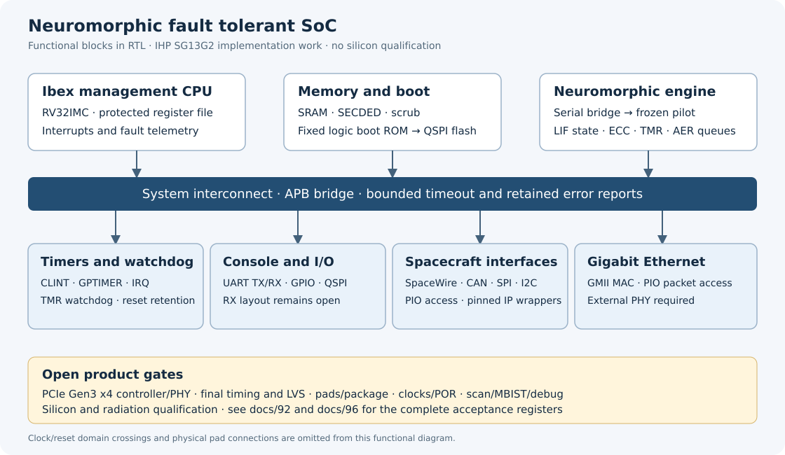

# Neuromorphic Fault Tolerant SoC

[](https://github.com/Melihakbulut221/nssoc/actions/workflows/checks.yml)

An experimental RISC-V and spiking-neural-network SoC for IHP SG13G2.
The design combines an Ibex management core, ECC-protected storage, scrub,
TMR control and spacecraft interfaces. Product acceptance remains open.



## Current evidence
<!-- project-status:start -->
| Area | Measured status | Evidence |
|---|---|---|
| Silicon / product | No silicon or radiation qualification; product gates open | [Acceptance contract](docs/92-product-acceptance.md) |
| Frozen pilot | TTIHP26b submission; source tree frozen | [Freeze contract](docs/34-pilot-freeze.md) |
| Python regression | 1836 pass, 0 skip; commit `fad89ce` | [Exact revision and command](docs/evidence/local-ci-mbist-chip-20260926.json) |
| Peripheral checks | 10/10 new formal tasks; 6/6 native RAM profiles | [Formal scope](docs/evidence/peripheral-formal-20260920.json); [RAM + negative control](docs/evidence/hosted-memory-parity-20260920.json) |
| Mandatory formal sweep | 170 PASS at `1baeb63`, 6 historical exclusions | [Dated source-bound inventories](docs/evidence/formal-170-local-20260926.json) |
| Independent native boot | PASS base + full at `1d99a78`; functional four-state simulation | [Hosted result and retained prior failure](docs/evidence/native-recovery-1d99a78-20260922.json) |
| Local native correction | PASS: 28 checks, 653,726 cycles; firmware `100cad7` | [Same hosted netlist, verified serial initialization](docs/evidence/npu-native-startup-20260921.json) |
| 32-SRAM core geometry | Main DRC, density, antenna and transistor LVS PASS; timing/product open | [Exact GDS and supplemental checks](docs/evidence/sram-repaired-core-physical-20260926.json) |
| Historical timing estimate | Setup -2.867 ns, hold -0.089 ns; not final-core STA | [Earlier route and electrical failures](docs/evidence/startup-native-corners-20260920.json) |
<!-- project-status:end -->
These rows name different measured revisions and scopes; they are not a
combined signoff result. The [machine-readable status](docs/project-status.json)
is generated from [selected evidence records](docs/status-sources.json).
Check it with `python3 scripts/project_status.py`; update it with `--write`.

The [26 September SRAM continuation](docs/101-sram-characterization.md#current-rail-and-pin-candidate-and-process-reference)
repairs route grids, fill and SRAM wide-line gaps. The exact 32-SRAM core passes
560-category main DRC, density, antenna, supplemental spacing and transistor LVS.
Fresh DP capacitance-only patterns pass at TT/SS/FF; fresh SP runs remain pending.
Qualified coupled RC, complete SRAM timing/power libraries, final SoC timing,
PCIe PHY/padframe integration and manufacturing approval remain open.

SpaceWire, classic CAN, SPI, I2C and the Gigabit GMII PIO MAC have RTL and
profile-specific layout evidence. **PCIe Gen3 x4 remains open:** the tested
[transaction backend](docs/98-pcie-transaction-backend.md) is not connected to the SoC/PHY.
UART has [8N1 RX/TX and CPU tests](docs/97-uart-receive.md), with its updated
whole-SoC layout pending. Ethernet needs an external PHY and has no DMA.
The complete GR801 interface set is not implemented.

The [product acceptance register](docs/92-product-acceptance.md) and
[second audit register](docs/96-second-audit-closure.md) track all remaining gates.
Earlier claims and corrections are preserved in [HISTORY.md](HISTORY.md), with a
[migration digest](docs/evidence/readme-migration-20260920.json).

## Reproduce

Use Linux, Python 3.12 or 3.13, `make`, Git and a C compiler. Tcl guards also
need `tclsh`. Start with `make help`.

```sh
make setup PYTHON=python3.12
make -f tools.mk fetch-oss-cad-suite PYTHON=python3.12
make -f tools.mk toolcheck
export PATH="$PWD/hw/soc/tools/oss-cad-suite/bin:$PATH"
make test
make rtl-test
make check
```

The installer verifies the pinned 2026-08-04 archive, uses a project-local
folder and refuses to replace an existing installation. Allow about 4 GB;
`OSS_CAD_SUITE=/absolute/path` selects another checkout. Physical tools/PDK are separate.

The local `make check` command covers Python, licensing and documentation;
hardware jobs are separate. Missing dependencies are reported as skips.

```sh
make soc-prepare
make soc-prepared-guards
make soc-sim
make soc-memory-parity
```

The default `SOC_INTERFACE_PROFILE=base` includes I2C/Ethernet and SPI.
Explicitly set `SOC_INTERFACE_PROFILE=full` for LGPL SpaceWire/CAN, including
preparation and every subsequent build command. See [interface profiles](docs/88-interface-integration.md).

On a prepared checkout, `python3 scripts/check_formal_sweep.py` runs the declared
pilot/SoC formal regression with source checks and explicit non-closing exceptions.
RTL, RAM parity, formal and processor/boot jobs remain separate; whole-netlist
native boot is an explicit long-running workflow option.

The [pilot driver](sw/pilotlink/README.md) shares register, state, weight and
frame operations across cocotb, a serial bridge and RP2040 SPI backends.
Physical-board qualification remains open.

The [current SoC datasheet](docs/60-soc-datasheet.md), section 0.4, describes
the implemented interfaces, build profiles and verification limits. Older
measurements remain explicitly tied to their original revisions; the
[errata index](docs/ERRATA.md) links their corrections and reproduction paths.

## Repository map

| Path | Contents |
|---|---|
| `hw/rtl/`, `hw/tb/`, `formal/`, `tt/` | Frozen pilot sources and verification; [freeze rules](docs/34-pilot-freeze.md) |
| `hw/soc/` | SoC RTL, firmware, verification and physical flows |
| `sw/golden/`, `sw/tests/`, `sw/pilotlink/` | Integer models, regression tests and host driver |
| `regmap/` | Register and memory-map specifications and generators |
| `docs/` | [Numbered technical index](docs/00-index.md), evidence and acceptance registers |
| `paper*/`, `thesis/` | Papers and thesis sources; claims require their recorded evidence |

## Licensing and citation

This repository is a published subset of a private development tree.
The [mirror contract](docs/78-the-public-mirror.md) defines its boundary; original provenance is in HISTORY.md.

The licence decision was **signed 2026-09-09**; see [LICENSES.md](LICENSES.md) for components and exceptions.

| Material | Project licence |
|---|---|
| RTL, verification HDL, formal configurations | CERN-OHL-W-2.0 |
| Software, generators and flow drivers | Apache-2.0 |
| Documents and measurement records | CC-BY-4.0 |

Fetched IP retains its own licence, including LGPL/MIT/Apache components;
this table does not relicense it. SPDX and REUSE checks cover the distribution.

Use [CITATION.cff](CITATION.cff) and the exact commit; there is no release DOI or qualified silicon release.
See [CONTRIBUTING.md](CONTRIBUTING.md) for reporting, boundaries and development checks,
[SECURITY.md](SECURITY.md) for private vulnerability reports, and [CHANGELOG.md](CHANGELOG.md) for unreleased changes.
