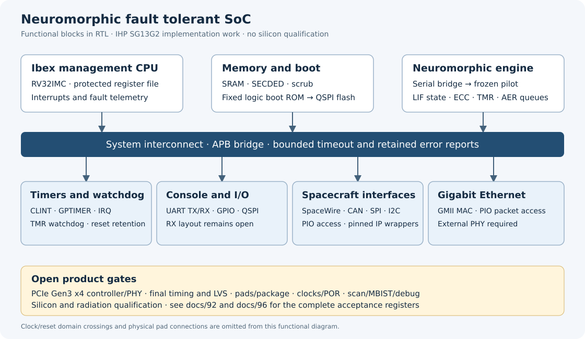

# NSSOC — Building an Open-Source GR801 Counterpart

[](https://github.com/Melihakbulut221/nssoc/actions/workflows/checks.yml)

**Our mission is to build an open-source counterpart to GR801 for space applications.**
NSSOC brings together fault-tolerant computing, neuromorphic acceleration and spacecraft interfaces.
We are committed to completing this open-source GR801 counterpart, from RTL and software through
physical implementation, silicon validation and qualification. The product acceptance gates below define when that goal is achieved.

The current IHP SG13G2 implementation combines an Ibex RISC-V core, a spiking-neural-network accelerator,
ECC-protected storage, memory scrubbing and TMR control. It forms the foundation for the product we are building.

## Product goal

GR801 is our product reference. NSSOC is an independent open-source design. Our development scope includes:

- Fault-tolerant processing and neural acceleration, protected memories, recovery and radiation qualification.
- SpaceWire, **PCIe Gen3 x4**, Gigabit Ethernet, CAN, I2C, SPI and UART, with controllers, PHY integration and software.
- Complete chip layout, characterized memories, padframe, clock/reset networks, power distribution and test access.
- Reproducible RTL, firmware, verification, physical flows and documentation under the [component licences](LICENSES.md).

Completion means meeting the integrated design requirements and [product acceptance gates](docs/92-product-acceptance.md):
functional verification, extracted setup/hold timing, full-chip DRC/LVS and antenna checks, manufacturing review,
silicon testing and qualification. Each result below records progress toward that goal within its verified scope.



## Recorded verification evidence

Setup/hold and full-chip LVS, including the I/O tap mismatch, remain open; see the [closure log](docs/106-timing-repair-research.md).
These selected milestones retain their original revision and scope; they are not a combined signoff result. [PCIe strict PCS and serial packets](docs/126-pcie-strict-pcs-and-serial-packets.md) records the latest bounded implementation, native tests and open physical gates.

<!-- project-status:start -->
| Area | Measured status | Evidence |
|---|---|---|
| Silicon / product | No silicon or radiation qualification; product gates open | [Acceptance contract](docs/92-product-acceptance.md) |
| Frozen pilot | TTIHP26b submission; source tree frozen | [Freeze contract](docs/34-pilot-freeze.md) |
| Python regression | 1872 pass, 0 skip; commit `136119c` | [Exact revision and command](docs/evidence/local-ci-mbist-physical-guards-20260927.json) |
| Peripheral checks | 10/10 new formal tasks; 6/6 native RAM profiles | [Formal scope](docs/evidence/peripheral-formal-20260920.json); [RAM + negative control](docs/evidence/hosted-memory-parity-20260920.json) |
| Mandatory formal sweep | 170 PASS at `1baeb63`, 6 historical exclusions | [Dated source-bound inventories](docs/evidence/formal-170-local-20260926.json) |
| Independent native boot | PASS base + full at `1d99a78`; functional four-state simulation | [Hosted result and retained prior failure](docs/evidence/native-recovery-1d99a78-20260922.json) |
| Local native correction | PASS: 28 checks, 653,726 cycles; firmware `100cad7` | [Same hosted netlist, verified serial initialization](docs/evidence/npu-native-startup-20260921.json) |
| 32-SRAM core geometry | Main DRC, density, antenna and transistor LVS PASS; timing/product open | [Exact GDS and supplemental checks](docs/evidence/ethernet-mbist-core-physical-20260927.json) |
| Historical timing estimate | Setup -2.867 ns, hold -0.089 ns; not final-core STA | [Earlier route and electrical failures](docs/evidence/startup-native-corners-20260920.json) |
<!-- project-status:end -->
The [machine-readable status](docs/project-status.json) derives from [selected records](docs/status-sources.json).
Check with `python3 scripts/project_status.py`; update with `--write`.

The [SRAM characterization record](docs/101-sram-characterization.md) documents core repairs and measured patterns.
Qualified coupled RC, complete SRAM timing/power libraries, final SoC timing,
PCIe PHY/padframe integration and manufacturing approval remain open.

SpaceWire, classic CAN, SPI, I2C and the Gigabit GMII PIO MAC have RTL and profile-specific layout evidence.
**PCIe Gen3 x4 remains open:** an optional [packet profile now shares GPIO/APB with the real CPU](docs/110-pcie-local-flow-and-clock-layout.md). The VCO and four-lane clocked sampler bank have separate DRC/LVS evidence; PLL/CDR, full SERDES/PCS/LTSSM and serial PHY/main-chip physical integration remain open. The [latest PCIe development record](docs/126-pcie-strict-pcs-and-serial-packets.md) records strict parser-owned lane cohorts, raw-input-to-packet RTL, native strict-leaf tests, separate predecode controls and the completed V7 maximum direct profile; qualified clocks/RC, complete PHY and main-chip physical integration remain open.
UART has [8N1 RX/TX and CPU tests](docs/97-uart-receive.md), with its updated whole-SoC layout pending.
Ethernet needs an external PHY and has no DMA.
The complete GR801 interface set is not implemented.

The [product acceptance](docs/92-product-acceptance.md) and [second audit](docs/96-second-audit-closure.md) registers track remaining gates.
Earlier claims and corrections remain in [HISTORY.md](HISTORY.md), with a [migration digest](docs/evidence/readme-migration-20260920.json).

## Reproduce

Use Linux, Python 3.12 or 3.13, `make`, Git, a C compiler and `tclsh`. Start with `make help`.

```sh
make setup PYTHON=python3.12
make -f tools.mk fetch-oss-cad-suite PYTHON=python3.12
make -f tools.mk toolcheck
export PATH="$PWD/hw/soc/tools/oss-cad-suite/bin:$PATH"
make test
make rtl-test
make check
```

The installer verifies the pinned 2026-08-04 archive and preserves existing installations. Allow about 4 GB;
`OSS_CAD_SUITE=/absolute/path` selects another checkout. Physical tools/PDK are separate.

Local `make check` covers Python, licensing and documentation; hardware jobs are separate. Missing dependencies produce skips.

```sh
make soc-prepare
make soc-prepared-guards
make soc-sim
make soc-memory-parity
```

The default `SOC_INTERFACE_PROFILE=base` includes I2C/Ethernet and SPI. Set `SOC_INTERFACE_PROFILE=full`
for LGPL SpaceWire/CAN in preparation and every subsequent build command. See [interface profiles](docs/88-interface-integration.md).

On a prepared checkout, `python3 scripts/check_formal_sweep.py` runs formal checks with source guards and explicit exceptions.
RTL, RAM parity, formal and processor/boot jobs remain separate; whole-netlist native boot is a long-running workflow option.

The [pilot driver](sw/pilotlink/README.md) supports cocotb, serial and RP2040 SPI backends. Physical-board qualification remains open.

The [SoC datasheet](docs/60-soc-datasheet.md), section 0.4, describes implemented interfaces, profiles and verification limits.
Older measurements retain their original revisions; the [errata index](docs/ERRATA.md) links corrections and reproduction paths.

## Repository map

| Path | Contents |
|---|---|
| `hw/rtl/`, `hw/tb/`, `formal/`, `tt/` | Frozen pilot sources and verification; [freeze rules](docs/34-pilot-freeze.md) |
| `hw/soc/` | SoC RTL, firmware, verification and physical flows |
| `sw/golden/`, `sw/tests/`, `sw/pilotlink/` | Integer models, regression tests and host driver |
| `regmap/` | Register and memory-map specifications and generators |
| `docs/` | [Numbered technical index](docs/00-index.md), evidence and acceptance registers |
| `paper*/`, `thesis/` | Papers and thesis sources; claims require their recorded evidence |

## Licensing and citation

This repository is a published subset of a private development tree. See the [mirror contract](docs/78-the-public-mirror.md) and HISTORY.md for provenance.

The licence decision was **signed 2026-09-09**; see [LICENSES.md](LICENSES.md) for components and exceptions.

| Material | Project licence |
|---|---|
| RTL, verification HDL, formal configurations | CERN-OHL-W-2.0 |
| Software, generators and flow drivers | Apache-2.0 |
| Documents and measurement records | CC-BY-4.0 |

Fetched IP retains its own licences, including LGPL/MIT/Apache; SPDX and REUSE checks cover the distribution.

Use [CITATION.cff](CITATION.cff) and the exact commit; there is no release DOI or qualified silicon release.
See [CONTRIBUTING.md](CONTRIBUTING.md) for development, [SECURITY.md](SECURITY.md) for reports, and [CHANGELOG.md](CHANGELOG.md) for changes.
