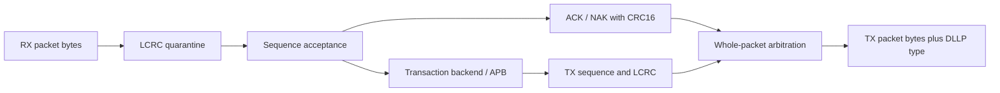
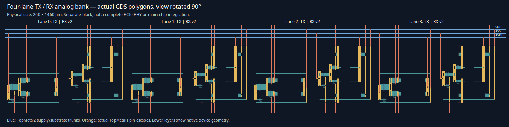

# 108 — PCIe packet integration and four-lane analog bank
<!-- SPDX-FileCopyrightText: 2026 Hasan Melih Akbulut -->
<!-- SPDX-License-Identifier: CC-BY-4.0 -->

## Integration boundary — 4 October 2026

This capture precedes [the replay, credits, sampler and physically padded-bank
continuation](109-pcie-replay-clock-and-pad-development.md). The later record
adds those measured blocks while retaining the main-chip integration boundary.

The PCIe work now has two concrete integration boundaries: a standalone
bidirectional digital packet endpoint and a physical bank of four TX/RX analog
lanes. **The bank is not instantiated in the main `nssoc_chip` layout and the
digital endpoint is not connected to `soc_top`.** The analog outputs cannot
feed byte-stream RTL directly: slicing, recovered/generated clocks,
serialization, physical coding, training and clock-domain crossings are still
missing. The current digital 3.3 V chip I/O contract has no PCIe analog pins.

These results advance the open-source GR801 counterpart; they do not establish
a PCIe Gen3 x4 link or manufacturing acceptance. The first RX cell and failed
150 fF experiment remain documented, unchanged, in
[docs/107](107-pcie-rx-development.md). No frozen design, measurement limit or
vendor DRC/LVS deck was rewritten to obtain the results below.

## Bidirectional digital packets

The new [`soc_pcie_sequence_rx`](../hw/soc/rtl/pcie/soc_pcie_sequence_rx.v)
accepts only the expected 12-bit sequence after the existing LCRC quarantine.
Duplicate and future packets are drained without reaching APB. Expected
packets advance the sequence modulo 4096 and request ACK; duplicates request
ACK of the last accepted sequence. Corruption or a future sequence requests
NAK; repeated NAK requests are suppressed until an expected packet is received.
The ACK/NAK request remains stable until consumed, and input backpressure
prevents overwriting it. Reset represents this local boundary becoming inactive.

[`soc_pcie_lcrc_tx`](../hw/soc/rtl/pcie/soc_pcie_lcrc_tx.v) buffers a whole
bounded DWORD packet, prepends its sequence with zero reserved bits and appends
the actual LCRC. Header bytes are MSB first; payload bytes retain APB byte order.
The sequence advances only when the last CRC byte is accepted. Malformed,
oversized and errored input frames are rejected before transmission. A new
SOP replaces a partial packet; reset discards buffered state.

[`soc_pcie_packet_endpoint`](../hw/soc/rtl/pcie/soc_pcie_packet_endpoint.v)
connects these blocks to the existing transaction backend. The final
[`soc_pcie_link_packets`](../hw/soc/rtl/pcie/soc_pcie_link_packets.v) also
connects the ACK/NAK requests to a real DLLP encoder and packet multiplexer:



The [`CRC16 recurrence`](../hw/soc/rtl/pcie/soc_pcie_crc16_byte.v) and
[`ACK/NAK serializer`](../hw/soc/rtl/pcie/soc_pcie_acknak_tx.v) generate six
bytes: type, reserved zero byte, sequence high nibble, sequence low byte and
the complemented CRC. The implementation uses reflected polynomial `D008`,
equivalent to normal polynomial `100B`, with seed `FFFF` and bit-zero-first
input. [`soc_pcie_packet_tx`](../hw/soc/rtl/pcie/soc_pcie_packet_tx.v) locks
selection from the first offered byte through accepted EOP, including stalls
and bubbles; packet-level round robin prevents starvation between the two
sources. `tx_dllp_o` tells a future physical-coding stage the packet type.

The classic sequence and ACK/NAK encoding rules were checked against the
Intel-hosted [PCI-SIG Base 2.1 specification](https://www.intel.com/content/dam/support/us/en/programmable/support-resources/fpga-wiki/asset03/pci-express-base-r2.1.pdf),
Figure 3-5, Table 3-2 and Figure 3-17. Indexed primary-source text/diagrams
were available; direct retrieval of the complete PDF was not. This is a
bounded engineering implementation, not a completed normative Gen3 review.

The byte interfaces omit physical SDP/STP/END symbols and Gen3 coding.
Replay buffering, received ACK processing, credit initialization/accounting,
ACK latency timers, LTSSM, full capabilities, multi-lane operation and
CDC/host arbitration are still required. A single-clock functional simulation
does not show 8 GT/s throughput, a 1 GHz byte clock, or closed timing.

### Executed digital checks

The sequence/LCRC endpoint passes six RTL and six IHP native-cell cases,
including **4,097 actual packets** wrapping both receive and transmit sequence
counters. Two standalone transmit cases cover header/payload ordering,
capacity, malformed input, stalls and reset. Eight focused tests include four
real rejected RTL faults: duplicate forwarding, wrong CRC seed, advancing under
backpressure and dropping a pending ACK.

The DLLP/multiplexer passes four identical RTL/native cases, including all
**8,192 ACK/NAK type/sequence combinations**, concurrent streams, first-byte
stall, bubbles, fairness and reset at every DLLP byte. Twelve focused checks
include 1,680 actual CRC primitive vectors, an unconstrained 24-input-bit SAT
relation and a wrong-polynomial counterexample, plus four actual CRC/arbitration
mutations. The formal proof covers the CRC recurrence, not the whole protocol.

The combined digital boundary passes three RTL and three native integration
cases: real ACK before completion, corrupt/future NAK with no APB access,
duplicate ACK without repeating a write, and queued packets under stalls/reset.
Native mapping produces 227 cells for the DLLP/multiplexer, 5,151 for the
sequence/LCRC endpoint, and **5,368 for the complete packet boundary**. These
are separate, overlapping synthesis results and must not be added together.
The unmodified IHP models use `-gspecify`; Icarus still reports unsupported
timing checks. No SDF, placed digital layout or extracted timing is claimed.

| Boundary | Source-bound measurements | Raw native/control evidence |
|---|---|---|
| Sequence and LCRC endpoint | [receipt](evidence/pcie-packet-20261004.json) | [capsule](evidence/pcie-packet-20261004.tar.xz) |
| DLLP encoder and arbitration | [receipt](evidence/pcie-dllp-controls-20261004.json) | [capsule](evidence/pcie-dllp-controls-20261004.tar.xz) |
| Combined packet boundary | [receipt](evidence/pcie-link-packets-20261004.json) | [capsule](evidence/pcie-link-packets-20261004.tar.xz) |

```sh
python3 scripts/check_pcie_packet.py --out /dev/shm/nssoc-pcie-endpoint-fresh
python3 scripts/check_pcie_packet.py --unit-tx --out /dev/shm/nssoc-pcie-tx-fresh
python3 scripts/check_pcie_packets.py --out /dev/shm/nssoc-pcie-dllp-fresh
python3 scripts/check_pcie_packets.py --top soc_pcie_link_packets \
  --out /dev/shm/nssoc-pcie-link-fresh
python3 -m pytest -q sw/tests/test_pcie_packet.py sw/tests/test_pcie_dllp.py
# For native replay, use the exact c4 IHP library/model bytes and Icarus >=13:
python3 scripts/check_pcie_packets.py --native --top soc_pcie_link_packets \
  --out /dev/shm/nssoc-pcie-link-native-fresh \
  --yosys /path/to/yosys --iverilog-dir /path/to/icarus/bin \
  --liberty /path/to/sg13g2_stdcell_typ_1p20V_25C.lib \
  --models /path/to/sg13g2_stdcell.v
```

Use the pinned Python/cocotb environment from `hw/requirements.txt` and fresh
output directories. The `pcie-transaction` workflow executes the added
controls and retains their raw outputs, including failures.

## Actual four-lane analog layout

The new [`bank generator`](../hw/soc/flow/make_pcie_analog_bank.py) places
four original native TX cells and four RXv2 cells in a **260 × 1460 µm**
hierarchy. Real TopMetal1 routes reach 44 signal/bias boundary pins;
TopMetal2 trunks join AVDD, AVSS and SUB, giving **47 physical ports**.
Every cell still requires an external current reference; each RX additionally
requires VCM. BULK and SUB retain their actual substrate-tap connection.
The circuit contains 32 HBTs, 24 foundry resistors and 64 square 2 × 2 µm taps.
The taps combine during strict LVS, producing 57 compared devices.



This is a rendering of the generated GDS polygons, rotated 90 degrees for
readability; it is not a conceptual floorplan. The [SVG](evidence/pcie-bank4-20261004.svg)
preserves the view at larger scale; the [render receipt](evidence/pcie-bank4-rendering-20261004.json)
binds its source GDS. It shows a separate analog macro, not the
current full-chip layout.

The first bank had 276 TopMetal1 width markers: the native via landing was
only 1.26 µm tall where this layer requires 1.64 µm. Adding real 2.4 × 2.4 µm
landing metal fixed the geometry. The original device geometries and vendor
deck were preserved. A physical-open negative initially exposed an overly
specific result collector: removing the lane-2 RX input via leaves 57 internal
devices matched but removes one top-level port. The collector now requires
the exact missing `L2_RX_INP` **and** the strict vendor mismatch for that
negative; the positive acceptance condition was not relaxed.

Final native checks for both RXv2 and the bank pass the **560-category main
DRC deck with zero markers**, strict transistor LVS, and physical LEF pin
checks. Seven bank controls reject off-grid geometry, wrong resistor load,
wrong lane connectivity, a missing substrate tap, the physically open input,
an AVSS–SUB short and a missing LEF pin. The focused/adjacent physical
regression has 79 passing tests. An independent review rehashed all native
inputs/outputs and reparsed the positive/negative LVS databases; it also
checked zero XOR of primitive conductors, all eight placements, all 47 real
pins and the exact seven-layer LEF obstruction regions.

| Evidence | Contents |
|---|---|
| [Physical receipt](evidence/pcie-bank4-20261004.json) | Source/tool/view hashes, DRC/LVS/LEF verdicts and explicit scope |
| [Physical capsule](evidence/pcie-bank4-20261004.tar.xz) | Actual GDS, LEF, transistor references, raw native databases/logs and rejected controls |
| [Independent review](evidence/pcie-bank4-peer-20261004.json) | RX 203 inputs/43 outputs and bank 212 inputs/61 outputs rechecked |

Reproduction uses the exact AppImage/PDK pinned in the receipt and the original
TX `layout-v5` bytes from the published
[TX cell evidence](evidence/pcie-tx-cell-20260926.json). The generator refuses
a different TX geometry. Prepare the locked decks with `prepare_ihp_drc.py`
and `prepare_ihp_lvs.py`, then use fresh output directories:

```sh
/path/to/librelane.AppImage python hw/soc/flow/make_pcie_rx_cell_v2.py \
  --pdk /path/to/pinned/ihp-sg13g2 --out hw/soc/out/rx-v2-fresh
/path/to/librelane.AppImage python hw/soc/flow/make_pcie_analog_bank.py \
  --pdk /path/to/pinned/ihp-sg13g2 --tx /path/to/original/layout-v5 \
  --rx hw/soc/out/rx-v2-fresh --out hw/soc/out/bank4-fresh
python3 hw/soc/flow/check_pcie_analog_bank.py --kind bank \
  --layout hw/soc/out/bank4-fresh --pdk /path/to/pinned/ihp-sg13g2 \
  --out hw/soc/out/bank4-check-fresh
```

This physical acceptance does not include density/antenna in chip context,
interconnect extraction, RF performance, matched-delay routing, crosstalk,
EM/IR, analog pads/ESD, post-layout PVT or production approval. The signal
routes establish connectivity; they are not yet qualified 8 GT/s routes.

## RXv2: real repair of the 150 fF load margin

[`rx_hbt_rsil_v2.spice`](../hw/soc/analog/pcie/rx_hbt_rsil_v2.spice)
changes the actual collector resistor geometry from 150 Ω to 100 Ω
(`w=2 µm`, `l=27.5 µm`) and uses a 0.75 mA external reference in the
characterization bench. Four native HBTs, self-heating, split 50 Ω input
terminations, 1.36 V common mode and all original engineering measurement
limits remain intact. The RXv2 physical generator implements these resistor
dimensions; this is not a changed model or relaxed pass threshold.

The full HBT × resistor × temperature × supply matrix has **81 corners**,
now all tested at **150 fF per output**, under both ngspice 42 and 47.
Each campaign also includes 16 extensions/controls and nine balanced AC
cases: **97 transient + 9 AC simulations per version**. All 81 PVT margin
screens pass the unchanged 100 mV threshold. This is a bounded pre-layout
engineering screen, not a PCI-SIG eye/BER compliance test.

| Simulator | Minimum PVT signed margin | Worst corner |
|---|---:|---|
| ngspice 42 | 119.005 mV | HBT wcs, resistor wcs, 125 °C, 1.71 V |
| ngspice 47 | 112.784 mV | HBT wcs, resistor wcs, 125 °C, 1.89 V |

The original 3 mA overbias stimulus no longer clips with the smaller loads.
Its first unexpected pass remains in the history; it is now recorded as a
passing extension. A real 6 mA overbias fault supplies the clipping/current
negative. All six genuine negative controls reject without changing limits.
Half-step sensitivity is below 0.027 mV in each version; this two-step
comparison is not a proof of numerical convergence.

**Both campaigns still return `RX_V2_MEASUREMENT_PASS_NUMERICAL_RESIDUAL`,
not a clean analog pass.** Each retains initialization warnings in 28
positive cases. Native ordered-output probes place the selected hot-case
NaN/stepping messages before the finite initial transient solution, with no
such messages afterward in those probes. This localizes the observed warning
phase; it neither proves harmlessness nor attributes a confirmed upstream
bug. Updating ngspice did not remove the warnings. The source models and
solver tolerances were not patched.

The frozen [producer](../scripts/characterize_pcie_rx_v2.py) and
[reviewer](../scripts/review_pcie_rx_v2.py) preserve numerical diagnostics
separately from measured margins. Full local reviews remeasure all 97 raw
waves per version. The compact publication deliberately retains **only the
complete ngspice47 worst-PVT waveform**, compressed losslessly with standard
XZ, plus both versions' logs, decks, measurements, AC tables and full-review
receipts. The other 193 transient waves are not published; their pinned
hashes/metrics do not replace raw replay, and they must be regenerated if
the local RAM captures disappear. No waveform is downsampled or silently
treated as retained.

| Evidence | Contents |
|---|---|
| [RXv2 receipt](evidence/pcie-rx-v2-20261004.json) | Both 97+9 campaigns, real limits, failures and numerical residuals |
| [RXv2 native capsule](evidence/pcie-rx-v2-20261004.tar.xz) | Logs/decks/AC, one complete worst-PVT wave, first failed attempt and startup probes |
| [Capture audit](evidence/pcie-rx-v2-capture-audit-20261004.json) and [raw audit capsule](evidence/pcie-rx-v2-capture-audit-20261004.tar.xz) | Full local 194-wave replay, exact source/stimulus binding and actual rejection controls |
| [Independent review](evidence/pcie-rx-v2-peer-20261004.json) | Independent initial source/deck and publication-subset checks |

The additive [`capture auditor`](../scripts/check_pcie_rx_v2_capture.py)
requires all 14 source/model/runtime inputs and regenerates all 106 test
decks and copied-circuit bridges. Omitting any input or modifying the actual
load/circuit and updating its receipt hash is rejected. Its 62 focused and
adjacent tests pass. `full`, `retained` and `metadata` modes explicitly replay
97, one and zero transient waveforms respectively. Audit success validates
the capture; it does not clear the producer's numerical-residual status.
Replaying the historical captures requires their exact absolute source/model/
runtime paths and bytes. Fresh characterization can use new local paths.

The ngspice47 executable came from the checksum-recorded
[Debian backport package](https://packages.debian.org/trixie-backports/amd64/ngspice/download).
The capsule retains its direct URL, package/executable hashes and diagnostics;
the package was extracted into RAM without replacing the existing simulator.

```sh
python3 scripts/characterize_pcie_rx_v2.py \
  --pdk /path/to/pinned/ihp-sg13g2 --ngspice /path/to/ngspice \
  --openvaf /path/to/openvaf --out /dev/shm/nssoc-rx-v2-fresh
# A complete run intentionally exits 2 while numerical residuals remain.
python3 scripts/check_pcie_rx_v2_capture.py \
  --directory /dev/shm/nssoc-rx-v2-fresh --mode full \
  --output /dev/shm/nssoc-rx-v2-audit-fresh.json
# Published subset after extraction; exact captured tools/paths still required:
python3 scripts/check_pcie_rx_v2_capture.py \
  --directory EXTRACTED/capture/ng47 --mode retained \
  --output /dev/shm/nssoc-rx-v2-published-fresh.json
```

## Remaining main-chip integration

The next physical dependency is a clocked receiver and transmitter interface:
bias generation/calibration, slicer, CDR/PLL, serializer/deserializer and
appropriate level conversion. Their extracted timing/electrical models must
connect to the Gen3 PCS, training and lane alignment logic. Replay, received
ACK processing, credits and link timers must complete the current packet
boundary before it can function as a reliable link.

Then the host master needs a defined SoC access policy, bus arbitration,
CDC/reset behavior, and verified analog pad/ESD/package connections. The
current 3.3 V digital pad contract cannot carry these analog signals. Only
after those interfaces exist can a new full-chip floorplan, routing,
extraction, timing and strict LVS establish chip integration. A separate
macro's GDS/LEF is useful input to that work, not evidence that it is done.
