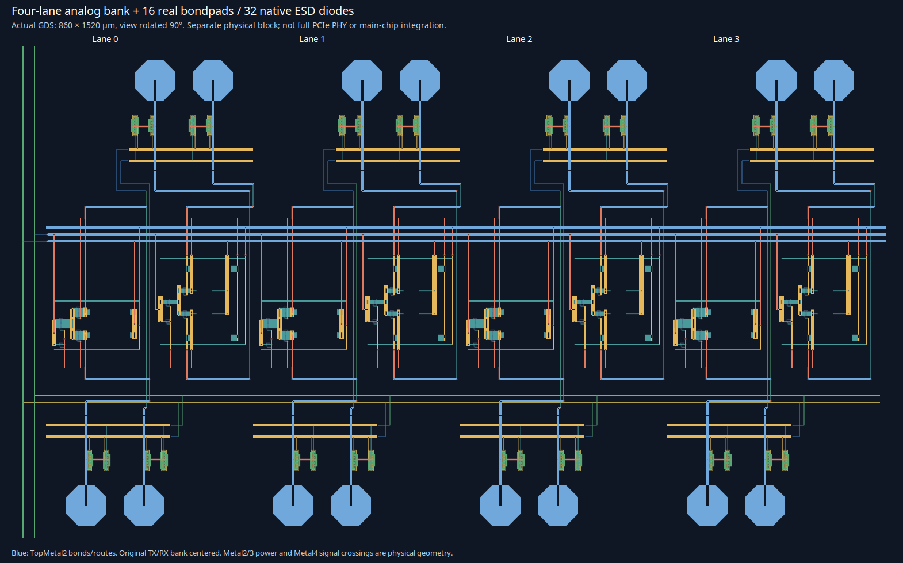

# 109 — PCIe replay, credit, clocked receiver and pad development
<!-- SPDX-FileCopyrightText: 2026 Hasan Melih Akbulut -->
<!-- SPDX-License-Identifier: CC-BY-4.0 -->

## Starting boundary — 4 October 2026

The user requested completion of the remaining controller and analog PHY
blocks, followed by main-chip layout integration. This development continues
the [four-lane analog bank and digital packet boundary](108-pcie-packet-and-bank-integration.md).
The existing main chip still has no PCIe serial interface or complete PHY.
Every result below distinguishes tested behavior from its remaining dependencies.

Both PCIe workflows at commit `bdf922e` completed successfully. The general
push checks instead failed REUSE parsing: Python strings used to generate
netlist licence headers were interpreted with their trailing Python syntax.
The three generators' real file headers were correct. Explicit per-file
annotations in `REUSE.toml` now retain both generator and emitted-template
licences without changing historically pinned source bytes. Full local REUSE
lint passes. The failed hosted run also reports 4,920 pytest passes and 46
explicit skips; those skips are not counted as executed verification here.
The [native evidence notices](evidence/pcie-native-20261004-NOTICES.txt)
preserve IHP/R3_CMC and ngspice component attribution for existing capsules.

## Unscaled VC0 transmit credits

[`soc_pcie_credit_tx`](../hw/soc/rtl/pcie/soc_pcie_credit_tx.v) maintains
independent header/data pools for posted, non-posted and completion traffic.
Initial limits come from CRC-validated, parsed FC messages. A zero initial
value fixes that pool as infinite until link reset. Later finite counter
rollover through zero does not change the pool into an infinite one.

Header limits/consumption wrap modulo 256; data counters wrap modulo 4096.
A new TLP atomically reserves one header and the payload rounded up to
16-byte data units. A stalled reservation consumes nothing. Replays consume
no additional credit. Malformed class/phase events and optionally checked
illegal limit advances are rejected without partially updating a pool pair.
The interface exposes the limit/consumption counters for observation.

The initialization receiver records all three classes from InitFC1 or InitFC2
messages. Only a later InitFC2, UpdateFC or received-TLP indication confirms
the peer's second phase; the local transmitter's separate completion input
must also be asserted before any new packet can reserve credit. InitFC1/2
values are ignored after collecting the initial capacities. Link-down resets
all pools, flags and consumption.

The implementation follows the classic unscaled rules indexed in the
Intel-hosted [PCI-SIG Base 2.1 specification](https://www.intel.com/content/dam/support/us/en/programmable/support-resources/fpga-wiki/asset03/pci-express-base-r2.1.pdf),
sections 2.6 and 3.3. Direct PDF retrieval remains unavailable; this is not a
complete normative Gen3 review. Intel's
[credit-interface documentation](https://www.intel.com/content/www/us/en/docs/programmable/790711/24-2-3-0-0/flow-control-credit-handling.html)
also describes separate pools, cumulative limits, 16-byte data units and
initial zero as infinity. No scaled-credit extension is advertised.

Four identical port-level RTL/native cases pass, including 12,000 randomized
reservation/update cycles that wrap both finite counter widths, independent
pools, mixed finite/infinite capacities, reset, malformed updates, simultaneous
reservation/return and replay. The oracle uses unbounded integer issued/used
counters rather than copying the RTL's modular arithmetic. Native synthesis
maps to **984 IHP cells**, with unmodified models and `-gspecify`; this is
functional gate simulation without SDF or placed timing.

Four actual RTL mutations are rejected by those same tests: rounding payload
credits down, debiting a blocked request, charging replay again and accepting
an illegal FC update. The source-bound
[receipt](evidence/pcie-credit-20261004.json) and
[native/control capsule](evidence/pcie-credit-20261004.tar.xz) retain all results.

This block alone does not advertise receive buffers, implement the local FC
transmit scheduler or enforce transaction bypass/ordering. Its parsed-message
inputs and local-initialization completion have explicit upstream obligations.
The tested logic must not be described as a complete autonomous flow-control
link until those obligations are connected to actual storage and timers.

```sh
python3 scripts/check_pcie_flow.py --out /dev/shm/nssoc-credit-fresh
python3 -m pytest -q sw/tests/test_pcie_flow.py
# The native option requires the exact pinned IHP library and models:
python3 scripts/check_pcie_flow.py --native --out /dev/shm/nssoc-credit-native-fresh \
  --yosys /path/to/yosys --iverilog-dir /path/to/icarus/bin \
  --liberty /path/to/sg13g2_stdcell_typ_1p20V_25C.lib \
  --models /path/to/sg13g2_stdcell.v
```

## Received DLLPs, bounded replay and the credit connection

`soc_pcie_dllp_rx` validates the actual six-byte CRC16-protected ACK/NAK
and unscaled VC0 InitFC1/InitFC2/UpdateFC messages. It checks reserved fields,
physical-error indications and framing before producing events. Unsupported
DLLP types are distinguished from corrupt messages. ACK events obey a held
valid/ready interface; FC events update the independently tested credit pools.

`soc_pcie_replay_tx` retains complete original sequence/TLP/LCRC byte strings
in four bounded packet slots. A cumulative ACK frees only the already-sent
window; NAK and timeout schedule byte-identical replay. Replay does not reserve
receiver credit a second time. New packets and ACK application wait for safe
packet boundaries. A stalled first byte remains stable. Timer expiry wins over
a competing new credit reservation. Training pauses new transmissions and the
local cycle timer while allowing an already-started packet to finish.
The tested defaults are four slots of at most 38 encoded bytes, a 1,024-cycle
timeout and three retries. The wrapper remains a single-clock development
endpoint; larger negotiated payloads and a line-rate timer are not qualified.

An early ACK is classified against the transmitted frontier when it first
appears, before local backpressure can defer its application. The initial
implementation checked the later handshake frontier; review found that an ACK
for an unsent packet could thereby become admissible. The final source latches
the original classification. The corresponding regression stalls the original
packet, presents its premature ACK, finishes transmission and requires rejection
with storage retained; a subsequent legitimate ACK frees the slot.

The retry limit raises a retrain request. An external recovery handshake is
required to resume, and malformed locally encoded packets halt the source.
The configurable cycle count is a development timer, not a verified PCIe
REPLAY_TIMER value. No LTSSM is internally faked to acknowledge recovery.

The decoder, replay store and reliable wrapper pass **14 RTL and the same
14 native mapped cases**: respectively 3, 7 and 4. The mapped sizes are
372, 4,746 and 11,753 IHP cells. Tests include all 8,192 ACK/NAK sequence
combinations, 54 FC field combinations, 144 single-bit corruptions, and an
actual 4,097-packet sequence wrap in both replay simulations. Eleven Python
checks include **10 actual rejected functional mutations**, including the
early-ACK snapshot and timeout/reservation race. Mutation runs intentionally
select the relevant failing case; unselected cases are recorded as skipped,
not additional passes. The [replay receipt](evidence/pcie-replay-20261004.json)
and [raw native/control capsule](evidence/pcie-replay-20261004.tar.xz) preserve
final sources, all tested logs/XML and earlier superseded attempts.

[`soc_pcie_flow_packets`](../hw/soc/rtl/pcie/soc_pcie_flow_packets.v)
connects the decoded FC events and the credit reservation to the reliable
packet endpoint. **The combined path passes three port-level cases both as
RTL and as 12,712 actual IHP cells.** The cases exercise real incoming config
reads and DLLPs: completions blocked before initialization; peer initialization
insufficient without local completion; exhausted credits blocking a second
completion; byte-identical NAK replay without another debit; ACK freeing replay
storage without returning receiver credit; corrupt UpdateFC rejected; and
valid UpdateFC releasing the waiting completion. Random output stalls,
infinite pools and link reset are also checked.

Three actual connection mutations are rejected: bypassing the credit grant,
forcing local initialization complete, and suppressing payload-credit debit.
An initial wrapper with a missing reset connection failed with unknown RX
readiness; its failed log is retained and the corrected full suite was rerun.
The [combined receipt](evidence/pcie-flow-integration-20261004.json) and
[51-member lossless capsule](evidence/pcie-flow-integration-20261004.tar.xz)
bind final source, native mapping, raw simulation logs/XML and mutated runs.
Native functional gate simulation uses unmodified IHP models with `-gspecify`;
it provides no SDF timing or physical closure.

```sh
python3 scripts/check_pcie_flow_packets.py --out /dev/shm/nssoc-flow-fresh
python3 -m pytest -q sw/tests/test_pcie_flow_packets.py
python3 scripts/check_pcie_flow_packets.py --native --out /dev/shm/nssoc-flow-native-fresh \
  --yosys /path/to/yosys --iverilog-dir /path/to/icarus/bin \
  --liberty /path/to/sg13g2_stdcell_typ_1p20V_25C.lib \
  --models /path/to/sg13g2_stdcell.v
```

## Clocked receiver development and rejected first full matrix

The new `nssoc_rx_sampler_hbt` uses a real two-stage master/slave CML sampler:
15 native HBTs and 12 native `rppd` resistors. It is driven by the unchanged
RXv2 preamplifier, with passive resistive level shifting and weak native emitter
bleeders. The separate sampler rail is 2.5 V; RXv2 remains at 1.8 V. An external
8 GHz differential clock and separate 0.5 mA/0.75 mA sampler/RX reference
currents are explicit bench assumptions. No behavioral latch or ideal voltage
gain substitutes for a transistor circuit.

The first full 121-case native campaign is **rejected**: 80 of 81 required
coupled-rail PVT cases pass, but `hbt_wcs_res_bcs_125_1.71` gives
**99.858274 mV** against the unchanged **100 mV** minimum. The failing point
is bit 18 at +0.9 UI after its actual clock edge; independent interpolation of
the two surrounding native samples reproduces it. Correct bit signs and passing
VCE limits do not waive that failure. The original source and full failed
campaign remain identified before any design revision.

Measurement checks all 19 HBTs in RX plus sampler, their 0.4–1.6 V VCE window,
per-emitter current, actual clock crossings, clock-to-valid time and the full
stored waveform over +0.3 to +0.9 UI of the hold interval. The phase scan is a
finite deterministic aperture experiment, not metastability, jitter or BER
qualification. Hot initialization diagnostics remain separately visible.

### Separate geometry revision and complete repeated screen

Revision 2 changes only the native collector `rppd` length from 2.04 to
2.12 µm, retaining 8 µm width and every measurement threshold. Six sizing
pilots compare the exact failed corner, the minimum-VCE corner and nominal
behavior at 2.08/2.12 µm. The chosen geometry raises the original failed
corner to **109.251651 mV** while preserving the headroom requirement.
The first circuit and its failed full matrix remain unchanged.

The fresh **121-case v2 campaign** completes with all **81 PVT cases** at
150 fF passing, all **85 required positive cases** passing and all **six
actual fault controls** rejected. Five load/clock/independent-supply extensions
and 25 deterministic phase points complete the census; phase-edge failures
are aperture measurements, not excluded required cases. Halving the maximum
timestep changes nominal minimum margin by only **6.960 µV**, and the explicit
step-sensitivity guard passes.

The result is nevertheless labelled
`SAMPLER_MEASUREMENT_PASS_NUMERICAL_RESIDUAL`: **28 positive cases** retain
initialization diagnostics. This is the recorded result of that exact capture,
not a claim that numerical startup or the complete PHY is closed. Separate
cross-version and solver-strategy results below must be read with their own
case coverage and unchanged circuit/accuracy contract.

Across the required PVT screen, the 19 native HBTs remain between
**0.425344 and 1.432964 V VCE**. Nominal minimum sampled differential is
147.507 mV, clock-to-100 mV is 23.453 ps, and the finite phase experiment
observes 46.853 ps setup and 77.613 ps hold. These are circuit measurements
under the stated deterministic bench, not PCIe timing or BER qualification.
Nominal sampler power is 14.519 mW, plus 5.083 mW for the RX preamplifier.

### Cross-version and startup experiments retain their failures

The separate nine-case ngspice 42 comparison completes three positive cases
above the unchanged margin threshold (worst 115.811 mV) and rejects five
faults by measured behavior. The sixth fault, `no_regeneration`, instead
aborts with a native timestep-too-small error at 10.2525 ns. That simulator
failure is **not** counted as a successfully measured negative control:
the cross-version campaign retains `FAIL_CROSS_VERSION_SAMPLER_SCREEN`
and exits 1. Its first interrupted attempt, exact method and partial output
are retained beside the final failure-aware result.

Increasing Newton iterations, providing electrical operating-point hints,
halving the transient timestep and additionally hinting all 16 resistor
thermal nodes do not eliminate the startup residuals. Completed measured
cases still report native thermal NaN/gmin/current-density diagnostics.
The separate source-homotopy strategy fails with nonfinite DC values and a
timestep abort rather than a useful transient. The startup diagnosis therefore
has no clean accepted strategy and exits 2. No model equation, accuracy
threshold or diagnostic filter was weakened to label it clean. The 28 positive
warning cases (29 including the deliberately faulty clock control) remain an
explicit unresolved numerical issue.

Independent review rehashes all 11 frozen method/circuit sources, 19 main
inputs and 605 case outputs, regenerates all 121 decks, and reparses every
native diagnostic log. It independently remeasures the worst v2 waveform,
all eight completed ngspice 42 traces and three completed startup traces;
it does not claim a second complete 121-case simulation. The 64 focused
Python checks pass, including capture/source integrity and retained-failure
classification.

The [source-bound sampler receipt](evidence/pcie-sampler-20261004.json) and
[1,325-member native capsule](evidence/pcie-sampler-20261004.tar.xz) retain
both full campaign records, raw decks/logs/metrics, source captures, failed
attempts, reviewer records and two seven-column waveform projections. Those
projections preserve all original timepoints and exact native numeric tokens;
they are explicitly not substitutes for the 64-column device-safety traces.
The [complete final worst-case waveform](https://github.com/Melihakbulut221/nssoc/blob/codex/complete-open-work/hw/soc/analog/pcie/evidence/sampler-v2-worst-20261004.dat.xz)
is separately retained in the repository: all 64 columns and 20,211 timepoints,
25,891,720 uncompressed bytes, with compressed and original SHA256 hashes in
the receipt. Other full raw waveforms remain local volatile captures; after a
restart, reproduce them with the exact pinned sources, runtimes and models.
The compact capsule does not redistribute vendor model implementations or
compiled OSDI/tool binaries.

```sh
python3 scripts/characterize_pcie_sampler_v2.py \
  --pdk /path/to/pinned/ihp-sg13g2 --ngspice /path/to/pinned/ngspice47 \
  --openvaf /path/to/pinned/openvaf --out /dev/shm/sampler-v2-fresh
# The recorded full screen exits 2 while numerical residuals remain.
python3 scripts/crosscheck_pcie_sampler_v2.py \
  --directory /dev/shm/sampler-v2-fresh --ngspice /path/to/pinned/ngspice42 \
  --out /dev/shm/sampler-ng42-fresh
python3 scripts/diagnose_pcie_sampler_startup.py \
  --directory /dev/shm/sampler-v2-fresh --out /dev/shm/sampler-startup-fresh
python3 -m pytest -q sw/tests/test_pcie_sampler.py sw/tests/test_pcie_sampler_v2.py
```

## Clock generation boundary

The clocked receiver requires an externally supplied differential clock and
bias. It is not clock recovery. A recent primary
[SG13G2 fractional-N PLL paper](https://arxiv.org/abs/2607.08852) reports a
2.4 GHz LC-VCO PLL with an EM-modelled inductor, 930 × 666 µm layout and
12.73 mW consumption. Those are the authors' results; this project has not
reproduced them.

The paper's [actual source repository](https://github.com/Manimohan05/SG13G2_2.4GHz_LC_VCO_FPLL)
is accessible at inspected commit `181be4906b95d492c938f2e1a51f7a8c2d99e094`.
The [bounded source audit](evidence/pcie-pll-candidate-20261004.json) checks
an untruncated 1,865-entry tree, 17 selected blobs against their Git/SHA256
identities and three small GDS hierarchies. Real native-IHP SPICE and physical
blocks exist. However, no redistribution/adaptation licence grant was found
in that tree or the inspected README/core netlists. Inspected source/layout
bytes stay outside the published project; only the audit facts/pins are retained.

The circuit also needs engineering changes before adoption: its 4 nH tank and
prescaler target 2.4 GHz, its 1.2 V CMOS output does not supply the sampler's
2.5 V-domain differential-clock interface, and the inspected VCO views differ
in their port contracts. An empty tank stub used for LVS, actual simulation
model and PEX varactor rewrite must be reconciled. These are findings from
source inspection, not failed or passed NSSOC PLL simulations. Independent
original PLL development remains possible, but **no PLL/CDR is implemented
or integrated by this delivery**. Acquisition, jitter transfer/tolerance,
phase noise, a validated high-speed divider and a matched SERDES remain open.

## Physical differential pad and ESD boundary

The new generator places two native 70 µm bondpads and four unchanged fixed
IHP `diodevdd_2kv`/`diodevss_2kv` primitives, with actual analog metal/vias to
PADP, PADN, AVDD and AVSS. It produces a **220 × 220 µm** GDS/LEF boundary,
four net terminals, six physical access shapes and seven routing-layer
obstructions. It does not repurpose a digital I/O-buffer timing abstract as an
RF pad. The bank's existing geometry and reference remain unchanged.

The final boundary passes the locked main native DRC deck (**0 violations in
560 checks**) and strict native LVS (**four devices, four ports**). Readback
also requires zero XOR against the unchanged primitive geometry, exact
translations, physical access coverage and named C/B/E-to-rail binding.
Seven native negative controls fail as intended, including wrong multiplicity,
wrong model/polarity, rail swapping, a physical short, a missing pad via and
an off-grid shape. The open-via case must fail specifically because PADP no
longer reaches the extracted circuit; a remaining device-level match cannot
hide the missing port.

The native diode terminal ordering needs care. The LVS database retains the
model's named terminals, while its generic exported transistor line uses a
different default positional order. The raw export is preserved as a diagnostic
and is **not** fed uncorrected into SPICE. Native loading decks bind the actual
source-model terminal contract, and wrong-rail simulation is a negative control.
Neither the device models nor the native LVS comparison rules were altered.

Twenty-seven supply/common-mode/temperature cases at three frequencies measure
**46.302–53.604 fF** per pad for the diode pair alone and at most **3.543 pA**
DC leakage in this campaign. An added 50 fF load and a wrong-rail connection are
checked controls. These values exclude bondpad, added wiring, package and
channel capacitance. The `2kv` primitive name is not an HBM/CDM test result for
this new assembly; clamp-current paths and qualification remain open.

The [source-bound receipt](evidence/pcie-pad-boundary-20261004.json) and
[222-member capsule](evidence/pcie-pad-boundary-20261004.tar.xz) retain the
GDS/LEF/reference, decks, raw native logs, observations and all negatives.
Sixty-nine focused/adjacent Python tests pass. Standalone pad acceptance does
not certify the analog bank, main chip or a PCIe channel.

## Four-lane analog bank physically joined to the pads

A new **860 × 1520 µm** parent layout now contains the unchanged four-TX/four-RX
bank and eight unchanged differential pad boundaries: **16 actual bondpads and
32 ESD diodes**. All 16 serial conductors and the common AVDD/AVSS rails are
physically routed. There are nine source-preserving parent instances and
47 exposed net ports. This is a real connected GDS hierarchy, not a placement
reservation or a drawing of future macros.

The fixed ESD structures connect the physical substrate to AVSS. Native
extraction confirms that the original bank's internal BULK therefore joins
AVSS. The new combined schematic explicitly represents that physical result,
while preserving the original bank, its literal substrate-tap devices and
separate SUB access. No virtual-name connection, adjusted tap device or changed
LVS matching rule is used.

The final parent passes **0/560 main DRC** and **strict LVS with 89 combined
devices and all 47 ports**. Eight actual negative controls reject physical
opens/shorts, incorrect substrate/reference connections and off-grid geometry.
Native readback checks original child geometry, all serial connections,
transforms and exact LEF access/obstruction shapes. Two initial parent-routing
errors—a crossing rail branch and a diagonal top-metal corner—were corrected
and the failed attempt is retained. Eighty-three focused tests pass.



The [receipt](evidence/pcie-padded-bank4-20261004.json) and
[99-member native capsule](evidence/pcie-padded-bank4-20261004.tar.xz)
include the real GDS/LEF/reference, raw native reports and negatives. The
render comes from that GDS. The clocked sampler is not part of this geometry;
its separate 2.5 V supply/clock and physical design remain to be integrated.
This parent is also not yet instantiated in `nssoc_chip`. Intrinsic device
models and successful connectivity checks do not supply extracted RF timing
or assembled-system ESD qualification.

The [separate read-only review record](evidence/pcie-controller-pad-peer-review-20261004.json)
rehashes the controller/pad captures, opens the actual native LVS databases,
checks original child geometry and independently reproduces the first sampler
margin failure. It is an additional audit of native results, not a new simulator
or physical-deck run.

## Limited RC producer repair and the rejected coupling case

A native TopMetal2 sheet/access experiment exposes double-counted ground
capacitance in the existing Magic extraction path. The original extraction
contains about 29.7685 fF per pad, while exported SPICE contains about
59.5370 fF. Source inspection identifies the mechanism: retaining an original
node name prevents its deletion, but the replacement resistance network adds
the already-distributed intrinsic capacitance again.

An isolated source-pinned Magic build now separately tracks the original
`NODE` intrinsic capacitance and emits one native `subcap` retirement when
a successful replacement network retains the original name. It preserves
the old runtime, PDK coefficients, original geometry and failed outputs.
The corrected uncoupled export contains **29.76854 fF** per pad. The native
resistances remain **0.338237 ohm** per pad access and **0.0495 ohm** for the
20 × 4 µm sheet control. This is a producer correction; no exported capacitor
is divided by two after extraction.

The actual two-strip coupled negative control exposes a separate remaining
limitation. Its 1,168.76 aF mutual coupling survives the export, but the same
amount is also added into each collapsed ground-capacitance diagonal. The
expected matrix has diagonal 2,351.35 aF and off-diagonal −1,168.76 aF;
the patched native result has approximately 3,520.120117 aF and
−1,168.760010 aF. The full matrix therefore **fails conservation**.
The new audit rejects every nonzero inter-conductor coupling input and
unsupported scale, hierarchy or node contract. Its supported scope is
strictly flat canonical ports, uncoupled conductors and native `cscale=1`.
The patch is not promoted to the main chip's extraction flow.

Five native consumer controls preserve the expected capacitance for retained
names, renamed nodes, additive repeated replacement nodes, no replacement and
a scale-2 input. Three actual bad native exports—missing, wrong and duplicate
retirement—produce 200, 150 and 0 aF instead of 100 aF and are rejected.
The scale-2 control checks the native reader only; it does not extend the
producer's accepted `cscale=1` scope. Forty focused tests also reject malformed
SPICE, duplicate element identities, negative/nonfinite replacement capacitance,
port/topology changes and a per-node distribution change that preserves the
total. The audit checks each node as well as the collapsed matrix.

The [compact source-bound RC receipt](evidence/pcie-rc-intrinsic-20261004.json)
and [181-member native capsule](evidence/pcie-rc-intrinsic-20261004.tar.xz)
retain the three pinned before/after Magic sources, isolated build recipe and
logs, full runtime inventories, unchanged original/fixed extractions, native
consumer controls and the rejected coupled geometry. Eight mutations of actual
outputs are rejected in addition to the native controls. No runtime executable
is redistributed. The original Magic licence and project notices are included.

```sh
python3 scripts/patch_magic_intrinsic_cap_retirement.py \
  --source-dir /path/to/pinned/magic/resis --out /dev/shm/isolated-resis-source
# Build only in a copied source tree using the retained capsule recipe.
python3 scripts/check_magic_intrinsic_cap_retirement.py \
  --ext /path/to/native.ext --replacement /path/to/native.res.ext \
  --exported /path/to/native.spice --baseline-spice /path/to/original.spice \
  --out /dev/shm/scoped-rc-review.json
python3 -m pytest -q sw/tests/test_magic_intrinsic_cap_retirement.py
```

The [Magic extraction instructions](https://www.opencircuitdesign.com/magic/howto.html)
and [extresist command reference](https://www.opencircuitdesign.com/magic/commandref/extresist.html)
provide the upstream command semantics. These small native conservation
controls do not validate substrate/RF coupling, extraction corners, package
parasitics, a PCIe eye or whole-chip PEX. Those require a qualified extraction
method and subsequent circuit/channel reruns.

## Remaining boundaries before main-chip acceptance

| Requested block | Current implemented boundary | Still required for closure |
|---|---|---|
| Replay and credits | Received CRC-checked ACK/NAK/FC, bounded encoded replay and six actual transmit credit pools pass RTL/native tests together | Receive-side buffer ownership and real InitFC/UpdateFC transmission, ordering, negotiated timers and autonomous recovery |
| SERDES | Transistor TX drivers, RX preamplifiers and an externally clocked sampler development circuit | Validated serialization/deserialization, clock distribution, timing/CDC and lane alignment |
| CDR/PLL | Native sampler experiments expose actual clock-level/loading requirements; one real external PLL candidate was audited | Original or properly licensed clock circuit, acquisition/lock, jitter/phase-noise and PVT/PEX validation |
| PCS/LTSSM | Packet-side interfaces and external training/recovery obligations are explicit | Physical coding/ordered sets, speed transitions, link training/equalization and four-lane state/deskew tests |
| Analog pads/ESD | All four TX/RX lanes physically joined to 16 bondpads/32 diodes; parent DRC/LVS and negatives pass | Full rail-clamp/discharge network, package path and assembled-system ESD/RF qualification |
| Parasitic extraction | Isolated native producer repair restores uncoupled TopMetal2 ground-C conservation; the real coupling matrix remains rejected | Verified interconnect/coupling/substrate extraction and correlation, followed by channel/eye and PVT reruns |
| Main-chip connection | Digital packet boundary and analog geometry are separately verified development artifacts | Complete clock/PCS link, protected host-fabric arbitration, reset/CDC, power/pad/DFT integration and fresh whole-chip physical checks |

The `soc_top` and generated `nssoc_chip` do not gain a fictitious serial link
or a tied-high link-up/completion signal. The separate analog bank's passing
native DRC/LVS cannot replace complete chip LVS, extracted timing or product
acceptance. [The product gate](92-product-acceptance.md) therefore remains open.
