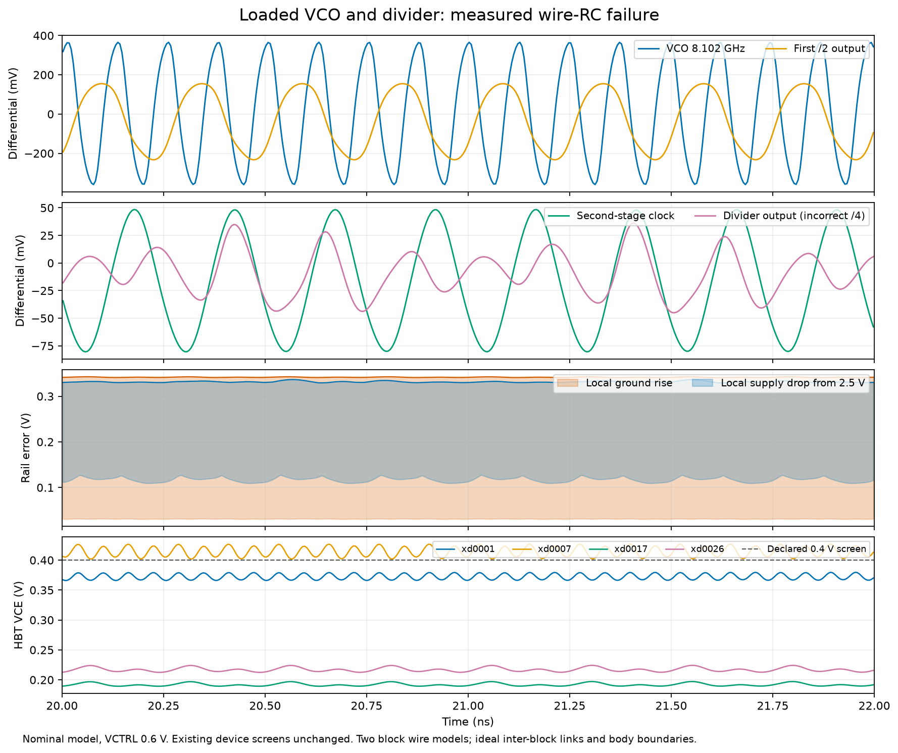

# 136 — Loaded divider failure and timing repair evidence
<!-- SPDX-FileCopyrightText: 2026 Hasan Melih Akbulut -->
<!-- SPDX-License-Identifier: CC-BY-4.0 -->

## Result — 5 October 2026

The first simulation combining the VCO and divider's actual wire RC fails
the declared divider function and four HBT headroom screens. V19's digital
integrity parser also regresses in the unchanged timing profile. **Neither
candidate closes the complete PCIe PHY or final whole-chip timing.** These
failures now have frozen sources, native results and public raw captures.

## Measured analog failure

The model contains **455 intrinsic devices**: 62 in the VCO, 91 physical
divider devices and 302 devices in the feedback logic. Its two block wire
networks contain 1,201 resistors and 1,383 capacitors. The divider contributes
the 312 resistors and 618 capacitors verified in [report 134](134-pcie-divider-wire-and-rx13-timing.md).
All 85 divider body terminals retain their explicit boundary identity.

The nominal probe uses VCTRL = 0.6 V, the unchanged supplies, 50 fF clock
loads, a 5 ps output step and the original 4–34 ns measurement window.
The simulator exits normally; the electrical and functional result is **FAIL**.
A numerical completion is not a passing design.

| Saved-wave observation | Result |
| --- | ---: |
| VCO frequency | 8.10238 GHz |
| First divide-by-two output | 4.05124 GHz |
| Second-stage clock differential range | −81.158 to +49.492 mV |
| Highest observed local AVSS | 0.345529 V |
| Lowest observed local DIV_AVDD | 2.160232 V, from a 2.5 V source |
| Lowest settled HBT VCE | 0.183909 V, below the unchanged 0.4 V screen |
| Divider /4 and feedback /80 screens | **Fail** |

Four HBTs fail the voltage-headroom screen: divider devices 1, 7, 17 and 26.
The saved wave contains 6,817 rows and **6,523,869 values**. Its source-bound
[diagnosis](../hw/soc/pcie-evidence/20261005-loaded-divider-and-write-frontier/records/pcie-vco-v6-divider-wire-v1-20261005/saved-wave-diagnosis06.json)
shows substantial voltage differences along the distributed power conductors.
The proposed repair adds upper-metal supply straps and real PDK via arrays;
its geometry, extraction and loaded result require fresh verification.

An independent binary reader scans every saved value, verifies strictly
increasing time and recomputes all 64 HBT voltage bounds from their intrinsic
collector/emitter nodes. Its [readback](../hw/soc/pcie-evidence/20261005-loaded-divider-and-write-frontier/records/pcie-phase26-delivery-20261005/root-loaded-wave-review.json)
confirms the same four failures and distributed supply drops. It does not
independently qualify every device-current screen or the RC model.

The plotted interval is a saved 20–22 ns slice. The VCO and divider are still
separately laid-out blocks with ideal inter-block connections and explicit
ideal body/reference boundaries. The model is not extracted complete-PHY
floorplan wiring, substrate resistance or a qualified RC-corner model.

## Digital timing and RX preparation

V19 moves seven ring-content writes out of the fault-qualified control loop
while retaining their exact `step` qualification. Public outputs, occupied
slots and committed verdicts remain checked. Invalid storage contents may
change before being quarantined; arbitrary internal-state equality is not
claimed. The initial missing coverage witness remains a failed campaign.
After its stimulus correction, 28 passing pytest executions plus that one
historical failure cover the original 27 selected tests and 26 distinct
predicates, with 22 actual RTL fault controls. Two MAX4118 profiles remain
outside this finite campaign.

| Same 4 ns preplacement profile | Setup slack, ns | Hold slack, ns |
| --- | ---: | ---: |
| Slow | **−3.420429** | +0.355779 |
| Typical | **−0.705328** | +0.262076 |
| Fast | +0.880972 | +0.177076 |

The mapped design has 103,720 cells and 9,410 flip-flops. Compared with V17,
slow setup worsens by 84.146 ps and cell count rises by 2,903; V19 is not
adopted. Its measured worst path now starts at `read_ptr[3]` and ends at
`current_valid`. The read/retire dependency is the next optimization target.
These preplacement figures are not routed chip timing.

RX14a separately passes its fresh 1,804-state/5,443-function comparison,
ten fault controls and six native port cases. All four global-route trials,
including the rejected larger-buffer alternative, are preserved. Its selected
targeted slow-corner estimate improves by 10.489 ps, but the last completed
routed RX result remains RX13 at **−0.441603 ns setup**. RX14a's detailed route
and subsequent RC/timing result are outside this delivery.

## Whole-chip diagnosis and reproducibility

[Report 135](135-npu-write-frontier-trace.md) records the corrected EVQ callback
parser and the new expanded NPU write-path measurement. Original failed job
receipts remain failed. The original boot passed 28 checks; the timing
candidate failed after 24. The new paired diagnostic is
[run 37364220044](https://github.com/Melihakbulut221/nssoc/actions/runs/37364220044),
bound to commit `1d0266867bfa85b0b46c4c855378fe91ec6addb4`; this report does not
claim its completion or an accepted chip repair.

The [delivery inventory](../hw/soc/pcie-evidence/20261005-loaded-divider-and-write-frontier/delivery-inventory.json)
binds **seven public capsules, 13 verified assets and 3,778 fully rehashed
members**. It also preserves the interrupted PLL run's unique remaining data
and the independently reviewed detached restart. That restart begins from
time zero; the old operating-point file is not a transient checkpoint.
No PLL-lock result is inferred from its preserved partial data.

New divider power routing, the next parser architecture, active TX/RX routes
and the restarted PLL's eventual result remain separate work. No constraints,
voltage screens or failed results were relaxed to claim closure.
