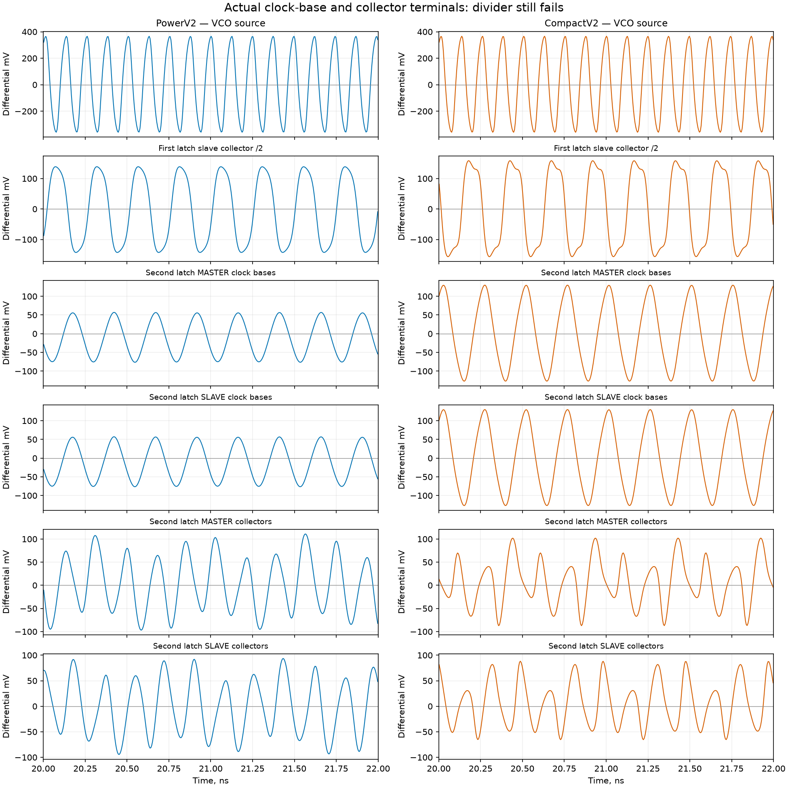

# 139 — Compact divider RC and measured timing-repair prerequisites
<!-- SPDX-FileCopyrightText: 2026 Hasan Melih Akbulut -->
<!-- SPDX-License-Identifier: CC-BY-4.0 -->

## Measured boundary — 6 October 2026

The compact divider's actual signal-metal export and loaded transistor
simulation are complete. **Electrical limits pass, but divide-by-four and
divide-by-eighty still fail.** The new TX timing candidate passes complete
binary state-function comparison and all three physical-netlist port tests;
its new detailed routing and extracted timing are separate, unfinished work
at this delivery cut. Full PCIe Gen3 x4 PHY and final whole-chip timing remain
open.

The [finite delivery inventory](../hw/soc/pcie-evidence/20261006-compact-rc-and-repair/delivery-inventory.json)
binds 24 product source files, five public archives and seven public assets.
Every one of the **592 archive members** was streamed and rehashed locally.
The compact copies retain source reviews, native results, earlier failures,
transport receipts and independent waveform analysis. Active simulation and
routing logs are excluded from this finite capture.

## Compact divider: shorter wires are insufficient

The preceding layout in [report 138](138-pcie-power-layout-and-timing-convergence.md)
passed its strict local geometry and transistor LVS checks. Fresh signal-wire
export now contains **382 resistors and 649 capacitors**, with 300 coupling
edges, 1,444 matrix entries, 205 terminal anchors and 37 conductors. Thirteen
actual raw-data corruption controls are rejected. These are the stated
bounded metal models, not foundry-qualified RF, substrate or package PEX.

The complete loaded circuit has 455 screened devices, 1,271 resistors and
1,414 capacitors. Its unchanged 34 ns transient uses the actual divider and
feedback load. All saved samples are finite and all 455 device electrical
screens pass. The minimum settled HBT VCE is **0.485621 V**, above the existing
0.4 V gate. The VCO measures **8.102486506 GHz**; the first divider stage
produces approximately **4.051234403 GHz** at its actual slave collectors.
The second stage fails the required division, leaving no valid feedback
frequency. Passing voltage/current screens does not establish clock function.

An independent reader follows each source transistor through the native
composition and terminal bijection. It recomputes all 64 HBT VCE minima from
each of the older supply-repaired and new compact captures, checking all
**13,048,695 raw values**. Both captures retain their failed functional verdict.

| Actual terminal pair | Supply-repaired layout | Compact layout |
| --- | ---: | ---: |
| Second master clock bases, differential minimum/maximum | −77.304 / +58.165 mV | −128.543 / +131.820 mV |
| Second slave clock bases, differential minimum/maximum | −77.322 / +58.262 mV | −128.600 / +131.786 mV |
| Second master collector rising-edge rate | 5.592882 GHz | 6.071595 GHz |
| Second slave collector rising-edge rate | 5.590250 GHz | 6.077664 GHz |

The last two rows describe failing waveforms; they are not valid divided clocks.
The stronger second-stage clock swing has not corrected the latch behavior.

The next isolated experiment enlarges only the second stage's two coupling
MIM capacitors, from 20 × 20 µm to 24 × 24 µm. That candidate requires its own
geometry, DRC/LVS, wire export and loaded simulation. No result from it is
included here.

## TX repair: preserve actual routed delay during optimization

The preceding TX03 route had slow-corner setup slack **−0.601762 ns**.
An earlier attempted follow-up initialized optimization with optimistic
global-route estimates, so its small sizing change did not address that
measured deficit. The new TX05 repair explicitly reloads the actual TX03
nominal SPEF after global-route initialization. The optimizer begins at
approximately **−0.602 ns**, agreeing with the saved routed report.

The completed repair performs 488 resize operations, inserts 335 setup buffers
and two hold buffers. A fresh final global-route estimate reports slow-corner
setup **+0.345354 ns**, hold **+0.065971 ns**, recovery **+0.745033 ns** and
removal **+0.177137 ns**. These are estimates, not accepted routed timing.
The original 4 ns constraint and input/output contracts remain unchanged.

The new native-expanded candidate matches **3,850 state elements and 11,680
state/output functions**. All ten injected logic faults and ten proof-binding
fault controls are rejected. The three native physical-netlist port tests
pass with no skips, covering 24,492 ns of simulation. An initial replay failed
before DUT compilation because resolving a virtual-environment Python symlink
selected the wrong interpreter environment. The preserved second replay uses
the lexical virtual-environment path; its real passing logs still retain the
inherited GPI path warning.

A corrected child-process owner also passes eight actual lifecycle controls,
including an exited leader with a live TERM-ignoring descendant. It retains the
leader identity until the group is empty. Healthy native jobs have no elapsed
watchdog. The correction prevents cleanup from silently leaving subprocesses
behind; it does not change circuit constraints or acceptance thresholds.

The [complete TX05 pre-route capture](https://github.com/Melihakbulut221/nssoc/releases/download/evidence-20261005-pcie-continuation/pcie-tx-repair05-preroute-proof-ports-20261006.tar.xz)
contains 105 verified members. Fresh detailed routing must retain the proved
netlist and reach zero router DRC before extraction. The same nominal PDK RC
model will then be analyzed against all three cell corners; this will still
not constitute qualified RC-corner or full-chip signoff.

## PLL numerical experiment: change only the maximum step

The completed earlier 2.5 ps acquisition replay retained a failing comparison
against the 5 ps run: approximately 695 ps of matched phase difference against
a predeclared 50 ps bound. Both saved operating-point payloads were identical.
Inspection of the [ngspice 47 transient implementation](https://github.com/imr/ngspice/blob/ngspice-47/src/spicelib/analysis/dctran.c)
shows that the requested output step also affects startup integration. The
previous comparison changed both requested output step and maximum step.

A separately versioned producer therefore holds **TSTEP at 2.5 ps** and changes
only **TMAX to 1.25 ps**. The 1 µs circuit, 539 devices, initial conditions and
100 ppm / 50 ps comparison bounds remain fixed. Forty-three source and control
tests pass, and the new actual operating point is byte-identical to the
completed reference: 825 values, 6,600 bytes. The fresh native acquisition is
running; there is no new convergence verdict in this delivery. No phase offset
is subtracted to turn the earlier failure into a pass.

The [finite method and launch capsule](https://github.com/Melihakbulut221/nssoc/releases/download/evidence-20261005-pcie-continuation/pcie-pll-maxstep125-methods-launch-20261006.tar.xz)
contains 44 verified members. The copied upstream analysis sources retain
University of California copyright and Modified BSD terms. The accompanying
upstream licensing document retains its separate CC-BY-SA-4.0 license.

## Remaining acceptance

The compact divider still needs valid loaded division, and the full PLL/CDR
and serial PHY need complete electrical and numerical qualification. TX05,
RX16one and the packet-integrity timing experiments require their own final
measurements. Their independent progress does not qualify main-chip timing.
The strict NPU repaired-netlist MBIST/28-check boot described in
[report 137](137-npu-initialization-reconvergence.md) remains a separate running
experiment. Qualified SRAM Liberty/RC, full-chip I/O/LVS and manufacturing
approval remain open.
