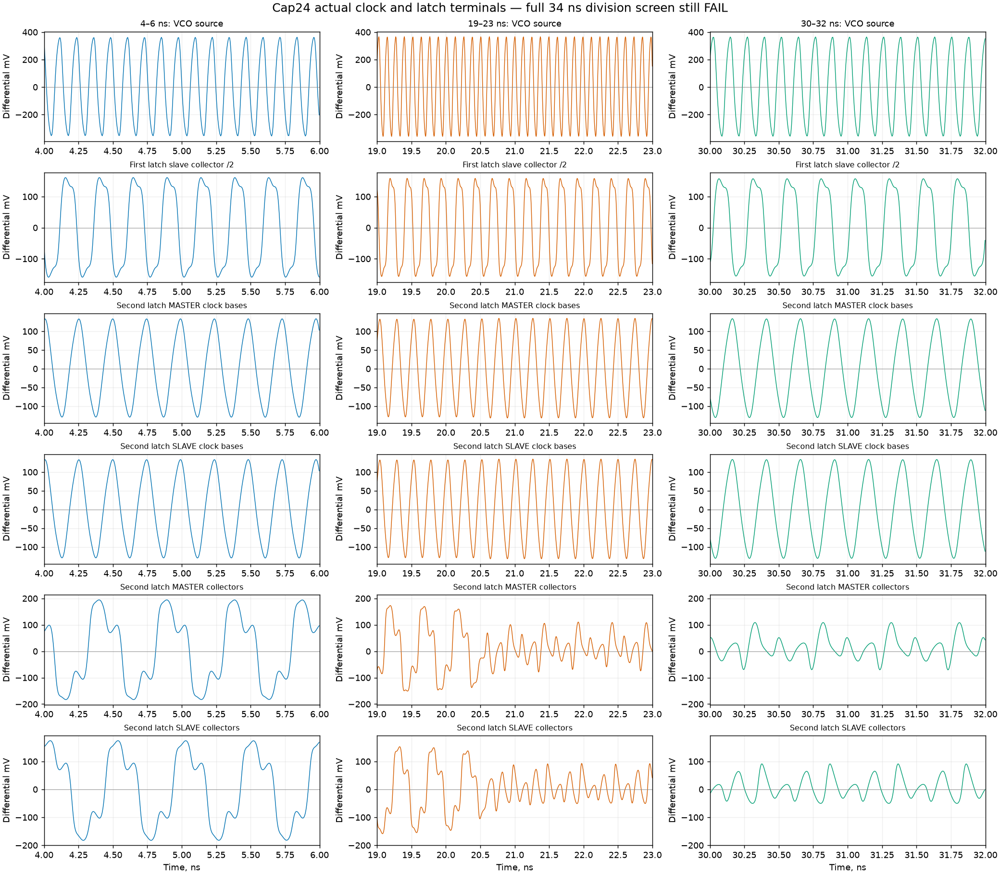

# 141 — Loaded divider capacitor experiment and repaired NPU boot
<!-- SPDX-FileCopyrightText: 2026 Hasan Melih Akbulut -->
<!-- SPDX-License-Identifier: CC-BY-4.0 -->

## Measured result — 6 October 2026

**The repaired NPU full-chip boot passes power-on MBIST and all 28 firmware
checks.** This closes the reproduced initialization failure for the exact
factored netlist. The separate PCIe divider capacitor experiment passes its
physical and electrical screens but fails the complete loaded divide-by-four
and divide-by-eighty checks. Full PHY and final whole-chip timing remain open.

The [finite delivery inventory](../hw/soc/pcie-evidence/20261006-cap24-and-repaired-boot/delivery-inventory.json)
binds 26 product files, the saved independent reviews and five complete public
archives. All **1,294 archive members** were streamed and rehashed locally.
Authenticated and anonymous readbacks of all six release assets pass. This
record excludes later analog experiments and ongoing routing/PLL work.

## Exact repaired netlist: complete strict boot passes

The [completed native run](https://github.com/Melihakbulut221/nssoc/actions/runs/37403350883)
uses source revision `c82d1280052c0da65281d87cda9af3b1c6177291`. Its retained
raw log reports:

```text
QUALIFICATION_MBIST PASS cycles=983043
LOGICROM_GL cycles=1596123 checks=28 fails=00000000 code=00000000 magic=600dc0de watchdog=1/0/0 flash_violations=0 uart_pass=1 framing=0
LOGICROM_GL PASS checks=28
```

The native process returns zero after 5,457.272 seconds. The firmware, vendor
SRAM models, compiled inputs and original three-million-cycle bound are
unchanged. The repaired vendor netlist is bound to the
[exact local physical-memory mapping](137-npu-initialization-reconvergence.md).
This is the actual complete boot, not a synthetic checker fixture.

Independent review rehashes all 211 files in the
[complete native archive](https://github.com/Melihakbulut221/nssoc/releases/download/evidence-20261005-pcie-continuation/nssoc-npu-eco-full-boot-20261006.zip),
checks the full progress history, both 256-case four-state primitive tables
and the exact inverse of the one-gate factoring change. The archive is
15,941,823 bytes with SHA-256
`329168d2296c77f92587f3d4baa6c5924eb9944300f1be6fb3529500ff6ef6cf`.
Its [validation record](https://github.com/Melihakbulut221/nssoc/releases/download/evidence-20261005-pcie-continuation/nssoc-npu-eco-full-boot-validation-20261006.json)
retains the actual input and output identities.

The prerequisite checker now returns
`READY_FOR_REVIEWED_PHYSICAL_EXPERIMENT_ONLY`: accepted binary relation,
exact memory mapping and successful strict boot are joined. The earlier
BLOCKED capture in [report 140](140-pcie-integrity-and-chip-prerequisites.md)
remains historical evidence from before this result arrived. The original
failed candidate boot is also retained. This result does not qualify SRAM
electrical behavior or grant final timing, physical adoption or production
approval.

## V8 capacitor layout: geometric checks pass, loaded division fails

Only the two MIM capacitors `XCP` and `XCN` change from 20 × 20 to 24 × 24 µm.
The 36 µm placement pitch, topology and other 89 intrinsic device geometries
remain unchanged. All 21 selected native physical gates and six actual
geometry fault controls pass. These are the recorded cell-level checks,
not whole-chip manufacturing qualification.

Fresh wire extraction has seven geometry stages, five input-binding controls
and thirteen wire fault controls. The source/native bijection covers 91
devices, 283 terminals and 72 clusters. The extracted wire network contains
382 resistors and 649 capacitors. The loaded composition uses this actual
geometry together with the existing transistor models; it is still an
experimental RC model rather than foundry-qualified signoff extraction.

The complete 34 ns transient with a 5 ps output step saves 6,817 rows and
**6,523,869 finite scalar values**, including time. All 455 selected electrical
device screens pass; the minimum settled collector-emitter voltage across
all 64 HBTs over 4–34 ns is 0.485642 V. Both full-run divider function checks
fail. The complete raw
capture is retained; the later diagnostic windows do not replace the original
acceptance interval.

| Observed signal | 4–20 ns diagnostic window | 22–34 ns diagnostic window |
| --- | ---: | ---: |
| VCO | 8.113360 GHz | 8.089117 GHz |
| First divider slave | 4.056713 GHz | 4.044584 GHz |
| Second divider master | 2.028770 GHz | 6.067796 GHz crossing rate |
| Second divider slave | 2.028596 GHz | 6.070369 GHz crossing rate |

The late second-stage crossings are irregular and do not represent a valid
divided clock. An independent reread of every saved raw value and the actual
device/terminal identities reproduces these diagnostic measurements and all
64 HBT voltage minima. The waveform shows loss of second-stage division near
20.6 ns while the VCO and first divider remain active. This narrows the next
repair to second-stage operation; it does not establish a unique analog cause.



The [complete loaded capture](https://github.com/Melihakbulut221/nssoc/releases/download/evidence-20261005-pcie-continuation/pcie-vco-v6-divider-cap24-v1-wire-06-01.tar.xz)
contains 187 members and 48,827,684 bytes, SHA-256
`30e94da711cc76aff8cb5e67fd415f887e3a44b5c3d9208d9d790b89725ae48f`.
The inventory also retains the separate native geometry, wire extraction and
additive review archives, including failed source/control attempts and their
corrections. No successful short diagnostic interval is substituted for the
failed full loaded-divider result.

## Remaining acceptance boundary

The NPU repair is ready for a matched physical experiment under the original
clock, pin and SRAM placement constraints. Its final placement, detailed
route, extracted timing and post-layout functional checks are still required.
The analog divider still needs a loaded functional repair and broader
validation. PLL numerical convergence, full SERDES/PCS/LTSSM, serial PHY/main
chip integration, qualified SRAM/RC, final setup/hold and complete chip
DRC/LVS remain open, as does manufacturer approval.
