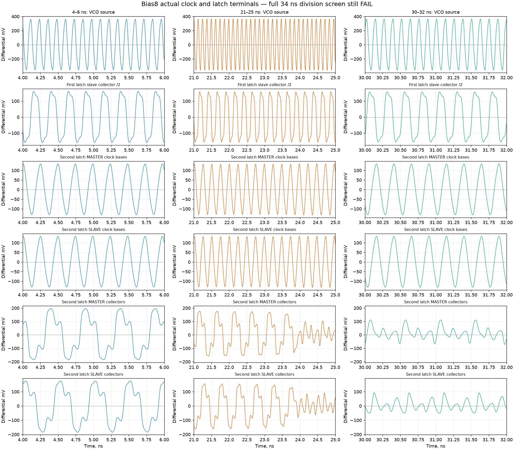

# 143 — Divider margin, accepted-header logic and routed transmitter
<!-- SPDX-FileCopyrightText: 2026 Hasan Melih Akbulut -->
<!-- SPDX-License-Identifier: CC-BY-4.0 -->

## Measured result — 6 October 2026

The routed transmitter's slow-corner setup improves by **295.519 ps**, but
still misses the unchanged 4 ns target by 306.243 ps. The V23 packet-integrity
candidate also improves its synthesis timing screen without closing setup.
The Bias8 analog divider passes its declared electrical screens yet loses
usable output amplitude during the full 34 ns simulation. None is accepted
as a complete PHY or a timing-closed chip.

Separately, the long V18 MAX4118 regression completes: all thirteen direct
tests and thirteen cycle-miter tests pass. That result applies to the exact
V18 implementation and does not substitute for later candidates' tests.

The [delivery inventory](../hw/soc/pcie-evidence/20261006-divider-integrity-and-routed-tx/delivery-inventory.json)
binds the source files, preserved failures, independent reviews and immutable
public captures. The [preceding chip/receiver record](142-chip-placement-and-routed-receiver.md)
retains the matched chip placement results and RX16one routed timing.

## Bias8: physical checks pass; full-window divider function still fails

The [V9 divider](../hw/soc/analog/pcie/clock_div4_hbt_v9.spice) changes only
the two top-level clock pull-down resistors from L7 to L8 µm. Both capacitors
remain 24 µm; the other 89 intrinsic devices and circuit topology are unchanged.
Actual native geometry completes the 21 physical checks and eight deliberate
geometry-fault controls. Main DRC and strict deep/flat transistor LVS pass
within the standalone divider scope.

Fresh geometry and terminal binding retain 91 devices, 283 terminals and
72 clusters. The wire model contains 382 resistors and 649 capacitors; all
thirteen RC fault controls pass. This geometric RC model is not qualified
process extraction. The composed loaded VCO/divider uses 1,271 resistors and
1,414 capacitors and preserves the source-to-native device bijection.

All 455 declared electrical screens pass in the actual 34 ns, 5 ps-step run.
The full-window /4 and feedback-division function still fails. The output's
regular interval lasts longer than the preceding capacitor-only experiment,
but ends around 23.7 ns; an early passing interval cannot accept the run.

Independent raw-waveform review rechecks every saved numeric value and all
64 HBT settled collector-emitter minima. It selects the actual device
terminals through the native/source bijection. The VCO and first divide-by-two
remain regular while the second-stage differential output amplitude collapses.
Its late small zero crossings yield an apparent rate near 6 GHz; this is
ringing around zero, **not a valid 6 GHz divided output**. No complete ±100 mV
or ±150 mV collector excursions remain after 24 ns.

The measured collector-to-regenerative-base attenuation stays about 0.92–0.94
through the collapse. The second stage's differential hold current drops
from about 1.13 mA to 0.40 mA while its hold-tail current changes only from
about 1.46 mA to 1.43 mA. These observations support testing regenerative
margin in that stage; they do not establish a repaired circuit. The subsequent
single-resistor reference-current experiment is excluded from this record.

## V23: precompute adjacent accepted-header relationships

The [generator](../scripts/generate_pcie_integrity_header_v23.py) registers
the adjacent STP/header-length relation with each accepted block. The last
word from the preceding accepted block supplies the next block's word-zero
context. The public cycle schedule and 4 ns timing target remain unchanged.

The completed control campaigns preserve their actual history: 28 pass/7 fail,
then 6 pass/3 fail, then 3 pass/0 fail. The initial observer/schema problems and
the surviving promotion mutant are retained. A stronger real-framer block
burst exercises fourteen promotions, thirteen changed-relation promotions
and thirteen simultaneous promotion/acceptance events, with both input and
output stalls. It detects the stale-promotion mutant at 28 ns.

The combined evidence covers the eighteen direct public profiles and eighteen
cycle-miter profiles, 557,056 literal binary vectors and 1,440 X/Z vectors.
It preserves the original seventeen-profile prefix. This is explicit combined
coverage across the recorded campaigns, not a claim that every earlier run
passed. The MAX4118 profile is excluded from V23's completed checks.

A subsequent clean execution of the final source files passes all **36
non-MAX4118 tests**, including the real block-burst test, with zero failures
and two MAX4118 predicates deselected. It finishes in 450.62 seconds. Its
full native test artifacts are retained separately; the earlier 47 execution
records remain unchanged. This closes the current non-MAX4118 regression
without changing the negative native setup result below.

| Cell corner, preplacement screen | Setup | Hold |
| --- | ---: | ---: |
| Slow | −3.191682 ns | +0.370623 ns |
| Typical | −0.549377 ns | +0.260212 ns |
| Fast | +0.998914 ns | +0.176000 ns |

The native design contains 94,742 cells and 8,846 flip-flops. Slow setup gains
352.600 ps over V22 and 144.601 ps over V17, but still fails. The actual mapped
graph retains the registered retire-data boundary. Its remaining critical
control path includes a shared enable tree with 697 loads; the next candidate
must reduce this measured path while preserving accepted-block semantics.
V11 remains the stable baseline. V23 is not adopted, and no routed timing,
mapped functional replay or main-chip integration is claimed for it.

## V18 MAX4118: complete long-packet functional regression

The original direct-test parent was lost, so its operating-system wait status
is unavailable. All thirteen completed direct XML cases and their compiled
simulation are preserved and independently checked; no exit code is invented.
The owned miter completes with return code zero and thirteen passing cases.

Independent review verifies all 127 archive members and the actual compiled
MAX4118/ring2048 parameters. The miter observes all seventeen public outputs
and the occupancy, commit and ingress witnesses. This closes the recorded
V18 long-packet regression. It does not establish MAX4118 timing or validate
V19–V24, full PCIe behavior, serial PHY operation or chip integration.

## TX05: improvement survives detailed routing and nominal RC

The transmitter completes detailed routing with **zero final router DRC
violations**. The routed netlist is byte-identical to the previously proved
and replayed repaired netlist. The binary comparison covers 3,850 states and
11,680 boundary functions; ten negative controls and three native public-port
cases remain bound to that same design.

Fresh nominal extraction is measured at all three cell corners. The saved
review parses every reported setup, hold, recovery and removal path and
accounts for all 150 intentionally input-only clock-tree load cells.

| Cell corner, nominal RC | Setup | Hold | Recovery | Removal |
| --- | ---: | ---: | ---: | ---: |
| Slow | −0.306243 ns | +0.042155 ns | +0.180606 ns | +0.205402 ns |
| Typical | +1.283555 ns | +0.072382 ns | +1.516654 ns | +0.177273 ns |
| Fast | +2.191549 ns | +0.097803 ns | +2.313462 ns | +0.159396 ns |

The previous routed TX03 slow setup was −0.601762 ns. The 295.519 ps improvement
is therefore measured after actual routing, not inferred from the earlier
positive global-route estimate. Slow hold decreases by 37.161 ps and remains
positive. The remaining worst setup path includes an O21AI output driving
87.569 fF with 1.032121 ns cell delay, followed by a mux with 0.594511 ns delay.
That measured load is a target for the next physical repair.

The 116-member routed capture and all three public assets are retained with
authenticated and anonymous readbacks. Zero router DRC is not foundry DRC
signoff; nominal RC across three cell corners is not qualified process-RC
coverage. Setup closure, integrated PHY operation, final chip timing,
complete chip verification and manufacturer acceptance remain open.
