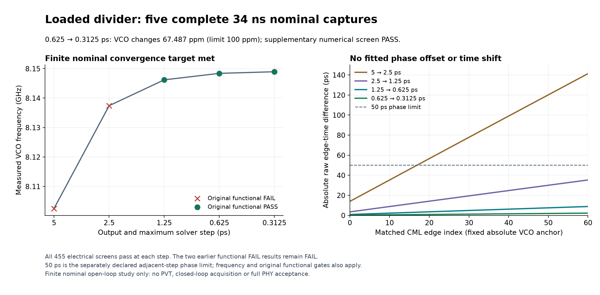

# 147 — Loaded divider meets the fixed time-step agreement checks
<!-- SPDX-FileCopyrightText: 2026 Hasan Melih Akbulut -->
<!-- SPDX-License-Identifier: CC-BY-4.0 -->

## Measured result — 6 October 2026

The finite numerical result and both complete raw captures have independent
local readback. Their immutable public archives and review records are bound
in the delivery inventory below.

The Tail115 VCO/divider now passes the predeclared numerical comparison at
the **0.625 ps and 0.3125 ps** output and maximum solver steps. The VCO
frequency changes by **67.487 ppm**, below the unchanged 100 ppm limit.
The largest unaligned edge-time difference is **2.224 ps**, below the
unchanged 50 ps limit. Both complete 34 ns runs also pass all 455 electrical
screens and all thirteen original functional checks.

This closes the specified adjacent-step test at one nominal operating point.
It does not establish the accuracy of the transistor or parasitic models,
PVT coverage, long-term jitter, PLL acquisition or PCIe clock compliance.
The actual fixed-bias VCO frequency is **8.148938 GHz**. The 67.487 ppm
figure measures sensitivity to the solver step; it is not error against the
8 GHz target or proof that a feedback loop is locked.

The [delivery inventory](../hw/soc/pcie-evidence/20261006-loaded-divider-numerical-convergence/delivery-inventory.json)
binds the finite captures, exact methods, independent readers and public
download receipts. The [preceding study](145-pcie-divider-time-step-and-prefix-timing.md)
retains the earlier strict functional failures and the rejected V24 timing
candidate. None of those historical failures is reclassified.

## Same circuit, finer sampling

All five captures retain the 455 intrinsic devices, model files, initial
conditions, supplies, 0.6 V control bias, output loads and 34 ns duration.
The acceptance window remains 4–34 ns. The changes are the solver/output
step and the explicitly bounded raw-capture capacity needed for more rows.

| Step | VCO frequency | Original functional verdict | Frequency difference from preceding step |
| --- | ---: | --- | ---: |
| 5 ps | 8.102491691 GHz | FAIL: one /4 interval counts three edges | — |
| 2.5 ps | 8.137405936 GHz | FAIL: one /4 interval counts three edges | 4,309.075 ppm |
| 1.25 ps | 8.146190014 GHz | PASS | 1,079.469 ppm |
| 0.625 ps | 8.148388270 GHz | PASS | 269.851 ppm |
| 0.3125 ps | 8.148938183 GHz | PASS | 67.487 ppm |

The two new captures pass sixty consecutive divide-by-four intervals and
two complete divide-by-eighty intervals. The feedback frequency changes by
67.334 ppm in the final pair. Maximum edge-time differences are 2.224 ps
at the VCO, 2.202 ps at the CML divider and 1.859 ps at the feedback output.
The comparison retains the declared global edge ordinals and mappings.
There is no fitted phase offset, shifted comparison window or relaxed limit.

## Complete raw replay with bounded memory

The 0.3125 ps capture contains **108,817 rows and 104,137,869 finite values**.
The independent reader streams both new captures, checking 156,214,938
values in total. It reproduces the device limits, all 64 HBT operating
bounds, the 91-device/283-terminal physical binding, divider ratios and
fixed edge correspondence. It also confirms that both native processes
have terminated and that the only circuit-deck change is the time step.

A streaming raw-table reader replaces the previous whole-table decompression
for this larger replay. It validates the complete header, ordered labels,
row/trailer dimensions, finite values and raw/payload hashes before exposing
the data. Its anonymous SSD-backed table has a 1 GiB capacity bound and a
1 GiB free-space floor, with cleanup on failure. Twenty controls cover exact
agreement with three earlier saved captures and actual malformed data,
storage-limit and cleanup cases. The original device and measurement code
is replayed from its exact source, rather than replaced with a new oracle.

The five-capture comparison peaks at 850,488 KiB resident memory; the final
raw sealer peaks at 860,692 KiB, under the unchanged 2 GiB address-space
limit. The independent two-capture reader uses about 70 MB. These are
measured resource observations for these executions, not general maxima.

The final native archive is 773,973,792 bytes. Its original monolithic upload
hit the bounded transport deadline; the failed attempt remains recorded.
An ordered manifest and 24 parts of at most 32 MiB preserve that exact archive.
Streaming concatenation reproduces the original archive hash. All 24 parts,
the manifest and the additive review archive have complete authenticated and
anonymous readback. The two new captures and their additive review archives
contain 1,311 members in total, represented by 28 public assets. The pieces
are byte slices, not standalone tar archives. The inventory links the
manifest and every part for exact reconstruction. Full archives and review
records remain available locally for independent replay.

## Connected PLL and chip work remain separate

The active long PLL acquisition uses an earlier 539-device schematic
composition. It does not contain this physically loaded Tail115 clock.
The physically loaded clock and the charge-pump/filter loop must still be
verified together. This delivery contains the finite open-loop captures;
ongoing connected-loop source development is outside its acceptance scope.

The loaded clock must first demonstrate tuning direction and range under
the intended charge-pump/filter loads. Its ideal control source must then be
replaced by the actual loop, with complete device checks and new connected
startup, acquisition and numerical comparisons. The reference PLL also does
not demonstrate data-driven CDR. Qualified inter-block/substrate parasitics,
full PHY integration and final chip setup/hold/LVS acceptance remain open.
