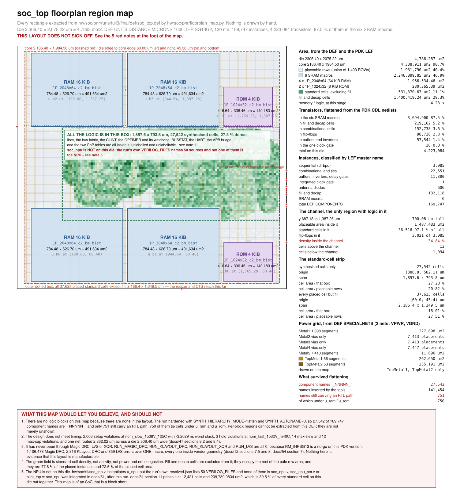

# 59 — The die, mapped: what `soc_top` is made of and where each piece sits

`docs/34-pilot-freeze.md` pins the TTIHP26b submission by blob hash and
the shuttle closes 2026-09-21. Nothing in `hw/rtl/`, `hw/tb/`, `tt/`,
`formal/` or `hw/openlane/` was modified for this document, and no run
directory was created, resumed or written to. What is new is one
script, one SVG, one JSON and this file.

Convention, as everywhere in this repository: **[fact]** = measured in
this environment or read out of a file in the working tree;
**[estimate]** = derived or judged from facts, with the derivation
stated; **[assumption]** = chosen, and named so it can be argued with.

---

## 1. Why this document exists, and the one rule it obeys

Every other physical document in this corpus reports the die as a table.
`docs/47-soc-place-and-route.md` section 6.1 gives the die and core
boxes, section 4.2 gives the macro areas, section 8.4 gives the
standard-cell span, section 8.6 gives the cell census; `docs/48-floorplan-and-capacitance.md`
gives three floorplans side by side. All of it is true and none of it is
a picture. A reader who wants to know what the chip *looks like* — the
thing an annotated die photograph gives you in one glance — has to
assemble it in their head from six tables in two documents.

So: a map. And immediately, the danger.

> **A floorplan diagram is the single artefact in this repository most
> likely to be believed without being checked.** A table of numbers
> invites arithmetic. A picture of a chip invites recognition. Draw six
> grey rectangles labelled RAM and a green blob labelled "logic", get
> the proportions roughly right, and no reader will ever verify it —
> they will simply carry it away as what the chip is. If any part of it
> is wrong, the error propagates silently and for ever.

The rule this document imposes on itself, therefore:

> **EVERY REGION, COORDINATE AND AREA ON THE MAP IS EXTRACTED FROM THE
> LAYOUT BY A SCRIPT THAT IS IN THE TREE. Nothing is positioned by
> hand, nothing is scaled to look right, and where something could not
> be extracted the map says so instead of drawing it.**

That is why the deliverable is three files and not one:

| File | What it is |
|---|---|
| `hw/soc/pnr/floorplan_map.py` | The evidence. Parses the DEF, the PDK LEF and the PDK CDL; emits the SVG and the JSON; self-checks its own geometry and cross-checks itself against the run's metrics. |
| `docs/img/soc-floorplan-map.svg` | The artefact. 236 KB, no external font, no network fetch, no script. |
| `docs/img/soc-floorplan-map.json` | Every extracted number, so a reader can check a figure in this document without re-running anything. |

The run mapped is `hw/soc/pnr/runs/full3`, the sign-off run
`docs/47` records **[fact]**. Run directories are gitignored, so the
SVG and the JSON are the durable record and the script is what
regenerates them.

---

## 2. The map



If the image does not render, `docs/img/soc-floorplan-map.svg` is a
plain SVG file and every number on it is also in section 4 below.

---

## 3. What "extracted" means here, and how it is checked

### 3.1 The scale factor is read, not assumed

```
UNITS DISTANCE MICRONS 1000 ;
DIEAREA ( 0 0 ) ( 2306400 2075220 ) ;
```

**1000 database units per micron [fact, DEF `UNITS` statement]**, so the
die is **2306.40 × 2075.22 um = 4,786,287.408 um2 = 4.7863 mm2**. The
script reads the `UNITS` line and refuses to run if the DEF does not
carry one; it never multiplies by a constant it was told.

### 3.2 The sources

| Thing on the map | Where it comes from |
|---|---|
| die box | DEF `DIEAREA` |
| core box | the run's `resolved.json` `CORE_AREA`, cross-checked against the DEF row extents |
| placeable rows | the union of the DEF's **1,403** `ROW` statements |
| site pitch | the minimum `STEP` between DEF rows: **0.48 × 3.78 um** |
| six macro rectangles | DEF `COMPONENTS` origin and orientation, size from the PDK LEF `SIZE` statement |
| every standard cell | the same, for all **169,747** components |
| cell-density field | those cells, binned at 18 um |
| power grid | DEF `SPECIALNETS`, both nets |
| die ports | DEF `PINS`, all 18 |
| transistor counts | the PDK's CDL netlists, flattened |

### 3.3 The geometry self-check

A picture cannot be diffed, so the script asserts the properties a
correct extraction must have and prints the result every run
**[fact, `floorplan_map.py` output]**:

```
  geometry self-check
    [ok ] every macro is inside the core box
    [ok ] no macro overlaps another macro
    [ok ] every standard cell is inside the die box
    [ok ] no standard cell overlaps a macro
    [ok ] every standard cell sits on a DEF ROW y
    [ok ] the macro area union equals the sum of the six rectangles
    [ok ] the placeable row union is smaller than the core box
    [ok ] core + margins reconstruct the die box
```

Three of these are also statements about the layout rather than about
the parser. "No standard cell overlaps a macro" is the same property
the flow's own `magic__illegal_overlap__count` reports as **0**; "every
standard cell sits on a DEF ROW y" would fail on any mis-handled
orientation. A disagreement here would be either a bug in this script
or a bug in the run, and both are worth knowing.

### 3.4 The cross-check against the flow's own metrics

The script classifies cells by LEF master name. That classification is
worth nothing unless it agrees with the tool's, so it is compared, every
run, against `final/metrics.json` **[fact]**:

```
    [ok ] macros                  script        6   metrics        6
    [ok ] fill cells              script   132118   metrics   132118
    [ok ] antenna diodes          script      606   metrics      606
    [ok ] sequential cells        script     3085   metrics     3085
    [ok ] clock gates             script        1   metrics        1
    [ok ] buffers+inverters       script    11380   metrics    11380
    [ok ] standard cells, no fill script    37623   metrics    37623
    [ok ] standard-cell area um2  script   531371   metrics   531371
    [ok ] macro area um2          script  2246900   metrics  2246900
    [ok ] total instances         script   169747   metrics   169747
```

Ten of ten. The two areas are the strongest of these: the script
computes **531,370.6272 um2** and **2,246,899.8528 um2** from LEF
rectangles and OpenROAD reports **531,371** and **2,246,900** — the
same numbers, rounded by the tool.

**One class the map does not claim.** OpenROAD splits buffers into
`buffer`, `clock_buffer` and `timing_repair_buffer`, and inverters into
`inverter` and `clock_inverter`. That split is a property of what a cell
is connected to, not of its name, so the script reports the five classes
as one total of 11,380 and says so, rather than guessing which buffer is
a clock buffer.

---

## 4. What the chip is made of

### 4.1 Area

| Region | Area, um2 | % of die |
|---|---|---|
| **die**, 2306.40 × 2075.22 | **4,786,287.408** | 100 % |
| **core**, 2186.40 × 1984.50 | **4,338,910.8** | 90.7 % |
| **placeable rows**, union of 1,403 `ROW` statements | **1,931,789.8656** | 40.4 % |
| **six SRAM macros** | **2,246,899.8528** | **46.94 %** |
|   4 × `RM_IHPSG13_1P_2048x64_c2_bm_bist`, 64 KiB RAM | 1,966,534.464 | 41.09 % |
|   2 × `RM_IHPSG13_1P_1024x32_c2_bm_bist`, 8 KiB ROM | 280,365.3888 | 5.86 % |
| **standard cells**, all 37,623 excluding fill | **531,370.6272** | 11.10 % |
| **fill and decap**, 132,118 cells | **1,400,419.2384** | 29.26 % |

**[fact, DEF `COMPONENTS` + LEF `SIZE`, `floorplan_map.py`]**

The die area is given here as **4,786,287.408 um2**; the run's own
`metrics.json` reports `design__die__area` as **4786290**, the same
quantity to six significant figures. The map uses the exact product of
the `DIEAREA` corners.

**The macro total reproduces `docs/47` section 4.2 exactly**: 2,246,899.85
um2, to the last digit it printed. That is worth stating because it is
an independent path to the same number — `docs/47` did the arithmetic
over six LEF `SIZE` statements, this reads six `COMPONENTS` records and
applies the LEF `SIZE` to each — and they agree.

### 4.2 The six macros, individually

| Instance | Master | Origin, um | W × H, um | Area, um2 | Orient |
|---|---|---|---|---|---|
| `u_ram.g_ram_2048x64.u_b0` | `1P_2048x64_c2_bm_bist` | (120.00, 60.48) | 784.48 × 626.70 | 491,633.6160 | FS |
| `u_ram.g_ram_2048x64.u_b1` | `1P_2048x64_c2_bm_bist` | (944.64, 60.48) | 784.48 × 626.70 | 491,633.6160 | FS |
| `u_ram.g_ram_2048x64.u_b2` | `1P_2048x64_c2_bm_bist` | (120.00, 1387.26) | 784.48 × 626.70 | 491,633.6160 | N |
| `u_ram.g_ram_2048x64.u_b3` | `1P_2048x64_c2_bm_bist` | (944.64, 1387.26) | 784.48 × 626.70 | 491,633.6160 | N |
| `u_rom.g_rom_1024x32.u_b0` | `1P_1024x32_c2_bm_bist` | (1769.28, 60.48) | 416.64 × 336.46 | 140,182.6944 | FS |
| `u_rom.g_rom_1024x32.u_b1` | `1P_1024x32_c2_bm_bist` | (1769.28, 1387.26) | 416.64 × 336.46 | 140,182.6944 | N |

**[fact, DEF `COMPONENTS`, all six `+ FIXED`]**

Two rows of three, both pin edges facing the channel between them — the
arrangement `docs/47` section 6.1 argues for and `hw/soc/pnr/floorplan.py`
generates. The map shows it rather than describing it: the memories are
two horizontal bands, top and bottom, and everything else in the design
lives in the 700.08 um gap between them.

### 4.3 Transistors

An annotated die photograph comes with a transistor count, and it is the
number that sets a reader's sense of scale. Guessing one from a cell
count would be exactly the kind of plausible figure this document exists
to refuse, so it is counted: `floorplan_map.py` reads the PDK's own CDL
netlists — **28 files, 2,319 subcircuits** — flattens every hierarchy to
`M` cards, and multiplies by the instance count in the DEF.

| Where | Transistors | % |
|---|---|---|
| the six SRAM macros | **3,694,900** | **87.5 %** |
| fill and decap cells | 219,162 | 5.2 % |
| combinational cells and ties | 152,738 | 3.6 % |
| flip-flops | 98,720 | 2.3 % |
| buffers, inverters, delay gates | 57,544 | 1.4 % |
| the one integrated clock gate | 20 | 0.0 % |
| antenna diodes | 0 | 0.0 % |
| **total on this die** | **4,223,084** | 100 % |

**[fact, PDK CDL flattened by `floorplan_map.py`; every master used by
the design resolved to a subcircuit, none was skipped]**

Per macro: **817,450 transistors** in a `1P_2048x64_c2_bm_bist` and
**212,550** in a `1P_1024x32_c2_bm_bist` **[fact]**. The 2048×64 part
holds 131,072 bits, so 786,432 transistors are the six-transistor
bitcell array and **31,018 are periphery, decoders and the BIST engine**
**[estimate, arithmetic on the two facts, assuming a 6T cell]**.

**Nothing on this die is logic, in the sense a die photograph means.**
87.5 % of the transistors are memory bitcells; another 5.2 % are decaps
that compute nothing. Ibex, the bus, the timers, the CLINT, BUSSTAT, the
UART and the APB bridge together account for **309,022 transistors, 7.32
percent** **[estimate, the sum of the combinational, sequential, buffer
and clock-gate rows]**.

---

## 5. Where the logic actually is, and the number that changes

This is the part the tables did not say, and the map makes it
unmissable.

### 5.1 Ninety-seven percent of the logic is in the channel

| Band | Cells | Cell area, um2 | Flip-flops |
|---|---|---|---|
| **the channel**, y 687.18 to 1387.26 um | **36,516** (97.06 %) | **518,208.9696** (97.52 %) | **3,021** of 3,085 |
| below it, beside the lower macro row | 1,094 | 13,040.0928 | 64 |
| above it, beside the upper macro row | **13** | 121.5648 | **0** |
| of which, in the 60.48 um strip right of the ROMs | 963 | 14,743.8144 | 109 |

**[fact, DEF component origins binned by the channel bounds, which the
script derives from the macro rectangles rather than being told]**

**Thirteen cells sit above the channel, and not one flip-flop.** The
upper half of the die outside the macros is, for practical purposes,
empty. The lower half has 1,094 cells in it, almost all of them in the
narrow strip to the right of the ROM column. Everything else — Ibex, the
whole fabric, every peripheral — is in one 700 um band across the middle
of the chip.

### 5.2 The density number, four ways

`docs/47` section 8.4's headline is **18.9 %**, and it is correct as
computed. But the map forces the question of what it is a fraction of,
and there are four defensible answers:

| Numerator | Denominator | Result |
|---|---|---|
| 396,177.6420 um2, cells as synthesised (`docs/47` §8.4) | 2,092,010.9472 um2, core minus macros | **18.94 %** |
| 402,210.7488 um2, the same cells as *placed* | 1,931,789.8656 um2, the actual `ROW` union | **20.82 %** |
| 531,370.6272 um2, every placed cell but fill | the same `ROW` union | **27.51 %** |
| 518,208.9696 um2, the cells in the channel | 1,487,483.2224 um2, the rows in the channel | **34.84 %** |

**[fact for the numerators and denominators; the percentages are
arithmetic]**

Two things follow.

**First, "placeable area" was 160,221.0816 um2 smaller than any document
has said.** `docs/47` and `docs/48` both use **2,092,010.9472 um2**, which
is the core box minus the macro area. The DEF's own rows sum to
**1,931,789.8656 um2** — 7.7 % less — because `FP_MACRO_HORIZONTAL_HALO`
and `FP_MACRO_VERTICAL_HALO` are both 10 um and the rows are cut around
the halo, not around the macro, and because a row must be a whole number
of 3.78 um rows tall and 0.48 um sites wide. Nothing was wrong; the
arithmetic answer and the extracted answer are different quantities and
this is the first document to have the extracted one.

**Second, and this is the one that matters: the region the placer
actually used is 34.84 percent full, not 18.9 percent.** `docs/48`
section 5 argues at length that FP-0's sparseness "is not slack the
placer was given"; the channel figure is the direct measurement of that
argument. The design is not a sparse chip. It is a *dense strip of logic
in a chip that is mostly memory*, and the 18.9 % is an average over a
denominator that includes **444,306.6432 um2** of row outside the
channel, in which the placer put 1,107 cells altogether and 13 above the
memories.

### 5.3 The two spans, and what the tools added

`docs/48` section 2 records the standard-cell span as **1,851.8 × 790.0
um over 27,558 cells at origin (388.8, 582.1)**, measured at
`27-openroad-cts/soc_top.def`, with the caveat that it counts only the
cells in the synthesised netlist. At sign-off, in the final DEF:

| | `docs/48` at CTS | this document at sign-off |
|---|---|---|
| origin | (388.8, 582.1) | **(388.8, 582.12)** |
| span | 1,851.8 × 790.0 um | **1,857.6 × 793.8 um** |
| cells | 27,558 | **27,542** |

**[fact, DEF component origins; the sign-off figures from
`floorplan_map.py`]**

**The origin reproduces to the last digit `docs/48` printed.** The span
grew by 5.8 um in x and 3.8 um in y — one site and one row — and the
count fell by 16 between clock-tree synthesis and sign-off, which is the
post-global-route resizer removing buffers. `docs/48`'s number is
confirmed and its provenance is now a script rather than an ad-hoc parse.

The caveat `docs/48` attached is visible on the map as a second box.
Counting *every* placed standard cell except fill, the span is
**2,186.4 × 1,349.46 um at origin (60.0, 45.36)** over **37,623 cells**
**[fact]** — the full width of the core, and 559 um taller. The
difference between the two dashed boxes is what CTS and the resizer did
to this design: 10,081 cells placed outside the region synthesis needed,
reaching to the core's own edge.

### 5.4 The clock arrives at the wrong end of the die

All 18 DEF `PINS` are extracted and drawn **[fact]**. Twelve of the
sixteen signal ports are on the east edge at x = 2306.20, three on the
west edge at x = 0.20, one on the south edge at y = 0.20; `VPWR` and
`VGND` are TopMetal1 shapes inside the die.

`clk_i` is at **(2306.20, 396.90)** — east edge, and **y = 396.90 is
below the channel**, beside the lower RAM row. The logic it drives is
between y = 687.18 and y = 1387.26. So the clock enters the die at a
corner of the memory and has to be carried past a macro before it
reaches anything sequential. `docs/47` section 8.4 measured CTS
delivering an **average sink wire length of 996.17 um** on `u_ibex.clk`;
the map shows one reason it is that large **[estimate, the port position
is a fact, the causal attribution is a judgement]**.

---

## 6. The hierarchy that is not on this map, because it is not in the layout

The brief for this document asked for the logic blocks — Ibex, the
fabric, `soc_npu` with the frozen pilot inside it, the CLINT, the
GPTIMER and its watchdog, BUSSTAT, the UART, the APB bridge — placed on
the die. **They cannot be placed, and the reason is not that the work
was not done.**

### 6.1 What the census says

`floorplan_map.py --hier-report` classifies all 169,747 component names
**[fact]**:

```
  total components            169747
  anonymous `_NNNNN_`          27542  (16.23 %)
  FILLER_*                    132118  filler, placed by FillInsertion
  ANTENNA_*                      606  antenna diode, placed by RepairAntennas
  clkbuf_*                       321  clock buffer, inserted by CTS
  hold*                         3549  hold-fix buffer, inserted by the resizer
  fanout*                       2771  max-fanout buffer, inserted by the resizer
  rebuffer*                      919  setup rebuffer, inserted by the resizer
  wire*                          595  long-wire buffer, inserted by the resizer
  input*                           2  input port buffer
  output*                         10  output port buffer
  max_cap*                        11  max-cap repair cell
  <other>                        552
  dotted RTL paths               751  (0.442 %)
      u_ram                             584
      u_rom                             166
      u_ibex                              1
```

**751 of 169,747 component names carry an RTL path, and 750 of those are
tie cells named after the six memory macros.** The one remaining is
`u_ibex.core_clock_gate_i.u_icg`, the integrated clock gate. The nets
are no better: the DEF declares **37,156** signal nets and they are
named `_00000_` upward.

### 6.2 Why

```
SYNTH_HIERARCHY_MODE = flatten
SYNTH_AUTONAME       = False
```

**[fact, `hw/soc/pnr/runs/full3/resolved.json`]**

Yosys flattened the design and did not auto-name the results, so a cell
that came out of `soc_clint` and a cell that came out of `soc_uart` are
both `_NNNNN_` and there is nothing in the sign-off database that
distinguishes them. This is a normal and defensible synthesis choice —
it is what lets the optimiser cross module boundaries, and `docs/45`
section 6.3 measures the design as **4,396.3668 um2 smaller than the sum
of its parts** partly because of it — but it means the physical database
has no memory of the logical one.

> **A per-block region map of this die cannot be extracted. Drawing one
> would be inventing it.** The boxes would be plausible, they would be
> in roughly the right places, and they would be fiction. This document
> declines.

### 6.3 What it would take

Three routes, in increasing cost, none of them run here:

1. **`SYNTH_KEEP_HIERARCHY_MODULES`** naming `soc_clint`, `soc_uart`,
   `soc_gptimer`, `soc_busstat`, `soc_apb_bridge`, `soc_bus`,
   `soc_pnp`, `soc_apb_pnp` and `ibex_top`. LibreLane supports it; it
   costs optimisation quality across those boundaries, which is exactly
   the 4,396 um2 above and possibly some timing, on a design that
   already fails setup by 3.2029 ns. **[estimate]**
2. **`SYNTH_AUTONAME = 1`**, which names cells after the signal they
   drive. It does not restore hierarchy, but it restores enough of the
   RTL signal names that a prefix census would attribute most cells.
   Cheaper, and partial. **[estimate]**
3. **A hierarchical or partitioned flow**, with the blocks hardened
   separately and assembled. That is a different project.

None of these is worth doing for a picture. All of them are worth
knowing about if the question ever becomes "which block is the
congestion in", because today that question has no answer in this
database either.

### 6.4 What *can* be said about placement without hierarchy

Two things, both extracted:

- **The 3,085 flip-flops are the state of the machine**, and 3,021 of
  them are in the channel, 64 below it and none above it **[fact]**.
  Where the flops are is where the blocks are, even unlabelled.
- **The tie cells still carry macro paths.** 584 tie cells under
  `u_ram` and 166 under `u_rom` **[fact]** — those are the memories'
  unused BIST and byte-mask inputs being tied off, and they are the only
  named logic on the die.

---

## 7. The NPU is not on this die

The brief asked for `soc_npu` with the frozen pilot inside it. It is not
there, and this is the most important thing on the map.

`hw/soc/rtl/soc_top.v` instantiates `u_npu` unconditionally. The run's
own frozen configuration does not include it
**[fact, `hw/soc/pnr/runs/full3/resolved.json`]**:

- `VERILOG_FILES` lists **50 sources**, and not one of them is
  `soc_npu.v`, `soc_npu_ser.v`, `pilot_top.v`, `lif_core.v` or
  `aer_fifo.v`.
- The DEF holds **27,542 synthesised cells**, consistent with `docs/47`
  section 6.1's hardened netlist of **27,565**. `docs/51-npu-integration.md`
  section 11 prices `soc_npu` at **12,421 cells and 209,739.0834 um2**.
  A netlist containing it would be about 40,000 cells.

`docs/51` says so itself, in its own section 11: *"`docs/47`'s sign-off
does not include this block."* This map is the picture of that sentence.
**209,739.0834 um2 is 39.5 % of every standard cell on this die put
together** **[estimate, arithmetic against the extracted 531,370.6272]**,
and there is no floorplan behind it.

So the map's most honest label is the one that names an absence: the
neuromorphic accelerator this SoC exists for has never been placed.

---

## 8. The power grid

Both `SPECIALNETS` are extracted **[fact]**:

| Layer | Stripe segments | Via placements | Union area, um2 |
|---|---|---|---|
| Metal1 | 1,398 | 7,415 | 227,898.21 |
| Metal2 | 0 | 7,413 | 0 |
| Metal3 | 0 | 7,413 | 0 |
| Metal4 | 0 | 7,447 | 0 |
| Metal5 | 7,413 | 7,447 | 11,696.06 |
| TopMetal1 | 66 | 2,358 | 262,649.95 |
| TopMetal2 | 53 | 0 | 255,190.76 |

Two nets, `VPWR` and `VGND`. The map draws TopMetal1 and TopMetal2
only. Those 66 and 53 segments resolve to **62 distinct vertical stripe
positions on TopMetal1 and 53 horizontal on TopMetal2, every one of them
2.20 um wide** **[fact]** — because the thin-metal grid is 46,000 segments and
drawn it is a solid block, not a map.

**Metal2, Metal3 and Metal4 appear only as via placements.** That is not
a parsing failure: a DEF special-wire statement of one point followed by
a via name has no extent, so the script counts them and does not draw
them, and says which it did. The 7,447 Metal4 vias are the mechanism
`hw/soc/pnr/pdn_macro.tcl` exists to create — `docs/12` section 7.3
found that the stock LibreLane macro grid bonds TopMetal1 to TopMetal2
and never descends to the RM_IHPSG13 supply pins on Metal4. The run
reports `design__power_grid_violation__count` **0** on both nets
**[fact]**, so the file worked.

---

## 9. What this map does NOT show

Stated plainly, because a map that does not say what it omits is a map
that implies it omits nothing:

1. **Routing.** 3,095,532 um of routed wire over 37,156 nets are in the
   same DEF and are not drawn. Drawn, the die would be a grey rectangle.
2. **Logic blocks.** Section 6. Not merely unshown — unextractable.
3. **The NPU.** Section 7. Not in the design.
4. **Congestion, IR drop, activity, power, temperature.** The green
   field is standard-cell *area* per bin. It is not a heat map of
   anything that happens at run time.
5. **The thin-metal power grid**, and every via in the design — 286,273
   of them, all single-cut **[fact, `docs/47` section 8]**.
6. **The GDS.** `final/gds/soc_top.gds` is 80 MB and was not read; the
   map is built from the DEF, which is the placement database the GDS
   was streamed from. If the two disagree the map is wrong, and nothing
   here checks that they agree.
7. **Fill and decap as individuals.** 132,118 of them, 29.26 % of the
   die and 72.5 % of the placed cell area, shown only as the pale row
   background.
8. **Any physical-verification result**, because there are none.

---

## 10. The uncomfortable facts, on the same page as the picture

All five are printed on the SVG itself, not only here, because the
picture will travel without the document. Two of them — the missing
hierarchy and the missing NPU — are sections 6 and 7 above; the rest
follow.

### 10.1 It does not meet timing

| Corner | setup ws | setup vios | hold ws | hold vios | max slew | max cap |
|---|---|---|---|---|---|---|
| `nom_slow_1p08V_125C` | **−3.2029** | **2,003** | +0.4082 | 0 | **14** | **10** |
| `nom_typ_1p20V_25C` | +5.7231 | 0 | +0.0367 | 0 | 0 | **10** |
| `nom_fast_1p32V_m40C` | +10.6634 | 0 | **−0.2015** | **3** | **1** | **12** |

**[fact, `docs/47` section 7.3 and 8.2, from
`19-openroad-stapostpnr/summary.rpt`]**

Setup fails, hold fails, max slew fails, max cap fails at all three
corners. `docs/47`'s 43.10 MHz is what this floorplan achieves, not what
this design achieves.

### 10.2 One net is longer than the die is wide

`route__wirelength__max` is **2,332.02 um** **[fact, `final/metrics.json`]**.
The die is **2,306.40 um** wide. A single net is **101.1 %** of the die
width and **3.33 times** the height of the 700.08 um channel that
contains all the logic **[estimate, arithmetic]**. The map shows the
geometry that permits this: a strip of logic 1,857.6 um long with
memories above and below it and nowhere else to go.

### 10.3 It has never been through DRC, LVS or XOR

`RUN_MAGIC_DRC`, `RUN_KLAYOUT_DRC`, `RUN_KLAYOUT_XOR` and `RUN_LVS` are
all 0 **[fact, `docs/47` section 9]**, and the run's own log says so on
the way out **[fact, `hw/soc/pnr/runs/full3/flow.log`]**:

```
'design__lvs_error__count' not reported. Netgen.LVS may have been skipped.
klayout__drc_error__count not reported. KLayout.DRC may have been skipped.
magic__drc_error__count not reported. Magic.DRC may have been skipped.
```

The reason is `docs/12-sg13g2-flow-bringup.md` sections 7.5 and 8:
**1,106,478 Magic DRC errors, 2,316 KLayout DRC errors and 359 Netgen
LVS errors over ONE RM_IHPSG13 macro, every one of them inside vendor
geometry this project does not author**, and the recommendation
**NO-GO on RM_IHPSG13 integration**. `docs/54-klayout-deck-and-the-macro.md`
section 7 examined the KLayout half in detail and the exit stayed shut:
the deck that returns 0 is the PDK's *unverified* residual set.

> **Every rectangle on this map is a rectangle whose manufacturability
> has never been checked.** Six of them are known to fail the checker
> that would check them.

### 10.4 The logic is 18.9 percent of a denominator that does not describe it

Section 5.2. Both numbers are true; the one that describes what the
placer did is 34.84 %, and it is nowhere in the corpus until now.

---

## 11. Numbers this document corrects

| Where | What it says | What the DEF says |
|---|---|---|
| `docs/47` §1 and §4.2 | "2,246,899.85 um2 of macro, against **523,809.64 um2 of standard cells**: the memory is **4.29 times** the logic" | 523,809.6444 um2 is the **rejected `deferred_flatten` netlist** (§6.3), not the one hardened. The placed standard cells are **531,370.6272 um2** and the ratio is **4.2285**; against the as-synthesised 396,177.6420 it is **5.6714**. Three numbers, three ratios; the DEF's is the one on this map. |
| `docs/47` §6.1, `docs/48` §4.1 | placeable area **2,092,010.95 um2** | that is core minus macro. The DEF's 1,403 `ROW` statements union to **1,931,789.8656 um2**, 7.66 % less, because of the 10 um macro halos and site quantisation. |
| `docs/48` §2 | standard-cell span **1,851.8 × 790.0** over **27,558** at origin (388.8, 582.1), at CTS | at sign-off, **1,857.6 × 793.8** over **27,542** at origin **(388.8, 582.12)**. The origin reproduces exactly; the span grew one site and one row. |
| `docs/47` §8.4 | "the standard cells occupy 396,178 um2 of a placeable area of 2,092,010 um2 — **18.9 %**" | correct as stated. Inside the channel, which is where 97.06 % of the cells are, the density is **34.84 %**. |

None of these is an error of measurement. Every one is a case of two
true quantities with the same name, and the map is what made the
difference visible.

---

## 12. Scale: what a reader coming from a die photograph should know

The mental model a reader brings to an annotated die shot comes from
parts with a hundred to ten thousand times this transistor count. One
paragraph to set it.

**This die is 4.7863 mm2 and holds 4,223,084 transistors** **[fact]**,
of which 87.5 % are SRAM bitcells. The whole design has **72 KiB of
on-chip memory** — 64 KiB RAM and 8 KiB ROM — occupying **46.94 % of the
die**.

GR801, the reference part `docs/01-reference-decomposition.md` and
`docs/00-reference-brief.md` decompose, is a NOEL-V plus a BrainChip
Akida instance on **STMicroelectronics 28 nm FDSOI**, in a **23 × 23 mm
441-ball BGA**, with **11.2 MB of on-chip SRAM** — 8 MB system side plus
3.2 MB private to the Akida unit **[fact, `docs/01` §2.4 and §2.6]**.
**No GR801 die area is public**: `docs/08-gr801-datasheet-notes.md`
section 1 establishes that the only public document is a product brief,
which carries no die figure. So the comparison cannot be die to die, and
this document will not invent one.

What can be compared is memory, because both sides of it are measured:

- This die's SRAM density, from the extracted macro area and the bit
  count, is **3.8094 um2 per bit** **[fact, 2,246,899.8528 um2 for
  589,824 bits]**. That is close to `docs/01` section 3.2's estimate of
  ~3.6 um2/bit for a 130 nm foundry compiler, which is worth noting as
  independent corroboration of that table.
- GR801's 11.2 MB is **93,952,410 bits** **[estimate, assuming MB means
  2^20 bytes]**, **159.3 times** this design's 589,824.
- At this die's measured density, GR801's memory alone would need
  **357.9 mm2** — **74.8 times this entire die** **[estimate, arithmetic
  on the two facts]**.

That is the sentence worth carrying: **the reference part's memory,
built out of the macros on this map, would be seventy-five chips this
size.** It is the same 70–90× gap `docs/01` section 3.2 derived from
published density figures, now measured on this project's own layout
rather than estimated from a table.

And the transistor count sets the other axis. **4.22 million.** A modern
processor die photograph of the kind that prompts a question like "what
does our chip look like?" is of a part several orders of magnitude
larger, in a process many nodes finer **[estimate, not measured here and
not claimed precisely]**. The proportions on this map — one very
large memory, one small strip of logic — are what a chip looks like when
its logic is 300 thousand transistors and its memory is 3.7 million.

---

## 13. Reproducing this

```
python3 hw/soc/pnr/floorplan_map.py
python3 hw/soc/pnr/floorplan_map.py --hier-report
```

The first regenerates `docs/img/soc-floorplan-map.svg` and
`docs/img/soc-floorplan-map.json` and prints every number in sections 3,
4, 5 and 8, including the eight geometry self-checks and the ten metric
cross-checks. The second prints the census in section 6.1. Both run in
about six seconds against the 52 MB DEF, use the Python standard library
only, and write nothing outside `docs/img/`.

Other options: `--run <dir>` to map a different LibreLane run,
`--bin <um>` to change the density bin, `--out-svg` / `--out-json`,
`--no-write` to print without writing.

The script reads:

- `hw/soc/pnr/runs/full3/final/def/soc_top.def` — the layout;
- the LEF files named by that run's `resolved.json` — cell sizes;
- the PDK's CDL netlists beside those LEFs — transistor counts;
- `hw/soc/pnr/runs/full3/final/metrics.json` — **for cross-checking
  only**. No metric is copied onto the map. Everything drawn is
  computed from the DEF, and the metrics are there to disagree with it.

It writes SVG by hand rather than through a plotting library on purpose:
the artefact must render with no external font, no CDN, no script and no
Python at all, in a browser and in GitHub's markdown renderer. It is
236 KB, which is large for a repository file and small enough to live in
one; the density field is the bulk of it, and `--bin 30` roughly halves
it if that ever matters.

---

## 14. What was not done

- **`scripts/build_docs.py` does not copy `docs/img/`.** The generated
  site will render this page with a broken image until it does; the
  markdown link is correct and the file is in the tree. The generator is
  shared, so this is recorded rather than fixed **[fact, there is no
  asset-copying path in `scripts/build_docs.py`]**.
- **The SVG was not visually rasterised.** No renderer was available in
  this environment, so the map was verified structurally instead: it
  parses as XML, and every rectangle, circle and text element was
  checked to lie inside the viewBox with no element overlapping the
  notes panel **[fact]**. Its *appearance* has not been seen by anyone
  and should be looked at before this is published anywhere.
- **The GDS was not read.** Section 9 item 6.
- **No per-block attribution was attempted by any indirect route** —
  not by net name, not by clock-tree topology, not by re-synthesis. Two
  of those are possible in principle; none was done, and section 6.3
  says what would be needed.
- **No run was created, resumed or modified.** The extraction is
  read-only against `runs/full3`.
- **`docs/00-index.md` was edited in one place only**: the row for this
  document.

---

## 15. Wall time

Extraction, script, self-checks, SVG, this document and its index row:
**30 minutes** **[fact, session clock]**. The script itself runs
in **6.5 seconds** against the 52 MB DEF, single-threaded, standard
library only.

---

## 16. What the map made visible that the tables did not

Five things, in the order they surprised:

1. **The upper half of the die outside the macros is empty.** Thirteen
   cells and no flip-flops above the channel. No table said this and no
   table would have; it is a spatial fact.
2. **The channel is 34.84 percent dense, not 18.9.** The headline
   sparseness figure averages over row area the placer barely touched.
3. **The clock enters the die below the logic**, at (2306.20, 396.90),
   beside a memory macro rather than beside anything it drives.
4. **The placeable area is 160,221 um2 smaller than every document
   states**, because the halo and the site grid take a share the
   arithmetic did not.
5. **The neuromorphic accelerator is not on the neuromorphic SoC's only
   floorplan.** That is in `docs/51` in one sentence, and it is a
   different thing to see the die with nowhere for it to go.

And one thing the map refuses to make visible, which is the point of the
document: **there is no Ibex on this die, and no CLINT, and no UART —
not because they are absent, but because the sign-off database no longer
knows which cells they are.**
