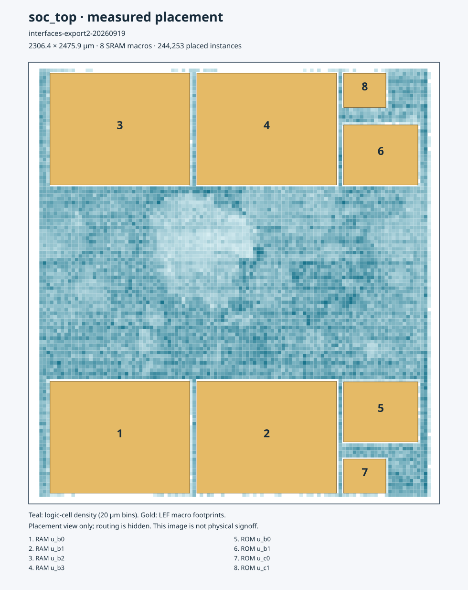

# 88 — SpaceWire, CAN, SPI and I2C integration

2026-09-19. This work extends `soc_top`, not the frozen Tiny Tapeout pilot.
In the explicitly selected full profile the four previously reserved slots
contain real RTL, physical pins and interrupts. Since 21 September the default
base profile includes SPI/I2C and reserves SpaceWire/CAN with bus errors.

## Scope and dependencies

| Block | Implementation | Integration |
|---|---|---|
| SpaceWire | Pinned SpaceWire Reloaded `spwstream`, generic RX/TX | Single endpoint; APB PIO; 64-character RX, 16-character TX; strict timecodes; IRQ line 5 |
| CAN | Pinned Mohor CAN 2.0B controller | SJA1000 byte registers through the proved APB/Wishbone bridge; IRQ line 6 |
| SPI | Project `soc_spi.v` | 8-bit transactions, modes 0–3, two chip selects; IRQ line 7 |
| I2C | Pinned MIT `i2c_master` plus project APB wrapper | 7-bit addressing, read/write, repeated START, stretching, NACK and timeout; IRQ line 8 |

The PnP identification values retain their assigned device numbers. Software
must use the **project register maps** below for SpaceWire, SPI and I2C; these
are not binary-compatible GRLIB drivers. CAN uses the documented SJA1000 map.
SpaceWire is PIO, not the originally proposed DMA channel or a four-port router.
CAN is classical 2.0B, not CAN FD. SPI supports continuous-CS multi-byte transfers through its HOLD control bit.

`make soc-interfaces-prepare SOC_INTERFACE_PROFILE=full` fetches four commits pinned in
`hw/soc/tools.soc.mk` and runs `hw/soc/flow/prepare_interfaces.py`. The generator
refuses dirty or differently pinned upstream trees. It expands their includes
into ignored `hw/soc/gen/interfaces-full.bundle.vh`, retains upstream notices, and
writes input and output SHA-256 values to `interfaces-full.bundle.json`. The `.vh`
extension deliberately keeps the bundle out of the Ibex `gen/*.v` source glob.
Verilog-2005 keyword directives permit upstream's port named `do` in Icarus's
SystemVerilog mode; Yosys uses its native Verilog frontend. Upstream's implicit
wire declarations are permitted within the generated bundle. No upstream
checkout is modified.

SpaceWire and CAN carry LGPL-2.1-or-later, I2C/Ethernet MIT. The two LGPL cores are
used only in the full profile; the earlier assessment-only statement in docs/65 is
historical. They are not copied into the frozen pilot or relabelled under the
project's licence. External LVDS transceivers for SpaceWire, a CAN transceiver,
and open-drain I2C pads/pull-ups remain board/pad integration requirements.
The CAN source retains its Bosch protocol notice; this integration provides
no patent clearance or silicon permission.

The default `SOC_INTERFACE_PROFILE=base` fetches only I2C/Ethernet and uses a
separate `interfaces.bundle.vh`. It does not instantiate SpaceWire/CAN, even
if their checkouts or a full bundle remain from a previous run. Their APB
slots return errors, discovery records are zero, IRQs stay low, SpaceWire
outputs stay low and CAN TX stays recessive. The full profile restores their
original instances, addresses and discovery records. The generated C header
provides each record's `SOC_<NAME>_PNP_OFF`; the static map is the full superset.
The resolver verifies the selected manifest, input and output hashes before use.

```sh
make soc-prepare SOC_INTERFACE_PROFILE=base
SOC_INTERFACE_PROFILE=base SW_DEFINES=-DINTERFACE_DEMO make soc-sim
make soc-prepare SOC_INTERFACE_PROFILE=full
SOC_INTERFACE_PROFILE=full SW_DEFINES=-DINTERFACE_DEMO make soc-sim
SOC_INTERFACE_PROFILE=full make -C hw/soc/tb/cocotb -f Makefile.soc_interfaces
```

Pass the same variable to synthesis, PNR and FI commands. The physical launcher
also rejects netlists whose preserved `u_spw`/`u_can` hierarchy names contradict
the selection; that structural guard is not an equivalence proof. Existing
historical layouts predate these profiles and remain full-interface results.
Normal CI uses base. Manual workflow input `full_interfaces=true` selects full
for all jobs; native whole-SoC boot separately requires `native_boot=true`.

PCI/PCIe and Ethernet are separate from these four blocks. The repository's
original scope excluded them; this change does not implement or advertise them.
PCIe needs a specified PHY/controller boundary; no open digital RTL wrapper can
substitute for the missing mixed-signal PHY. Hardware fabrication, radiation
qualification, and the vendor SRAM DRC/LVS issue are not closed by this change.

## APB register contracts

All offsets are byte offsets from the generated `SOC_*_BASE`. SpaceWire, SPI
and I2C use aligned 32-bit accesses with all strobes asserted. Unsupported
addresses, partial writes and forbidden/busy operations return PSLVERR without
performing the operation. Reads have no side effects except receive-data pops.

### SpaceWire, `0xFF90D000`

| Offset | Name | Fields |
|---|---|---|
| 0x00 | CONTROL | bit 0 autostart, 1 start, 2 disable; reset 4 |
| 0x04 | STATUS | bit 0 started, 1 connecting, 2 running, 3 TX ready, 4 RX valid, 5 TX half full, 6 RX half full |
| 0x08 | DIVIDER | TX bit period is divider+1 system clocks; minimum 1; reset 4 |
| 0x0c | TX | write 9-bit character: flag in bit 8, data in bits 7:0; full is an error |
| 0x10 | RX | read/pop 9-bit character; empty is an error |
| 0x14 | IMASK | mask for CAUSE |
| 0x18 | CAUSE | sticky W1C: disconnect, parity, escape, credit, timecode in bits 0–4; bit 5 is live RX valid |
| 0x1c | TIMECODE_TX | writing sends timecode, control bits 7:6 and count 5:0 |
| 0x20 | TIMECODE_RX | last in-sequence timecode |

A new error/timecode wins over simultaneous W1C. RX-valid clears only when the
FIFO empties. A flag character with data 0 is EOP, 1 is EEP. The core performs
link startup, parity, credit flow control and disconnect recovery. With the
50 MHz build clock, startup and default transmit speed are 10 Mbit/s. The
generic receiver supports at most half the system clock; this is not a
200 Mbit/s fast-receiver implementation. Firmware must pace timecode requests.

### I2C, `0xFF913000`

| Offset | Name | Fields |
|---|---|---|
| 0x00 | STATUS | bit 0 command active, 1 core busy, 2 bus owned, 3 bus active, 4 RX valid |
| 0x04 | PRESCALE | 16-bit, minimum 4, reset 125; nominal SCL = clk/(4*prescale) |
| 0x08 | ADDRESS | 7-bit target address |
| 0x0c | COMMAND | bit 0 read, 1 write, 2 START, 3 STOP; bit 4 abort/reset; read+write together is rejected |
| 0x10 | DATA | write next TX byte while idle; read/pop RX byte |
| 0x14 | IMASK | mask for CAUSE |
| 0x18 | CAUSE | W1C: bit 0 done, 1 NACK, 2 RX valid, 3 timeout; RX-valid reasserts until drained |
| 0x1c | TIMEOUT | read-only system-clock limit, default 500000 cycles |

One outstanding command is allowed. Another command is rejected until the
previous command completes and its RX byte is consumed. A command without
STOP retains the bus for the next command/repeated START. The total command
timeout bounds indefinite stretching; timeout or software abort resets the
engine and releases both open-drain outputs. It does not promise that an
external device holding the bus low has recovered. This is a single-controller
interface; multi-controller arbitration is not claimed. Input pins have two
synchronizer stages. Firmware polling is also bounded in `soc_interfaces.h`.

### SPI, `0xFF912000`

| Offset | Name | Fields |
|---|---|---|
| 0x00 | CONTROL | bit 0 CPOL, 1 CPHA, 2 chip-select index, 3 IRQ enable, 4 HOLD_CS |
| 0x04 | DIVIDER | 16-bit clocks per SCK half period, minimum 2, reset 4 |
| 0x08 | DATA | write starts one 8-bit MSB-first transaction; read last RX byte |
| 0x0c | STATUS | bit 0 busy, 1 done (W1C), 2 CS active |

Configuration and TX writes while busy fault. Completion wins over a
simultaneous DONE clear. CS remains asserted for one full half-period after
the final edge. With HOLD_CS set, it stays asserted across successive bytes
until firmware clears HOLD_CS. Changing mode or CS index while CS is active
faults. Reset releases both chip selects and restores mode 0.

### CAN, `0xFF911000`

Offsets 0x00–0xff are the upstream byte registers. Use `lb/lbu/sb`: the lowest
address bits travel in PSTRB through this fabric, and `soc_apb_wb` restores the
byte address and correct data lane. Multi-byte strobes and offsets above 0xff
fault. The core's active-low interrupt and bus-off outputs are inverted at the
SoC boundary. The CAN clock and Wishbone clock both use `clk_i`.

## Verification and physical flow

`make rtl-test` includes `Makefile.soc_interfaces`, with actual pin-level peers:

- SPI: every mode and both chip selects, varied payloads, busy-write rejection,
  completion interrupts, invalid dividers and invalid APB accesses. An independent
  peer exchanges different MOSI/MISO payloads at the minimum divider, checks
  sampling edges and verifies exactly sixteen clock edges per byte. Continuous
  chip select is also checked across five-byte frames.
- SpaceWire: two real endpoints, 160 transferred characters (credit recycling),
  EOP/EEP, reverse traffic, strict timecodes, disconnect/reconnect and disable.
- I2C: an independent pin-level slave verifies write, read, repeated START,
  address NACK, clock stretching, stuck-bus timeout, explicit abort and errors.
  Four-byte bursts verify continuation without repeated addressing and the
  controller's three ACKs followed by final NACK on a read.
- CAN: two real nodes exchange standard-ID and 29-bit extended-ID frames,
  eight-byte payloads and an extended remote request in the reverse direction,
  including ACK, RX interrupt and buffer release; every CPU byte lane is exercised.

The final standalone interface run reports **11 passed, 0 failed, 0 skipped**.
The CPU run with full ECC RAM/ROM, `MEM_RDREG=1`, `REQ_REG=1` and register-file
`SYNPRE=1` reports **29 passed application checks** in 663477 cycles. All four
fault-free upstream register-file equivalence tasks (both SYNPRE settings, with
and without scrub) prove by induction. The full RTL sweep on GitHub reports
**471 passed, 0 failed, 15 explicitly skipped**, including all eleven final
interface tests (run `35446249180`, source commit `ed79766`).

`SW_DEFINES=-DINTERFACE_DEMO` adds check 31 to the real Ibex firmware. The SoC
board model loops SPI and SpaceWire at the pins, resolves the I2C open-drain
pins, and leaves I2C unaddressed to exercise NACK. The program checks actual
CPU interrupt entry for SPI, SpaceWire and I2C, plus CAN byte-register access.
The standalone CAN test supplies the second transmitting/acknowledging node.

The synthesis and layout profile retains ECC RAM and ROM and enables the
existing `MEM_RDREG=1` and `REQ_REG=1` pipelines, with `SYNPRE=1` for the
register file. Its 50 MHz floorplan is generated with a 1100 um channel and
40% placement target in `config-interfaces.json`; `config-interfaces-synpre.json`
records the selected variant. The die is 2306.4 by 2475.9 um (5.7104 mm²).
This profile does not change the RTL defaults. Results are recorded only after
the corresponding tool run completes; synthesis is not counted as layout.

The final mapped netlist has 61,991 cells, including 8,820 resettable flip-flops,
three clock gates and eight SRAM macros. Yosys reports 977,098.6638 um² of
standard-cell area; that figure excludes the SRAM macro areas.

`interface_flow.py` preserves Classic's entire step list and checker
thresholds, adding `-max_iterations 600` to setup repair after CTS
and global routing. The installed OpenROAD otherwise allows unlimited setup
iterations: the first attempt repeatedly returned to the same -0.501 ns
placement estimate after iteration 330. The bound limits optimization effort;
it does not waive timing failures, relax the 20 ns clock, or narrow the checked
corners. This native parameter is not a global limit on wall time or the total
printed iteration count across internal searches. The generated Tcl is saved
in each resizer step's directory.

The first global route at the inherited 30% capacity reserve failed with
20 Metal5 overflows. Reusing the same post-CTS placement with a 20% reserve
produced **zero global overflow on every layer**, routing 83,881 nets
(`interfaces-route20-20260919`). The selected profile records that reserve.
`GRT_ALLOW_CONGESTION` remains false. This global-route result does not replace
detailed-routing DRC, final extracted timing, or the separate physical decks.

### Routed implementation and extracted timing

Scope clarification, 20 September 2026: routed geometry does not establish
timing closure. Every recorded candidate has failed one or more timing or
electrical acceptance gates; the eight-macro image also predates Ethernet
and the immutable logic ROM. See docs/92 for the current image-specific gates.


The final antenna correction is `interfaces-antfinal-20260919`, resumed from
`interfaces-route20-20260919/10-openroad-checkantennas-1/state_out.json`.
The parent had one Metal3 antenna violation on `net3121`, at `_058330_/B1`
(PAR 296.62 against 200). Native repair with a 25% margin inserted five
diodes; detailed routing then finished with **zero router DRC errors**, and
the subsequent antenna check measured **zero violating nets and pins**.
This run preserves the already completed post-global-route timing repair
instead of repeating it. It does not disable the final timing checks.

Fresh extracted STA from `14-openroad-stapostpnr` retains the 20 ns clock,
0.25 ns uncertainty and 5% timing derates:

| Corner | Setup worst slack (ns) | Hold worst slack (ns) | Setup / hold violations | Slew / cap violations |
|---|---:|---:|---:|---:|
| fast, 1.32 V, −40 °C | +8.591611 | −0.253600 | 0 / 16 | 19 / 65 |
| typical, 1.20 V, 25 °C | +3.809705 | −0.043042 | 0 / 3 | 37 / 64 |
| slow, 1.08 V, 125 °C | −5.774160 | +0.320549 | 2102 / 0 | 336 / 62 |

**The 50 MHz target fails.** Hold also fails and cannot be repaired simply
by lowering the clock frequency. Zero routing/antenna errors do not close
these electrical or timing failures. The independent decks below are a
separate verification scope, and this implementation is not tapeout-ready.

Two alternatives were measured without being substituted into this result.
Enabling Ibex's writeback stage failed the real-CPU timer check, so the
supported RTL retains `WritebackStage=0`. A repeated native post-global-route
electrical repair improved the slow-corner setup estimate from −8.54415 to
−4.41091 ns, but still left 54 slew and 12 cap violations; that estimate
does not replace extracted timing for a completed layout.
A subsequent setup-repair study still oscillated near −3.05 ns after more than
1,000 internal iterations and was stopped without adopting its output.

The final views are saved under
`hw/soc/pnr/runs/interfaces-export2-20260919/final/`. This continuation retained
the antenna-clean layout and exited **2** on the four enabled timing/electrical
checker failures. A saved GDS is therefore not a successful physical signoff.
The layout has 244,253 placed instances: 87,744 non-fill standard cells,
156,501 fill cells and eight SRAM macros. There are 1,717 antenna cells within
the standard-cell count and zero disconnected pins.

The separate `interfaces-lvs-20260919` run reports **Circuits match uniquely**,
with **all seven LVS counters zero**. Both circuits contain 87,756 devices
and 86,414 nets. This compares Magic's DEF/LEF-derived SPICE with the routed
powered netlist, checking standard-cell and macro-pin connectivity. Vendor
SRAM interiors are black boxes; this is not a transistor-level SRAM comparison.

`interfaces-kdrc-20260919` exits **2** with **11,048** KLayout DRC markers:
`Cnt.c.digibnd` 2,120, `Sdiod.d` 4,464 and `Sdiod.e` 4,464. The last two have
identical `(cell, geometry)` sets, giving **6,584 distinct report-cell/geometry
pairs** overall. These are hierarchical report coordinates, not flattened
occurrence counts across every macro instance.
All 204 report cells map to the 260 cell names read from the three declared
vendor SRAM GDS files, after removing KLayout's orientation suffixes. There
are **zero markers in other cells**. These are still errors, not waivers.
`classify_klayout_drc.py` reproduces the attribution and refuses a report whose
marker count disagrees with the native metric; a deliberately corrupted count
was rejected without writing a result.

The Magic report reader also rejects empty/interrupted reports, missing or
inconsistent final counts, malformed boxes and boxes appearing after the count.
Signed coordinates are retained. Ten focused tests exercise these cases; a
still-empty live report is rejected rather than interpreted as zero errors.

Magic's DEF/LEF scan completed in **1 h 53 min 33 s**, reporting **219 boxes**.
Against the actual LEF macro footprints, **20 are inside, zero straddle and
199 are outside**. Every outside box has a rectangle-to-footprint separation
of at most **0.5 um**; this is a measured minimum gap, not a waiver or a claim
that the abstracted view is the full GDS. The native and independently parsed
box counts agree. The outside rules are M2.f (24), M3.f (163), M4.e (8),
M3.e (2) and M2.e (2); the inside rules are M2.d (4) and M4.f (16).

The completed DRC state is retained under `interfaces-decks-20260919/03-magic-drc`.
The helper was then stopped to avoid repeating the already completed KLayout
and LVS runs. `interfaces-mdrc-20260919` resumes that state at the unchanged
native `Checker.MagicDRC` only and exits **2**. It does not claim to execute
all 80 flow stages. XOR, KLayout, Magic and LVS have now completed on the same
geometry; **both independent DRC decks fail**. The checked-in native metrics
and resolved configurations are under `docs/evidence/`; the consolidated
record is [interfaces-20260919.json](evidence/interfaces-20260919.json).



This map is generated from the final DEF and the run's LEFs; all **18** geometry
and native metric cross-checks pass. Gold rectangles are SRAM footprints, and
teal shows logic-cell density. Synthesis flattened the logic, so no invented
CPU or peripheral region boundaries are drawn. The separate
[actual KLayout GDS rendering](img/interfaces-gds.png) shows the routed geometry.


## Reproduction

```sh
make setup PYTHON=/usr/bin/python3
make soc-prepare
make soc-interfaces-test
make soc-interfaces-sim
export OSS_CAD_SUITE=/absolute/path/to/oss-cad-suite
make rf-equivalence
make soc-interfaces-layout RUN_TAG=interfaces-reproduction
# After stream-out, use the last numbered step's state_out.json:
make soc-interfaces-decks RUN_TAG=interfaces-decks STATE=/absolute/path/to/state_out.json
# Attribute a completed KLayout run without suppressing any marker:
klayout -b -r hw/soc/pnr/classify_klayout_drc.py \
  -rd run=/absolute/path/to/run -rd output=/absolute/path/to/classification.json
# Attribute the native Magic report against the same run's actual DEF:
python3 scripts/classify_magic_drc.py /absolute/path/to/drc-run \
  --def /absolute/path/to/input.def --lef-dir /absolute/path/to/pinned/sram/lef
```

The layout command requires the same rootless LibreLane, OpenROAD shims and
pinned IHP PDK as the existing SoC flow. It refuses to overwrite its synthesis
output, snapshots the RTL input hashes, binds them to the mapped netlist hash,
and keeps the physical log under `hw/soc/out/<tag>/layout.log`. The P&R wrapper
now creates a unique resolved-config snapshot for every invocation; simultaneous
variants could previously overwrite `config.resolved.json` before the other
process read it. A concurrent preparation check with two different profiles
verified separate outputs and exact preservation of both input configurations.
The interface helpers also give each run its own seed state. The inherited
main profile disables the independent Magic/KLayout DRC, XOR and Netgen LVS
steps because of the recorded vendor SRAM problem. Router DRC is still enabled,
but does not replace those decks. Any separate deck runs must be reported with
their own scope; this profile does not provide SRAM signoff. The wrappers and
the new peripheral control state are not radiation-hardened replicas.

New runs retain detailed-router DRC markers after every iteration via
`DRT_SAVE_DRC_REPORT_ITERS=1`. The recorded `interfaces-route20-20260919` run
started before this reporting-only addition; its immutable `resolved.json`
records the settings actually used. Clock, routing effort and checker gates
are unchanged by this reporting option.

The selected profile also omits the optional abstract top-level LEF export.
The superseded parent run exceeded 10 GB RSS in that export; both actual GDS
streams had already completed. `interface_flow.py` ties the corresponding
informational LEF antenna-metadata warning to `RUN_MAGIC_WRITE_LEF`, because
LibreLane 3.0.5 otherwise requests a nonexistent LEF. The routed-design antenna
check and all final timing checkers remain enabled. The delivered views are
GDS/DEF/database/netlists, not an abstract LEF for embedding this chip as a macro.

The independent-decks command refuses to overwrite a run, checks that the
input layout matches this floorplan and clock, and hashes its DEF, database,
netlist and both GDS streams. It enables Magic/KLayout DRC, GDS XOR and Netgen
LVS while retaining checker thresholds. Magic DRC uses the DEF/LEF view;
KLayout DRC evaluates the complete GDS with the unmodified PDK deck, in
`deep` mode with `no_recommended=true`: the pinned PDK's default excludes
optional recommended rules. No failing category is waived. The
abstracted Magic view follows the existing eight-macro verification recipe
in docs/67; it does not claim to check SRAM interiors. Removing the vendor SRAM CDL models
limits LVS to standard-cell and macro-pin connectivity. Extraction uses the
DEF/LEF view (`MAGIC_EXT_USE_GDS=false`), as in the existing
`config-lvs-ecc-rom.json` recipe. Failures remain nonzero exits; a vendor-deck
failure is not converted to a passing result. Input hashes and the full log
are retained under `hw/soc/out/<deck-run-tag>/`.

## Profile verification — 21 September 2026

[Source-bound profile evidence](evidence/interface-profiles-20260921.json)
records 29 successful CPU checks per profile, including discovery reads and
base-profile access-fault traps. The base and full pin suites have 8 and 11
passes respectively, with the other profile's cases explicitly skipped.
Both whole-SoC elaborations and all six profile-specific discovery formal tasks
pass. A stale or altered bundle and a mismatched physical netlist are rejected.
This does not replace the outstanding final-layout and full product gates.
