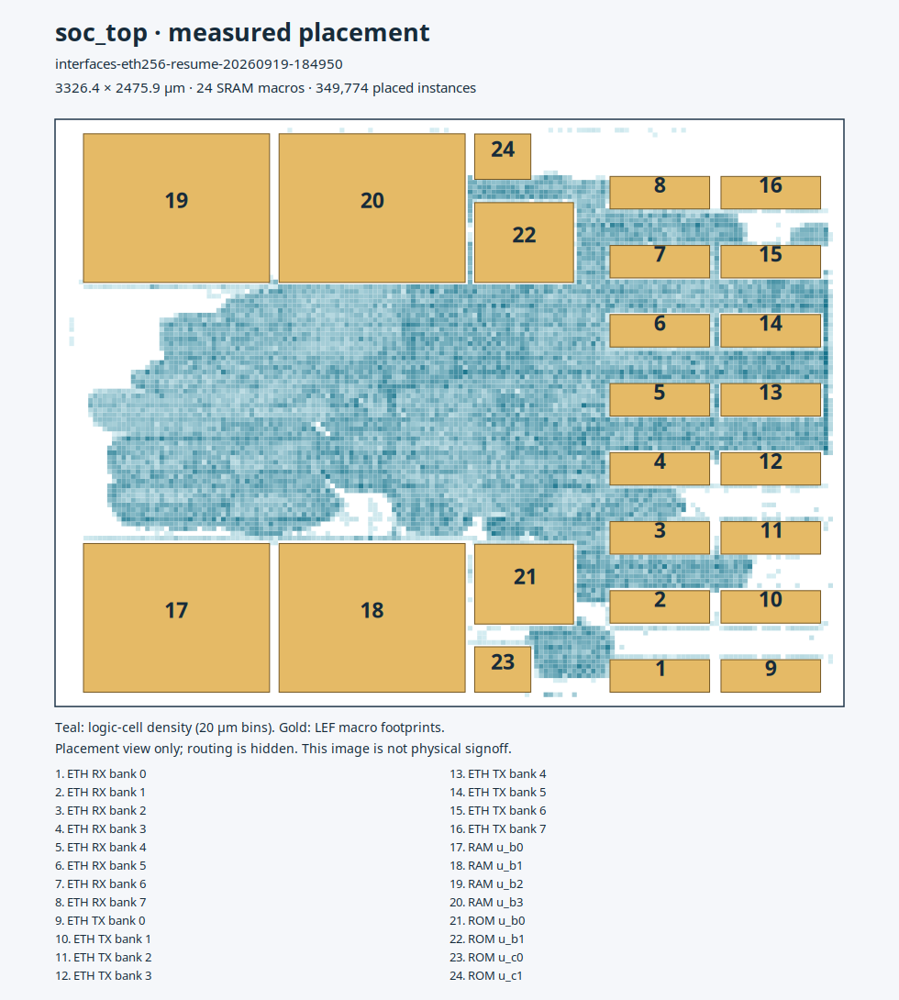

<!--
SPDX-FileCopyrightText: 2026 Hasan Melih Akbulut
SPDX-License-Identifier: CC-BY-4.0
-->
# Gigabit Ethernet MAC integration

2026-09-19. `soc_eth` adds a fixed **1 Gb/s, full-duplex GMII MAC** to
`soc_top`. The external copper/fibre PHY, pad ring, package and board are not
implemented here. PCIe has a separate dependency assessment in docs/91.

## RTL and software boundary

The upstream MAC is `alexforencich/verilog-ethernet` at
`77320a9471d19c7dd383914bc049e02d9f4f1ffb`, including its bundled AXIS snapshot,
under MIT. `make soc-interfaces-prepare` fetches the clean pinned dependency;
`prepare_interfaces.py` retains license notices and hashes every input.
The generated bundle adds synchronous reset to the TX frame pointer, padding
counter and error register. The upstream checkout remains unchanged. Native
gate simulation exposed X propagation through their mapped feedback with
FPGA initialization removed; explicit reset makes ASIC startup deterministic.

The MAC inserts preamble/SFD, pads short TX payloads to 60 bytes, appends CRC32,
and uses a 12-byte interframe gap. Each direction has a 2048-byte frame-aware
asynchronous FIFO carrying data, last and error bits. RX bad-FCS and overflowing
frames are discarded; oversized TX frames are discarded. Reset asserts
asynchronously and releases synchronously in the 50 MHz APB and independent
125 MHz RX/TX domains. The external TX clock is forwarded as `eth_gtx_clk_o`.
GMII clocks must continue while normal packet transfers are active.

The interface is programmed IO, without DMA. It cannot sustain an uninterrupted
1 Gb/s stream through the 50 MHz APB port. It has no 10/100 Mb/s mode, MAC-address
filter, network stack or ECC/TMR protection of the new packet buffers/control
state. The CRC is a link-integrity check, not radiation hardening. MDIO is a
software-controlled MDC/data/output-enable interface with synchronized input;
there is no autonomous management transaction engine or auto-negotiation driver.

APB slot `0x01A`, base **0xFF91A000**, project device ID `0xE01`, logical IRQ25
maps to Ibex fast IRQ13 / `mip` bit29. No existing address or IRQ moved.

| Register | Offset | Fields |
|---|---:|---|
| CTRL | 0x000 | TX enable bit0, RX enable bit1; writing bit2 flushes both FIFOs/MAC |
| STATUS | 0x004 | TX ready bit0, RX valid bit1, RX last bit2, RX error bit3, reset active bit4 |
| TX | 0x008 | Data bits7:0, last bit8, abort/bad bit9; one byte per write |
| RX | 0x00C | Data bits7:0, last bit8, error bit9, valid bit31; read pops one byte |
| EVENTS | 0x010 | Sticky W1C; a concurrent event wins over clearing |
| IRQEN | 0x014 | Event masks bits8:0, RX-available level mask bit9 |
| MDIO | 0x018 | MDC bit0, MDIO output bit1, output-enable bit2, synchronized input bit8 |
| ID | 0x0FC | `0x474D4901` |

Event bits0..8 are TX good, RX good, TX bad, RX bad, RX overflow,
TX underflow, RX bad FCS, RX bad frame and TX overflow, respectively.
Empty RX reads, disabled/full TX writes, undefined registers and writes to
read-only registers return PSLVERR. Writes require byte strobe0; strobe1 gates
the upper event/mask bits and TX last/abort. Firmware must enable TX/RX before
using the FIFOs. `hw/soc/tb/sw/soc_eth.h` supplies the software constants.

## Verification and physical mapping

```sh
make soc-interfaces-prepare
scripts/run_cocotb.sh soc_eth
SOC_MEM_RDREG=1 SOC_REQ_REG=1 SOC_RF_SYNPRE=1 SW_DEFINES=-DETHERNET_DEMO \
  bash hw/soc/flow/sim_soc.sh hw/soc/out/ethernet-demo
bash hw/soc/flow/test_eth_sram.sh hw/soc/out/eth-sram
bash hw/soc/flow/implement_interfaces.sh unique-run-tag
```

The six block tests pass in RTL and with the **native PDK SRAM and standard-cell
models**, without initialization of DUT registers from the testbench. They
check independently computed wire CRC/padding, 1514-byte TX/RX frames spanning
both SRAM banks, bad-FCS discard/recovery, overflow preserving a committed RX
frame, oversized/incomplete TX discard/flush, APB errors, byte strobes, MDIO and
interrupt/reset behavior. The gate runner requires Icarus 13 or newer because
Icarus 12 does not drive the PDK flip-flop delayed timing pins. These are
functional, zero-delay tests without extracted SDF or analog PHY compliance.

The CPU demo executes firmware that sends 60 bytes, loops actual GMII output
pins into the receive pins, checks the payload/last indication, observes `mip`
bit29 and drains the receive interrupt. It does not inject a pre-completed
packet directly into an internal FIFO.
The fresh run finishes after **159269 cycles**. Source hashes, native gate-test
XML and the complete CPU transcript are committed in
[the Ethernet evidence record](evidence/ethernet-20260919.json).

**First mapping, superseded 2026-09-19:** Yosys 0.33 maps the FIFO pair to **four
`RM_IHPSG13_2P_1024x16_c2_bm_bist` macros**, with 508 standard-cell flip-flops
and **2615 total cells** including macros. Combined typical Liberty area is
**667066.4354 um2**, of which **620615.3428 um2** is SRAM. The register-array
experiment used 41486 flip-flops; it is not the physical profile. These are
standalone MAC synthesis figures, not placed whole-chip area.

`SOC_ETH_SRAM=1` selects the mapping in the whole-SoC synthesis script and is
mandatory in `implement_interfaces.sh`. Only the Ethernet memories are selected;
the frozen accelerator's memories and protection are not remapped. The active
~~floorplan extends 540 um to the right for the four new SRAMs and carries all
twelve macro physical views~~. **Corrected 2026-09-19:** the active mapping uses
sixteen `RM_IHPSG13_2P_256x16_c2_bm_bist` macros, eight per FIFO, keeping each
FIFO at 2048 bytes. The die is now **3326.4 × 2475.9 um**, with two new SRAM
columns and **24 macros total**. Each has physical views and power hooks;
RX/TX clocks remain explicitly constrained to 8 ns.
Cross-domain paths have an 8 ns maximum datapath budget; only asynchronous
hold checks are excepted. A broad clock-group false path would hide this bound
and is deliberately absent. GMII input/output budgets are stated board/PHY
assumptions in `soc_interfaces.sdc`; they require replacement against real
pad, package and PHY characterization.

The old eight-macro routed results in docs/88 **do not validate this revision**.
Its physical timing and DRC must be measured afresh; passing RTL/gate packet
tests is not a physical signoff or a radiation qualification.

## Measured SRAM replacement

The first 1024-word-bank implementation failed 125 MHz setup after clock-tree
construction and timing repair: **−0.805066 ns**, with 17 setup violations at
the slow corner. The critical path starts at the TX SRAM's read output.
Its native slow Liberty clock-to-output delay leaves too little of the 8 ns
period for the bank mux and destination register. This is an implementation
failure, not an input/output constraint to waive.

The 256-word banks pass the same **six native gate-level packet tests**,
including overflow, bad FCS, flush and a full-size packet. Standalone mapping
uses **2693 cells, 512 flip-flops, 16 SRAM macros**, and **968710.3670 um2**
of combined cell/macro area. It costs more SRAM area than the first mapping.
The complete SoC synthesis has **65667 cells, 9352 flip-flops, 24 macros** and
**1045780.5456 um2 of standard-cell area**, excluding macro area.

Identical pre-layout STA budgets, OpenSTA 3.1.0, ideal clocks, 5% derates:

| TX-domain setup margin | First 1024-word banks | Active 256-word banks |
|---|---:|---:|
| Fast | +4.717523 ns | +5.083783 ns |
| Typical | +2.846943 ns | +4.077037 ns |
| Slow | −0.434501 ns | +1.520293 ns |

These are setup comparisons without wire RC or CTS; **hold still fails** in
both pre-layout netlists. The new physical optimization includes fast, typical
and slow corners, whereas the first candidate optimized only typical and slow.
Signoff checker limits are unchanged. The first candidate was stopped during
post-global-route repair; it has no completed detailed-route/GDS result.

The scripts used for the comparison, exact path reports, hashes, gate-test XML,
whole-SoC synthesis input inventory and the first candidate's native post-CTS
metrics are in [the SRAM comparison record](evidence/ethernet-sram256-20260919.json).
The new physical run is `interfaces-eth256-20260919`; its completion and
extracted timing must be reported separately from the setup-only comparison.

## Restart and timing-replay correction

The checkpoint resumed into `interfaces-eth256-resume-20260919-184950`.
The original post-CTS design is retained; global routing and antenna repair
ran on the resumed candidate. Final detailed routing and extracted timing
remain pending at this update.

**Diagnostic correction, 2026-09-19:** an independent read-only timing probe
initially reported slow setup **−0.721402 ns** on the post-GRT design-repair
ODB. It loaded the same Liberty models and SDC but omitted the native process's
`_LAYER_RC_*` and `_VIA_R_*` environment entries, silently using tech-LEF wire
RC defaults. This is **not comparable with the native flow**. Sourcing a step's
`_env.tcl` alone did not reproduce its complete timing environment.

Repeating that probe on the **same ODB**, with the native layer/via overrides,
measured **−6.660567 ns** slow setup. The ODB has saved global routes; their
absence was checked and rejected as the explanation. Neither probe is final
extracted STA, and neither changes the ongoing repair run. The corrected
comparison, exact scripts, model environment and artifact hashes are in
[the replay record](evidence/timing-replay-20260919.json). The earlier ideal-clock,
no-wire-RC SRAM comparison above has a different, explicitly pre-layout scope.

A separate optimizer experiment used the identical post-antenna input state
and identical resolved configuration, changing only the setup search to
120 iterations and four repairs per pass. OpenROAD 26Q1-2938-g0e2d771c5e
aborted in `rsz::SizeUpMove::doMove` with a C++ vector bounds assertion. It
produced **no completed output state** and is rejected. The baseline flow and
its default one-repair-per-pass policy remain unchanged. The failed trial's
script, configuration identity and error are retained in the replay record.

A subsequent standalone **512-word-bank** comparison maps the same FIFO
capacity to **8 macros, 2593 cells and 510 flip-flops**, with combined
cell/macro area **754922.4916 um2**. Using the same ideal-clock budgets, TX setup
margin is +5.043968 ns fast, +3.382492 ns typical and **+0.424931 ns slow**.
Its smaller area trades away 1.095362 ns of the active 256-word mapping's
slow setup margin, so it was **not adopted**. This is a synthesis/STA experiment;
no routed result or packet-regression success is claimed for the 512-word
candidate. Scripts and hashes are appended to the SRAM comparison record.

The native post-global-route repair subsequently completed and saved a new
ODB/netlist. Replaying that saved state with the native layer/via RC gives
setup/hold in ns: **fast +3.262364 / -0.150652, typical +2.042962 / +0.131439,
slow -2.045677 / +0.385958**. The fast values agree with the fresh native
`STAMidPNR-3` report; the other corners were explicitly remeasured rather than
read from inherited state metrics. The worst slow path starts at register-file
read address B bit 2 and ends at register x28 check bit 6. It is not an Ethernet
SRAM path. These are global-route estimates, not final extracted timing.

The existing netlist guards were also applied directly to this post-GRT
netlist: boot, NPU and watchdog replica cones remain disjoint, and the
asynchronous-reset cone guard passes. The exact saved artifacts, probe command,
results and guard log are appended to `timing-replay-20260919.json`.
Detailed routing is still in progress at this observation.

### Native whole-netlist fault-free execution

2026-09-19. The old `fi_core_gl.sh` could not elaborate this design: it
omitted the ECC ROM check macros and dual-port Ethernet SRAM models.
The flow now selects their native PDK models from the actual netlist, initializes
the ROM check banks with the frozen SECDED encoder, and connects the added
interface inputs to explicit idle levels. `fi_core.sh` now checks that
`SOC_REQ_REG` and `SOC_RF_SYNPRE` select the requested elaborated branches.
Historical defaults remain unchanged.

The current post-global-route netlist and a matching RTL build both complete
the same ROM workload with watchdog disabled (`+armed=0`): signature `9c07ef12`, mask and exit zero, four rounds,
19 UART characters with hash `6d6942c8`, and no asserted watchdog, trap, NMI,
alert or double-fault channel. The measured cycle counters are **27,306 at
gate level and 27,307 in RTL**, so this is a matching-answer check, not a
cycle-equivalence claim. The native gate run uses Icarus 13; the RTL bytecode
uses its matching configured Icarus 12 runtime.

The [baseline record](evidence/ethernet-gate-baseline-20260919.json) includes
commands, both complete result records, source/model provenance, hashes and
failed attempts. This is a zero-delay, fault-free check with idle interfaces;
it does not establish SDF timing, an injected-fault coverage rate or Ethernet
traffic behaviour. Missing gate-level shadow instrumentation is recorded as
unavailable, never as a zero error count.

2026-09-19, watchdog-enabled follow-up: the same native post-global-route
netlist also completes with the watchdog armed and matches RTL's published
answer, with no watchdog event, NMI, trap or alert. The existing software
`FI_WDOG_RELOAD=255u` override sets a 4096-cycle interval; RTL's measured
maximum kick gap is 2894 cycles. RTL completes in 27307 cycles and the gate
bench in 27306; these counters are not a cycle-equivalence claim.

The earlier workload's default reload 127 permits only 2048 cycles. Running
that program with the watchdog armed produces four stage-1 events and four
NMIs in **both** RTL and gates, despite returning the right answer. Those
logs remain recorded as a failed clean-control condition. The software
override, exact ROM identity and both outcomes are appended to the
[baseline evidence](evidence/ethernet-gate-baseline-20260919.json). This is a
fault-free control, not a completed injected-fault campaign or SDF signoff.

2026-09-20, extracted candidate: `interfaces-eth256-resume-20260919-184950`
now has detailed routing, nominal interconnect extraction and both GDS streams.
Three independent native STA runs measure:

| Corner | Whole-design setup WNS (ns) | Hold WNS (ns) | Worst GMII TX output setup / hold (ns) |
|---|---:|---:|---:|
| Fast | +3.283147 | −0.036038 | +3.283147 / +0.712912 |
| Typical | +2.348404 | +0.083726 | +2.348404 / +1.370800 |
| Slow | −1.828438 | +0.243966 | +0.632443 / +2.582863 |

The slow corner has 513 setup violations and the fast corner four hold
violations. The worst setup path runs from the APB address register to the
Ethernet TX SRAM write enable; CPU paths also fail. All ten GMII TX data/control
ports meet the stated core-to-port budgets, but this does not close internal
SRAM timing or characterize a PHY, pad or package. The experimental extra
falling-edge output stage passed six native packet tests; it is not adopted,
since the extracted shipping outputs now meet these budgets.

Router DRC is zero; three antenna nets/pins still fail. The connectivity checker
reports zero **critical** disconnected pins, with 256 unused macro outputs
reported as noncritical unconnected pins. Independent Magic/KLayout DRC, stream
XOR and scoped LVS are running separately. Exact source artifacts and the
unmodified native measurements are pinned in the
[extracted layout record](evidence/ethernet-extracted-layout-20260920.json).
This candidate remains a failing physical implementation.



The [vector placement view](img/interfaces-ethernet-layout.svg) is generated
from this run's actual final DEF and metrics; all 18 geometry/metric checks
pass. It shows macro footprints and logic density, with routing hidden.
It is a view of the failing candidate above, not a clean-layout claim.

### Antenna repair follow-up, 2026-09-20

The separate `eth256-antfix-20260919` candidate raised the permitted antenna
repair iterations to eight without changing antenna thresholds. Three further
iterations reduced violating nets **3 → 2 → 1 → 0**, inserting **six diodes**;
the final detailed-router DRC count is **zero**. The subsequent independent
checker was interrupted by SIGTERM, so it was replayed against the saved route
as `eth256-antcheck-20260920`: **zero violating nets and pins**, flow complete.
The [record](evidence/ethernet-antenna-repair-20260920.json) binds the command,
metrics and output hashes. This closes that candidate's antenna check only.
The original extracted timing/GDS above, the ongoing independent decks, and
the later timing ECO are distinct artifacts; their results cannot be mixed
into a passing final candidate.

### Independent extracted-netlist LVS, 2026-09-20

`eth256-lvs-20260920` completed on the original 24-macro
`interfaces-eth256-resume-20260919-184950` candidate. Netgen reports
**Circuits match uniquely**, with **94,490 devices and 94,219 nets** on
each side, all **seven LVS counters zero**, and **zero Magic illegal
overlaps**. The [record](evidence/ethernet-lvs-20260920.json) contains the
command and hashed inputs/reports. SRAM interiors are black boxes; standard
cells and every macro pin are compared. This result does not cover the later
antenna-repaired or timing-ECO candidates and does not close DRC or timing.

### ECO2 native extracted follow-up, 2026-09-20

`eth256-eco2-route-20260920` completed routing, native extraction, three
separate STA corner processes, both GDS streams and rendering. Its command,
input inventory, artifact hashes and full metrics are in the
[ECO2 record](evidence/ethernet-eco2-extracted-20260920.json). The clock and
I/O constraints are unchanged. This is still a **failing candidate**.

| Corner | Setup worst slack (ns) | Hold worst slack (ns) | Setup violations | Cap / slew violations |
|---|---:|---:|---:|---:|
| fast | +3.266211 | +0.007986 | 0 | 15 / 4 |
| typical | +2.325380 | +0.123994 | 0 | 15 / 5 |
| slow | -1.063485 | +0.272884 | 328 | 15 / 89 |

All corners have zero hold violations. Slow setup TNS is -115.755465 ns;
327 of its 328 setup violations are register-to-register. Each corner also
reports 892 max-fanout violations. Native detailed-router DRC and the
subsequent independent antenna check both report zero; critical disconnected
pins are zero, with 256 unused SRAM output pins still counted separately.
All ten GMII TX data/control ports appear and meet the stated max/min budgets
in all three native reports. The final design retains 24 SRAMs and 9,352
flip-flops. These are core-level measurements, not PHY/pad/package tests.

An exact comparison against the ECO2 input netlist found no removed or
modified original instance, pin, port or assign. Routing added 523 antenna
cells plus 255,127 filler/decap cells. This check preserves the logic but is
not an independent extracted LVS verdict. The original baseline's independent
DRC/LVS/XOR results do not apply to this modified geometry. The small positive
fast hold slack is the measured value; it is not a new guard-band guarantee.

The following independent `eth256-eco2-lvs-20260920` check **matches uniquely**:
95,044 devices and 94,244 nets on each side; all seven LVS counters and the
illegal-overlap counter are zero. Its [record](evidence/ethernet-eco2-lvs-20260920.json)
binds the same ECO2 DEF and powered netlist. SRAM interiors remain black boxes.
This closes this candidate's scoped LVS check; it does not close timing or DRC.

## ECO7 functional controls, 2026-09-20

The later `timing-eco7-cap` seed is undergoing a separate native detailed
route and extraction. Its [completed controls](evidence/ethernet-eco7-controls-20260920.json)
compare it directly with the antenna-repaired baseline: all 94,492 original
instances remain, with 441 equivalent combinational substitutions, 21
equivalent sequential substitutions and 63 added non-inverting buffers.
Original ports, aliases, wire widths and original pin connectivity are
preserved after buffer contraction. State definitions and pin functions come
from the pinned Liberty files, including explicit SRAM bus directions.

The reproducible guard is
[check_physical_eco.py](../hw/soc/flow/check_physical_eco.py):

```bash
python3 hw/soc/flow/check_physical_eco.py before.nl.v after.nl.v inputs.json
.venv/bin/python -m pytest -q sw/tests/test_physical_eco.py
```

The input JSON names `before_sha256`, `after_sha256`, `liberty`,
`liberty_sha256`, a `macro_libraries` list of `{path, sha256}`, the exact
`substitutions` map `{instance: {old, new}}`, and `new_buffer_drivers`
(one entry per added buffer). The latter records the planned count; actual
direction, single-driver connectivity and acyclicity are derived independently
from the netlists and libraries. Unsupported syntax or a failed invariant
exits nonzero, including under `python -O`. There is no implicit library search.
The focused regression passes **26 tests**, including changed clock/data
semantics, swapped memory bits, wire-width changes, reversed/duplicate drivers,
hash corruption and unrecognized state/tristate constructs.

The same seed passes the real gate-level fault-free CPU workload with the
watchdog armed and the documented reload255 firmware override: **27,306 cycles**,
signature `9c07ef12`, zero failure mask and the same complete answer as RTL.
Watchdog stages, reset events, traps, NMIs and observed fault alarms remain
zero. This is zero-delay simulation with no fault injected. It is not SDF,
WCET, an upset campaign, memory-interior equivalence or a final-route timing
verdict. The historic reload127 failed clean control remains unchanged.

Added 2026-09-20: the guard now supports added buffer strengths 1, 2, 4, 8
and 16, checking each actual Liberty function and absence of state. The
expanded regression passes **31 tests** and the actual ECO7 replay still
passes; the dated follow-up in the same record retains the earlier checker
hash at commit `dd14c38`.

The separate [ECO8 estimate](evidence/ethernet-eco8-estimate-20260920.json)
replaces one critical delay cell with an equivalent positive buffer and
increases one launching flip-flop's drive strength. Full global routing gives
slow setup **-0.729996 ns** and fast hold **-0.157326 ns**; both remain failures.
The restricted structural check passes with all 94,555 original instances,
one equivalent combinational substitution and one equivalent state-preserving
substitution. These are estimated values, separate from the still-running
ECO7 native flow; no clock, interface budget or RTL was relaxed.

The completed ECO9 buffering follow-up in that record retains all original
instances and passes the same guard with 74 added buffers, 21 combinational
and two sequential substitutions. After recomputing the entire global route,
slow setup is **-0.579369 ns**, fast hold **-0.246511 ns**, and typical hold
**-0.023671 ns**. Setup improves but hold worsens; this candidate still fails.
The final estimates supersede the optimizer's more optimistic intermediate
slack within this experiment. It is not promoted to a finished physical design.

An isolated [timer-interrupt register prototype](evidence/timer-irq-prototype-20260920.json)
also completes real CPU boot and **28 software checks**, with zero failure mask,
sleeping at cycle **635,360**. It separates CLINT's comparator from the CPU
interrupt-control path by one free-running clock. This is a copied RTL
experiment only: the added single state bit has no upset protection, and its
synthesis cost, final timing and fault behaviour have not been qualified.
It is not adopted into the shipping design or any physical result above.

### Boolean-preserving bank-select experiment, 2026-09-20

The [ECO10 record](evidence/ethernet-mux-eco-20260920.json) replaces nine
NOR/AOI bank-select cones with mux/inverter pairs. Its separate bounded
logic check derives selector equivalence through the actual positive buffers
and checks every input combination against the pinned Liberty functions:
**72 matching rows**, with **72 rejected wrong-polarity controls**. All
94,611 instances outside those 18 replaced cells, all port/alias declarations
and all original wires are unchanged. The sizing-only guard is not used to
approve this different topology. Exact prototype scripts are included in the
record, together with source/output hashes and the measured cell-area cost.

After full global routing, the worst reported slow internal Ethernet TX path
is **-0.097586 ns**, improved from ECO9's **-0.579369 ns**. Overall slow setup
is still **-0.502222 ns** on the processor/fault-output path; fast hold is
**-0.389087 ns** and typical hold **-0.131440 ns**. These remain failing
estimates. This Boolean check does not prove analog glitches, power-up X
behaviour or final routed timing, and no release gate is closed by it alone.

### Completed ECO7 extraction and later repairs, 2026-09-20

**Dated update:** the ECO7 native flow described above as pending is now
complete. Its [extracted record](evidence/ethernet-eco7-extracted-20260920.json)
reports zero detailed-route DRC markers and zero violations in both the route
antenna report and independent antenna check. All three nominal-RC/PVT runs
pass hold. Fast/typical/slow setup WNS is **+3.284046 / +2.353035 /
-0.529278 ns**; slow setup still has **109 violations**. All ten GMII TX
ports pass both stated output budgets. Slow slew (30), capacitance (10) and
fanout (881) remain open. Route DRC zero does not establish Magic/KLayout DRC.

A separate post-route comparison preserves all 94,555 input instances and
all their connections, adding only 481 antenna and 254,927 fill/decap cells.
This checks emitted logical connectivity, not power connectivity or LVS.
The record binds the comparison script, exact artifacts and native commands.

The [clock/electrical repair experiments](evidence/ethernet-clock-repair-20260920.json)
remain global-route estimates. ECO12 passes its structural guard with 145
positive stateless cells added (84 normal buffers, 61 delay cells). ECO13
adds 1,489 clock buffers, costing 35,121.3408 µm² in cell area, and reduces
fanout violations from 843 to 101. ECO14 removes the remaining estimated
fanout/capacitance violations with 165 buffers, but slow setup regresses to
**-2.251792 ns** and slew still fails. It is not accepted as timing closure;
the newly inserted small buffers require a separate strength experiment.

The permanent guard's expanded regression now passes **35 tests**, including
actual positive-delay functions, inverted variants and a hidden-state negative
control. This extends the earlier 26/31-test records without replacing them.
The isolated WB1/CLKGATE0 CPU counterfactual still fails the mtime check and
was stopped after that decisive failure; it is recorded with the timer-IRQ
prototype and is not adopted into the shipping core.

The following ECO15 drive-strength experiment changes only 156 newly added
buffer masters and passes the exact structural check. It recovers slow setup
to **-0.292147 ns**, with fast hold **-0.144564 ns**, while estimated
fanout/capacitance stay at zero. Slow slew still has 30 violations. The
[repair record](evidence/ethernet-clock-repair-20260920.json) includes the
2,540.16 µm² cell-area increment and all three corner reports. Native routing
and extraction would still be required for any selected later candidate.

### Reproducing the CPU packet probe

The isolated generator reuses the established FI harness for boot, ECC ROM
loading, memory observations and UART capture, while changing its generated
copies to run the Ethernet firmware and an independent GMII monitor:

```bash
python3 hw/soc/flow/ethernet_cpu_probe.py --prepare hw/soc/out/ethernet-cpu-probe
bash hw/soc/out/ethernet-cpu-probe/run_rtl.sh
bash hw/soc/out/ethernet-cpu-probe/run_gl.sh /absolute/path/to/soc_top.nl.v
```

Use the matching 24-SRAM, registered-request/registered-memory-read/SYNPRE,
`WAKE_GNT=1` profile for the mapped netlist. This is a 50 MHz core with
independent 125 MHz GMII clocks. The generated GL script uses Icarus 13 and
the pinned native cell/SRAM models; `GL_IVERILOG` selects its executable.
`PROBE_TIMEOUT` controls wall time (default 2,400 seconds), without changing
the 300,000-cycle simulation limit. A timeout is a non-verdict.

The eight frames carry 2,171 payload bytes in total, exceeding the 2 KiB FIFO
capacity without flushing between frames. The CPU checks every received
byte and end marker, RX-ready interrupt assertion/clearance and MAC errors;
the GMII monitor independently checks preamble, SFD, payload, frame length
and CRC residue. The result parser requires signature `00043b07`, all eight
frames and CRC checks, a clean exit/UART result and no observed fault or
watchdog-reset event. A truncated log cannot pass. The RTL-only ECC/kick
counters are not claimed observable in the mapped GL harness.

Preparation refuses an existing directory and fails if its source-template
anchors drift. It preserves the shipping RTL and original FI instruments.
The [recorded RTL probe](evidence/ethernet-cpu-loopback-20260920.json) completes at **175,253 cycles**, with eight
frames, all bytes correct and no observed fault events. The matching native
cell GL run is still pending at this dated checkpoint. This is a fault-free
loopback test, not SDF, a PHY link, sustained hardware throughput or an upset
campaign. Its result-parser and preparation regression passes **19 tests**.

**Dated completion, 2026-09-20:** the matching native-cell gate run is now
PASS: **175,252 reported cycles**, eight frames, 2,171 bytes and eight CRC
checks. The [completed record](evidence/ethernet-cpu-loopback-20260920.json)
binds the ECO13 netlist, compiler/model provenance and exact simulation
command. All 23 compared functional result fields match RTL, including
signature, exit/UART, workload window and observed fault/watchdog signals.
The printed cycle counts differ by one; this is not an exact temporal or
SDF equivalence claim. Unobservable gate-level counters remain `-1`, not zero.

### Cross-corner repair regression and input drivers, 2026-09-20

ECO16's post-setup global-route slow WNS reaches **-0.001835 ns**, but its
subsequent hold repair and reroute regress final slow setup to **-1.975127 ns**.
Final fast hold remains **-0.327806 ns**. Loading three corners and omitting
`allow_setup_violations` does not establish that this repair invocation
preserves every corner; final reports control the verdict. The actual delta
contains 74 normal buffers, 82 delay cells and 84 equivalent substitutions,
not merely the optimizer's last summary count. This candidate is not selected
for native routing. The [repair record](evidence/ethernet-clock-repair-20260920.json)
retains both intermediate and final values.

The structural checker initially rejected its QSPI input buffer because the
driver census omitted primary inputs. Its extension now recognizes unchanged
scalar and packed input declarations, counts external and cell drivers, and
rejects bidirectional buffer cases and unsupported declarations. All **43
regression tests** and the actual ECO16 replay pass this restricted logic/state
check. Timing remains a separate failure; the extension does not waive it.

ECO17 replaces three measured RX-enable delay cells with equivalent positive
buffers; ECO18 strengthens two of those buffers. Each passes the exact
structural guard. Final ECO18 global-route estimates are **slow setup
-0.188810 ns**, **fast hold -0.327806 ns**, zero fanout/capacitance violations
in all three corners, and 47/28/29 slew violations (fast/slow/typical).
The successive cell-area changes are -27.22 and +32.66 um2, with the same die.
These estimates still fail and are not extracted signoff.

The first native ECO18 attempt stops with `DRT-0222` before completing routing:
`net24735` has one output terminal, no external port or load, and six stale
guides left in the ECO database. The restricted
[`prune_orphan_guides.tcl`](../hw/soc/flow/prune_orphan_guides.tcl) removes only
that metadata. Both emitted Verilog and DEF are byte-identical before and
after the cleanup; cells, nets and connectivity remain present. Eleven Tcl
regression cases exercise connected nets, external ports, input/inout pins,
power/ground/clock nets and cleanup failure. A separate native retry,
`eth256-eco18-clean-route-20260920`, is running at this checkpoint. The
[record](evidence/ethernet-clock-repair-20260920.json) preserves the failed
attempt, cleanup hashes and candidate measurements. ECO7 remains the latest
completed optimized native timing measurement until that retry finishes.

The restricted guide cleanup is now connected to future `Interfaces` flow
invocations immediately after the database is read for detailed routing.
The upstream routing script remains otherwise byte-identical; missing or
duplicate insertion anchors fail closed. Sixteen combined cleanup/flow
controls pass, including execution with Tcl metacharacters in the helper
path. The installed LibreLane template was also checked directly. The two
already-running native jobs retain their original scripts and explicitly
recorded seeds; this integration does not rewrite those measurements.

### Dated update, 2026-09-20 — completed native ECO18 and targeted follow-up

The clean ECO18 retry has now completed native extraction, separate STA for
three Liberty corners with nominal extracted RC, and both GDS streams. This
supersedes the pending status above; the
[complete record](evidence/ethernet-eco18-extracted-20260920.json) is the
latest completed optimized native measurement, **not a passing release**.

| Corner | Setup worst slack (ns) | Hold worst slack (ns) | Setup / hold violations | Slew / capacitance / fanout violations |
|---|---:|---:|---:|---:|
| Fast | +3.388568 | -0.039599 | 0 / 4 | 2 / 8 / 71 |
| Typical | +2.485622 | +0.122469 | 0 / 0 | 1 / 8 / 71 |
| Slow | -0.785313 | +0.238602 | 4 / 0 | 29 / 7 / 71 |

Route DRC, both antenna checks and critical disconnected pins report zero.
The raw 256 disconnected pins are unused SRAM outputs. The design retains
24 macros and 9,352 sequential cells. All ten GMII data/control output ports
pass the stated max/min budgets in each corner. The four slow setup failures
are internal APB data paths; the four fast hold failures are TX SRAM address
paths. Neither group can be waived by the passing output-port checks.

Exact comparison against the ECO18 seed preserves all 96,584 original cells,
masters, pins, ports, aliases and wires; only 562 antenna cells and 251,774
filler/decap cells were added. The reusable
[`check_postroute_connectivity.py`](../hw/soc/flow/check_postroute_connectivity.py)
now carries this check in the repository, with 20 controls and a replay on
this actual netlist. Together with the 43 sizing controls, 63 tests pass.
This unpowered netlist comparison is not extracted LVS. Independent stream
XOR, scoped LVS and the locked updated IHP main-deck DRC have been started
for this exact candidate and have no verdict at this checkpoint.

Every one of the 71 reported fanout violations has added antenna terminals;
subtracting that terminal count arithmetically brings each net within its
reported limit. This diagnoses the difference from the zero-fanout pre-route
estimate; it does not remove a diode, alter the library, or turn a native
failure into a pass. Post-route capacitance also remains a measured failure.

The [next experiments](evidence/ethernet-clock-repair-20260920.json) retain
all original connectivity and state. ECO19 sizes 46 gates/buffers along the
four failing APB paths; ECO20 changes five RX/TX memory-path buffer strengths.
Their measured cell-area changes are +529.81 and -18.15 um2 respectively,
with unchanged die size. ECO20 estimates slow setup at -0.061945 ns and fast
hold at -0.330479 ns, with slew failures. These are still global-route
estimates; no extracted result or physical-verification verdict is borrowed
from ECO18.
