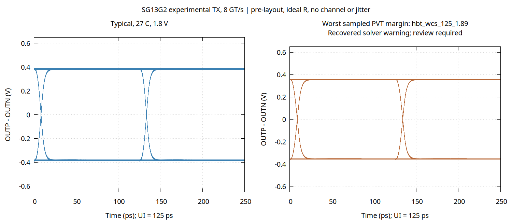

# 99 — Custom PCIe Gen3 x4 PHY development

## Status and scope — 22 September 2026

Custom analog development has started, following the feasibility research in
[docs/91](91-pcie-gen3-feasibility.md). There are now executable SG13G2 HBT
transistor-level netlists for an NRZ transmitter output cell and a four-cell
bank. These are experimental **TX building blocks**, not a working PCIe PHY.
No new PCIe GDS/LEF, extracted layout, receiver, PLL/CDR or link has been
delivered, and these cells are not instantiated in `soc_top` or its layout.

The current milestone is **pre-layout feasibility with ideal resistors**.
The final characterization receipt is
[pcie-tx-characterization-20260922.json](evidence/pcie-tx-characterization-20260922.json).
Numerical warnings and earlier failed attempts are part of that record;
waveform screening is not a substitute for resolving them.
All 43 final simulator logs are published in the
[log archive](evidence/pcie-tx-logs-20260922.tar.gz), with member hashes in
the receipt. Compressed raw waveforms remain in the local run directory;
the commands below reproduce them.

## Circuit and integration boundary

The project-authored sources are
[tx_cml.spice](../hw/soc/analog/pcie/tx_cml.spice) and
[tx_bank4.spice](../hw/soc/analog/pcie/tx_bank4.spice). The simulator loads the
unmodified `npn13G2` VBIC models from the pinned IHP PDK. Device self-heating
remains enabled; it was not disabled to remove solver warnings.

```text
                     AVDD
                 50 ohm  50 ohm        ideal loads for this milestone
                    |      |
             OUTN --+      +-- OUTP
                    C      C
    INP ----------- B XP  XN B ----------- INN
                    E--+---E
                       C
                  XTAIL B ---- IREF ---- B=C XREF
                       E                  E
                       |                  |
                      AVSS               AVSS
```

XP and XN form the current-steering pair. Output polarity follows INP by
taking OUTP from the opposite collector. XREF and XTAIL form a 1:8 mirror;
the externally supplied reference current is nominally 2 mA. All substrate
terminals connect to SUB. The zero-volt VTAIL source only measures current
and becomes a wire in a future physical schematic.

| Interface/device | Present design or testbench assumption |
|---|---|
| AVDD / AVSS / SUB | Nominal 1.8 V analog supply, swept 1.71–1.89 V; ground and substrate tied in the testbench. A separate analog supply distribution is needed. |
| INP / INN | Ideal complementary NRZ sources, 1.36 V common mode and 200 mV differential magnitude; 10 ps transitions. This is **not** a direct 1.2 V CMOS connection. A real level shifter/predriver remains required. |
| OUTP / OUTN | Collector outputs, 100 ohm differential external termination, normally 100 fF to ground on each pin. Neither an ESD model nor an extracted pad/package/channel is included. |
| IREF | One ideal 2 mA source per lane; the on-chip reference, enable and calibration loops remain absent. |
| XREF | `npn13G2 Nx=1`; remaining geometry uses the pinned model defaults. |
| XTAIL / XP / XN | `npn13G2 Nx=8` each. These are model multiplicities, not a completed PCell placement. |
| Load resistors | Two ideal 50 ohm resistors per lane. Foundry `rsil` implementation, tolerance, temperature coefficient, current density and extracted parasitics remain to be characterized. |
| Four-cell bank | Four independent cells with shared AVDD/AVSS/SUB and separate data/reference pins; no lane bonding, shared PLL or serializer. |

The bank test uses a **hypothetical** 0.1 ohm / 100 pH series supply and
100 pF decoupling model, with the substrate grounded ideally. It exercises
simultaneous switching and conducted supply interaction only. It does not
establish the actual package inductance, substrate isolation or lane crosstalk.
The reported supply power excludes the upstream ideal data drivers and all
missing clock, receiver and digital circuitry.

## Reproducible simulations

[characterize_pcie_tx.py](../scripts/characterize_pcie_tx.py) generates and runs
the benches, checks captured time coverage and finite values, measures the
waveforms and retains compressed raw traces, logs and hashes. It refuses
different bytes for either of the two PDK model files. `-n` prevents a user
`.spiceinit` from silently changing the setup. No PDK file is patched.

The actual local simulator is Ubuntu `ngspice 42+ds-3build1`, extracted into
the project's ignored tool directory without a system installation. Package
SHA-256: `466c4c06418107ceaa9c9457065b3bb71a9d9dc5ec6fef186d7de9d5208ce8db`.
The receipt also identifies the executable and exact design/driver/model bytes.

```sh
python3 scripts/characterize_pcie_tx.py \
  --pdk /path/to/c4b8b4e5e7a05f375cca3815d51b3a37721fbf5c/ihp-sg13g2 \
  --ngspice /path/to/ngspice \
  --out hw/soc/out/pcie-tx-characterization

python3 scripts/plot_pcie_tx.py \
  --run hw/soc/out/pcie-tx-characterization \
  --gnuplot /path/to/gnuplot \
  --out hw/soc/out/pcie-tx-eye
```

Use a fresh output directory each time. Exit 0 means this limited screen
passed without numerical warnings; exit 1 means failure; exit 2 means the
screen passed but numerical warnings require review. `--quick` runs eight
smoke/control cases and does not replace the full matrix.

The full matrix contains **43 simulations**:

* 27 single-cell runs: typical/best/worst HBT corner, −40/27/125 °C and
  1.71/1.80/1.89 V. Ideal resistor values do not vary with those corners.
* Two nominal extra loads: 250 and 500 fF per output pin.
* Ten four-cell bank runs: nominal PRBS and simultaneous alternating data,
  plus best/worst HBT corners at both temperature and supply extremes.
* Three deliberately faulty cases: no reference current, swapped output
  polarity and 100 pF per output pin. These must fail the signal screen.
* One nominal repeat at a 0.5 ps maximum step, compared with the 1 ps run.

Data rate is 8 GT/s, UI = 125 ps. Each lane receives 254 bits (two PRBS7
periods), following a 2 ns bias settling interval. Bank PRBS seeds differ
by lane. The first 16 bits are excluded from signal scoring; each remaining
bit is checked at 0.3, 0.5 and 0.7 UI, giving 714 samples per lane.
These are finite, deterministic, noise-free tests; zero sampled sign errors
do **not** establish a BER, a jitter budget or PCIe compliance.

Engineering thresholds are a signed output margin of at least 100 mV,
0.4–1.6 V transistor collector-emitter voltage over the post-settling trace,
and tail emitter current below 24 mA. The latter is a conservative bound on
collector current for Nx=8. These checks cover selected model operating
limits, not complete reliability/SOA/ESD verification. No PCI-SIG electrical
mask is claimed. The timestep repeat requires margin change below 1 mV and
relative supply-power change below 0.2%.

## Measured results and iteration record

Final result: **REVIEW**, not unconditional PASS. All 40 non-faulty cases
passed the defined waveform/stress screen, and all three faulty cases were
detected. Thirteen hot-corner runs retained numerical warnings. Across all
non-faulty cases, the checked VCE range was **0.416–1.265 V**.

| Measured condition | Signed margin | Sampled eye height | Analog supply power |
|---|---:|---:|---:|
| One lane, typical, 27 °C, 1.80 V | 369.37 mV | 739.25 mV | 31.36 mW |
| One lane, worst HBT, 125 °C, 1.89 V; numerical review required | 346.12 mV | 693.62 mV | 32.28 mW |
| One lane, nominal, 500 fF per output | 305.37 mV | 611.54 mV | 31.36 mW |
| Four lanes, nominal PRBS; lane 0 signal metrics | 369.37 mV | 739.25 mV | 125.43 mW total |

The nominal median positive-to-negative differential swing was **755.13 mV**.
At half the timestep, margin changed by **1.45 µV** and supply power by
**0.000215%**, passing the numerical-resolution comparison. This does not
resolve the separate hot-corner initialization warnings.

Fifteen Python controls passed, including maximal-length PRBS checks and
rejection of truncated/nonfinite/wrong-vector waveforms, polarity errors,
overvoltage and overcurrent. They supplement the actual SPICE fault runs.
The broader focused publication/metadata regression passed **199 tests**.

The first 1.30 V input-common-mode candidate passed the nominal signal screen
but reached only about **0.372 V minimum VCE at −40 °C**, below the chosen
0.4 V lower model-range screen. Raising common mode to **1.36 V** fixes that
observed headroom issue without changing the voltage limit or PDK model.
The receipt preserves both aborted early sweeps, rather than presenting only
the final candidate.

Some 125 °C operating-point solves report an intermediate temperature-limiter
NaN and/or gmin recovery. A recovered finite transient does not erase the
warning. Explicit node guesses improve some starts but do not eliminate all
warnings. Separate source-stepping and fixed-gmin experiments also failed;
neither is adopted as a workaround. Resolving these numerical diagnostics,
including checking a newer supported simulator and an independent solver,
remains a prerequisite to analog signoff.



The figure overlays actual captured differential output waveforms; it is
generated by [plot_pcie_tx.py](../scripts/plot_pcie_tx.py) using gnuplot,
without smoothing or a fabricated eye mask. The second panel is the
single-cell PVT case with the smallest sampled margin, not the worst of
every possible load/channel/mismatch condition.

## Work required before layout integration

The intended physical partition is four analog lane slices plus shared
clock/reference/control infrastructure, adjacent to the high-speed pads.
Dimensions, placement, macro obstructions and pin coordinates are **not yet
chosen**; speculative rectangles would not constitute a PHY layout.

| Next gate | Concrete acceptance work |
|---|---|
| Simulation/model closure | Resolve hot-corner warnings; compare independent solver/timestep results; add DC transfer/output impedance, mismatch, noise and wider data-pattern coverage. |
| Physical TX schematic | Replace ideal resistors with sized foundry devices and their OSDI models; design bias/reference, CMOS-to-CML predriver, calibrated swing, electrical idle, receiver detection and Gen3 equalization taps. Qualify lower-rate behavior. |
| TX layout | Use actual IHP HBT/passive PCells, symmetric routing and substrate contacts; size supply/return conductors using measured current and foundry current-density rules. Add compatible high-speed ESD/pads. |
| Extracted TX acceptance | Unmodified foundry DRC, LVS against the physical schematic, R/C extraction, corner replay, EM/IR and pad/package/channel simulation. Replace the illustrative PDN with extracted/characterized data. |
| RX/clock | Termination, CTLE/VGA/slicer, CDR, PLL, reference clock/SSC modes, calibration and test access; measured jitter/noise/equalization budgets. |
| Four-lane PHY and link | Serializer/deserializer, PCS, 128b/130b, lane alignment, Gen1/2 fallback, PIPE/control boundary, full DLL/LTSSM and controller integration. The standalone TLP blocks in docs/98 do not supply these. |
| SoC integration views | Verified GDS/LEF, pins/obstructions, CDL/SPICE/LVS, timing/power/noise models and clock/reset/test constraints, then a new SoC route containing the real macro. |
| Product acceptance | Package/board channels, manufactured silicon, interoperability/compliance and required radiation/qualification tests. |

The currently running full-core physical flow still excludes PCIe. Completing
that existing route cannot close this new analog macro's gates. All product
and external-audit obligations in [docs/92](92-product-acceptance.md) and
[docs/96](96-second-audit-closure.md) remain in force.

## References

The [IHP Open PDK](https://github.com/IHP-GmbH/IHP-Open-PDK) supplies the HBT
models and physical-device resources used as the development basis. The
[ngspice documentation](https://ngspice.sourceforge.io/docs.html) describes
the simulator and control language. High-speed SG13G2 research and its
limitations are assessed in [docs/91](91-pcie-gen3-feasibility.md); no external
research netlist or unlicensed layout has been copied into these cells.

## Native resistor implementation continuation

The [26 September local work](103-local-closure-progress.md#native-resistor-tx)
adds self-heating, three-terminal IHP `rsil` load cells, their native PCell
geometry and a separate characterization driver. The original ideal-resistor
sources and their historical measurements are retained. The new unit geometry
is one resistor, not the TX bank or a complete PHY; contact-current, extracted
interconnect and substrate-contact integration remain qualification work.
